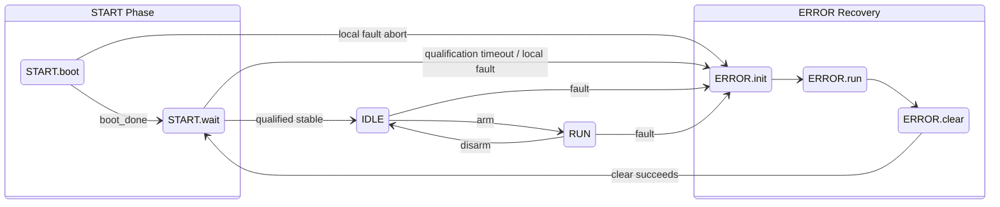

# Modular Detector Controller — Architecture & Specifications

**Status:** Draft / Pending Initial Team Review (April 2026)

This repository contains the evolving architecture specifications, ADRs, and ICD content for the modular detector controller.

To avoid documentation drift, **this README is a primer and map**, not the normative source. It explains the system intent and design philosophy.

## Changelog

### 2026-06-23 — Backplane utility voltages

- Added ADR-005 to define common backplane utility voltages: `+3.3V_DIG`, `+6V_ANA`, `-6V_ANA`, `+16V_ANA`, and `-16V_ANA`.
- Kept `+12V_RAW` distributed to modular boards for specialized local rails such as detector high voltages.
- Defined utility-voltage DC-DC synchronization as preferred but optional, with the main board acting as the sync authority when implemented.
- Updated ADR-001, ADR-003, and ADR-004 to separate utility-power distribution from sequencer timing, board-local special converters, and safety watchdog/fail-safe supply independence.
- Renamed the pre-arm synchronization readiness flag to `local_sync_ready` so it is not tied only to DC-DC converter synchronization.
- Split long transition tables, topology examples, and supporting diagrams into `decisions/reference/` to make the ADRs easier to peer review.
- Updated the architecture summary presentation and diagrams to show utility voltages as common backplane resources.

### Document Boundaries & Repository Map

```
specifications/
├── README.md                  ← This file (primer and map)
├── decisions/                 ← ADRs: architectural constraints and rationale
│   └── reference/             ← Long normative/reference tables and diagrams split out of ADRs
├── interfaces/                ← ICDs: protocols, message formats, electrical details  [planned]
├── design/                    ← Firmware and hardware design specs                    [planned]
└── integration/               ← Concept guide, system integration guide, worked examples
```

| Folder / Document Type | Purpose (What lives here) | Examples | When to look here |
|---|---|---|---|
| **`decisions/`** <br><br> **ADR** (Architecture Decision Record) | *What must be true and why.* <br><br>Architectural constraints, invariants, rationale, and rejected alternatives. Long tables/diagrams may live in `decisions/reference/` to keep ADRs reviewable. | Fault taxonomy, FSM states and transition guards, timing constants, safety-path rules (four OK sources, registered outputs), relay stage normative requirements. | When you need to know a system rule, understand why a design choice was made, or verify whether a proposed change violates an architectural constraint. |
| **`interfaces/`** <br><br> **ICD** (Interface Control Document) | *What crosses a boundary.* <br><br>Protocols, message formats, electrical interface details, and host-side orchestration sequences. | Ethernet command schemas, keep_alive format/cadence, UART command set, F4 verification host-side sequence, sequencer payload framing, backplane pinout/voltage levels. | When you are implementing host software, writing board firmware that handles external commands, or designing a backplane connector. |
| **`design/`** <br><br> **FDS / HDS** (Firmware & Hardware Design Specs) | *How internal implementation satisfies the ADR constraints.* <br><br>Reference code, pseudocode, schematics, and component selections. | START.wait qualification loop, ERROR.clear evaluator, FSM integration modules, D flip-flop relay stage wiring, wired-AND RESET_n generator, fail-safe buffer circuits. | When you are writing FPGA RTL, laying out a board schematic, or selecting components for a specific function board. |
| **`integration/`** <br><br> **Concept Guide / System Integration Guide** | *How the system behaves as a whole during operation.* <br><br>Reader-friendly concept explanations, worked examples, fault lifecycle walkthroughs, onboarding tutorials. | `system_concept_guide.md`, fault-trip and ERROR.clear recovery lifecycle narrative, multi-board power-up sequencing example. | Start here when the ADRs are too dense, when bringing up a new system, training a new team member, or debugging a cross-board interaction. |

**Rule of thumb:** If it says *"the board must..."* or *"this is prohibited because..."*, it belongs in an ADR in `decisions/`. If it says *"send command X, wait Y ms, read pin Z"*, it belongs in an ICD in `interfaces/`. If it says *"wire D=VCC, CLK=relay_drive"* or *"always @(posedge clk) begin..."*, it belongs in a design spec in `design/`.

**Recommended reading path for new readers:** Start with [`integration/system_concept_guide.md`](integration/system_concept_guide.md), then use this README as the map into the ADRs and future ICD/design documents.

---

## 1. Architecture Primer

### The Physical Layout
The system is a multi-board, backplane-based controller divided into two distinct roles:
* **The Main Board:** Acts as a PLC gateway and system coordinator. It distributes the master `CLOCK` and `SYNC`, manages the continuity loop, and drives the global `EN` (arm) and `CLEAR` (recovery) signals. *Crucially, the main board has no sequencer and does not run scientific acquisitions itself.*
* **The Function Boards:** (Video, Bias, Clock, etc.) These boards execute the actual sequencer logic, drive detector pins, and sample the ADCs. 

The backplane also distributes common utility voltages (`+3.3V_DIG`, `+/-6V_ANA`, `+/-16V_ANA`) so most modular boards do not duplicate the same local DC-DC converters. `+12V_RAW` remains available for boards that need specialized local rails such as high detector voltages. When utility DC-DC synchronization is implemented, the main board provides the sync reference; this is preferred but optional pending EMC/noise validation (ADR-005).

### Core Design Philosophy
> **"Go to safe state fast. Go to not-safe state slow."**

The architecture is intentionally safety-biased: a false trip costs observing time, but a false arm can damage hardware. We enforce this with two layers:
1.  **Hardware Interlock Layer (Sub-microsecond):** Deterministic hardware mechanisms. If a fault occurs, an open-drain `OK` bus drops, and hardware latches instantly sever relay power independent of software or FPGA clock state. 
2.  **Ethernet Telemetry Layer (Diagnostic):** Slower, software-driven diagnostics. Used to configure the system in `IDLE`, identify the root cause of a fault while safely deadlocked in `ERROR`, and orchestrate recovery.

### The Macro State Flow
The entire architecture is governed by this single hierarchical flow. `START.wait` is the required stability gate for entering `IDLE` during both boot and fault recovery, while local internal faults can still abort directly to `ERROR.init`.


