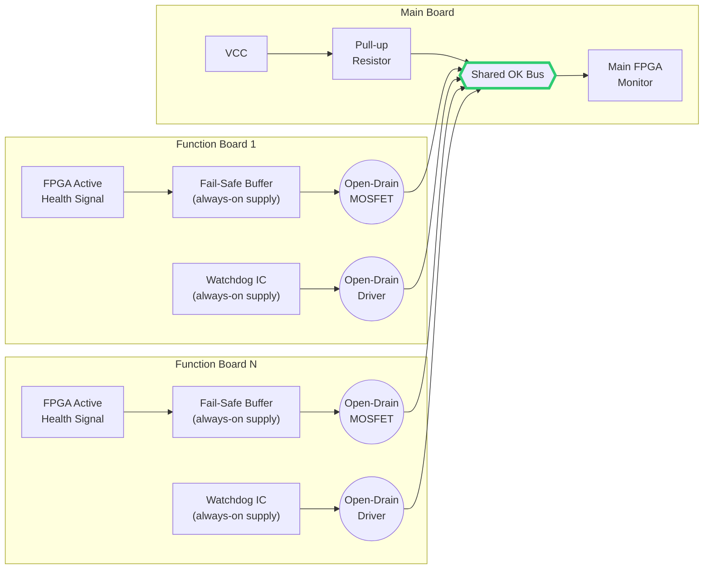
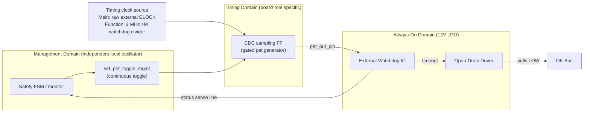
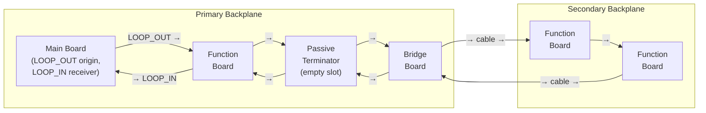

# ADR-001: Board Health Detection and Fault Visibility Strategy

**Status:** Resolved
**Last updated:** 2026-04-09

---

## Context

The system is a modular controller with one main board and multiple function boards across one or more backplanes. The core goal is:

> **All boards must know about any other board's failure — whether electronic or physical — as fast as possible.**

> **Core Decision:** Use two complementary paths: a passive copper loop for physical disconnects, and a shared open-drain `OK` bus for electronic/timing/software faults.

The failure modes to cover:

| # | Failure Mode | Description |
|---|---|---|
| F1 | Continuity loop broken | The passive continuity loop path is physically interrupted (board absent, cable/connector discontinuity, or equivalent open path), so `LOOP_IN` drops. |
| F2a | Brain dead (power/reset) | The board logic brain (FPGA/SoC) loses its digital rails or is held in reset, dropping its outputs to 0V. (Localized board failure; backplane 12V remains.) |
| F2b | Brain dead (logic frozen) | The board logic brain is fully powered (driving outputs) but the firmware/clock has frozen and cannot execute logic. |
| F3 | Internal electronic fault | A board-local monitored fault is detected (e.g., over-current, over-temperature, PLL loss), and the board actively asserts the fault path. |
| F4 | OK driver damaged | The board fault-output driver path is damaged (typically stuck open), so a local fault may fail to propagate onto the shared interlock bus. |
| F5 | CLOCK timing-path fault | The distributed timing path is invalid (missing/invalid `CLOCK` and/or failure in downstream divider/pet generation). |
| F6 | Loss of backplane 12V power | The board loses backplane 12V input power and local rails collapse (connector-discontinuity and connector-intact in-situ collapse cases). |

The table above defines the hardware fault taxonomy only. Detection paths, propagation behavior, and timing are defined in `R1`-`R9` below and in ADR-003/ADR-004. Supervisory interlock events (armed keep_alive lease timeout) are a separate category defined in R10 below.

**Taxonomy note on F6 (whole-board 12V collapse):** Full backplane 12V loss (F6) disables both watchdog and fail-safe driver assertion paths. Safety still holds because normally-open relays de-energize mechanically (energize-to-arm). Diagnostics then rely on the slower Ethernet-timeout path.

**Fault detection and response summary:**

| # | Failure Mode | Detected By | Propagated Via | Hardware Latency | FSM Safety Action |
|:---|:---|:---|:---|:---|:---|
| **F1** | Continuity loop broken | Main board (`LOOP_IN` drops) | Main latches fault, pulls `OK` LOW | ~2 clock cycles | All boards → `ERROR.init` |
| **F2a** | Brain dead (power/reset) | Fail-safe hardware buffer/path | Local fail-safe driver pulls `OK` LOW | Instant (combinational + bus propagation) | All boards → `ERROR.init` |
| **F2b** | Brain dead (logic frozen) | Hardware Watchdog IC (differentiated from F5 via diagnostic latches; see R6) | Watchdog IC pulls `OK` LOW | Sub-microsecond (after timeout) | All boards → `ERROR.init` |
| **F3** | Internal electronic fault | FPGA logic / sensors | Faulty board pulls `OK` LOW | 1 clock cycle | All boards → `ERROR.init` |
| **F4** | OK driver damaged | Board self-read / host verification | Ethernet telemetry / test | Slow (reporting) | Maintenance only |
| **F5** | CLOCK / pet-path fault | Internal clock monitor (`F5_latch`) + watchdog correlation (`WD_latch`); see R6 diagnostic truth table | Faulty board pulls `OK` LOW (clock monitor or watchdog, whichever fires first) | Clock monitor: sub-microsecond; watchdog: timeout bounded | All boards → `ERROR.init` |
| **F6** | Loss of 12V backplane | Relay mechanics (de-energizes) & Ethernet timeout | Relay physical de-energization / Ethernet timeout | Instant safety cutoff (relay); diagnostic reporting is slow | Hardware safe-state |
| **S1** | Armed keep_alive timeout | Board-local lease timer (ICD-defined) | Timed-out board pulls `OK` LOW | Detection: `T_keepalive_lease_max` (ICD-defined timeout). Assertion: 1 FSM clock cycle | All boards → `ERROR.init` |

**Taxonomy separation:** F1–F6 are hardware faults — always detectable regardless of FSM state. S1 is a supervisory interlock event — active only while armed (`EN=1`). Both use the same physical trip path (`OK` LOW → `ERROR.init`), but root causes and active conditions are fundamentally different. See R10.

---

## Considered and Rejected

### Active SSR loop

Each board places a solid-state relay in the loop path, driven by the board's FPGA. Would have covered both F2a/F2b brain-dead cases.

**Rejected because:**
- If the SSR is tied to FSM state, a fault causes all boards to drop their SSRs, breaking the loop permanently — a system-wide latch with no recovery path
- If the SSR is independent of FSM state, it adds a strict guardrail that is easy to violate in firmware
- Series on-resistance of SSRs accumulates across the chain, limiting the number of boards
- Startup sequencing becomes complex (loop open during FPGA boot)

The added complexity is not justified. KISS principle applies.

---

## Resolved Constraints

### R1: Both a passive continuity loop and the open-drain OK bus are required

They are complementary — neither alone covers all failure modes:

| Signal | F1: Loop broken | F2a: Brain dead (power/reset) | F2b: Brain dead (logic frozen) | F3: Electronic fault | F4: Driver damaged | F5: CLOCK/pet-path fault | F6: 12V lost |
|---|---|---|---|---|---|---|---|
| OK bus (FPGA registered fault-driver path) | No | No | No | Yes | No | Yes (via internal clock monitor) | No |
| Fail-safe power/reset path -> OK bus | No | Yes | No | No | No | No | No |
| Passive loop (PCB trace) | Yes | No | No | No | No | No | No |
| OK bus + fail-safe + hardware watchdog | No | Yes | Yes | Yes | No | Yes | No |
| Cascaded external watchdog path → OK bus | No | No | Yes | No | No | Yes (via hardware timeout) | No |
| OK loopback + Ethernet report | No | No | No | No | Yes (slow) | No | No |
| Ethernet poll/timeout | No | No | No | No | No | Yes (slow) | Yes (slow) |
| Shared connector discontinuity -> F1 path | No | No | No | No | No | No | Yes (connector/cable discontinuity case) |
| **Combined** | **Yes** | **Yes** | **Yes** | **Yes** | **Yes (slow)** | **Yes** | **Yes (fast if connector/cable discontinuity; slow if connector intact)** |

### R2: OK bus behavior

The `OK` bus is open-drain (wired-AND) with one pull-up resistor on the main board. Function boards never pull up `OK`; they only pull it low. When all boards are healthy, `OK` stays HIGH passively. Any board with an internal fault (F3) pulls `OK` LOW. Faults that do not naturally drive the bus are explicitly converted to LOW by dedicated paths: F1 (continuity loop broken) via main-board `LOOP_IN -> OK` conversion (R4), F2a (brain dead, power/reset) via the local fail-safe path, and F2b (brain dead, logic frozen) via watchdog timeout (R5).

All healthy: every MOSFET is off, pull-up holds OK HIGH. Any single board turning on its MOSFET (FPGA fault or watchdog timeout) pulls the entire bus LOW — all boards see the fault simultaneously.

**Hardware Fail-Safe Constraint (Normative):**
The physical path between FPGA and `OK` bus must be fail-safe. If the FPGA loses configuration, is held in reset, or loses digital rail power (I/O floats or drops to 0V), the path must inherently turn ON and pull `OK` LOW.

- The FPGA must actively drive a signal (e.g., logic HIGH) to declare health and keep the driver in a high-impedance (Hi-Z) state.
- Relying on an active signal from the FPGA to assert a fault is prohibited.
- **Power supply independence and isolation:** The fail-safe driver circuit must be powered from an independent local supply path derived from backplane 12V and present whenever backplane 12V is present, not from the FPGA digital rail. The circuit must not back-power FPGA I/O pins when FPGA rails are down (for example by using buffers with `Ioff` partial-power-down protection or equivalent isolation).

This ensures a localized FPGA power/reset collapse (F2a) trips the interlock immediately, without waiting for watchdog timeout. Complete backplane 12V loss is separately classified as F6.

### R3: Passive loop behavior

A PCB trace routed through every backplane slot and across all inter-backplane extension cables. The main board drives one end (LOOP_OUT) and reads the return (LOOP_IN). Any physical interruption (F1) breaks the trace and LOOP_IN drops.

### R4: Main board converts loop breaks to the OK bus via registered FPGA logic

Function boards do not monitor loop continuity directly. They only observe `OK` and `EN`. The main board converts `LOOP_IN` status into `OK` behavior inside FPGA fabric.

**FPGA logic is allowed in the OK safety path.** Synthesized FPGA logic (combinational/registered) is deterministic and acceptable here. Firmware running on a softcore is not allowed because it can hang or be delayed.

| Logic type | Allowed in OK path | Reason |
|---|---|---|
| FPGA registered logic (flip-flop) | Yes | Deterministic, glitch-free |
| FPGA combinational logic (internal) | Yes, but must feed a register before the OK driver | Glitches filtered by the output register |
| FPGA firmware / softcore | No | Can hang, schedule-dependent |
| External discrete logic | Yes | Fully independent of FPGA |

**The OK open-drain driver must be registered, not raw combinational logic.** Raw combinational paths can glitch while signals settle through unequal delays. Because `OK` is shared across all boards, one glitch can briefly pull the whole system LOW and cause a false global ERROR. Registering the output filters this: only faults present at a clock edge are asserted.

**Loop-break (F1) handling sequence:**

1. **Detection & Latching:** If `LOOP_IN` drops, the main board sets the loop-break source bit (`fault_vector[F1_LOOP_BREAK]`, level-sensitive set).
2. **Propagation Timing:** This asserts `local_trip_summary` and pulls `OK` LOW within two clock edges (one cycle to latch the fault vector, one cycle to propagate through the registered OK driver).
3. **Fleet-wide Visibility:** All boards see `OK` drop simultaneously — the exact same mechanism as F3 (internal electronic fault). This intentionally eliminates the need for function boards to monitor the loop directly.
4. **Clear Semantics:** The loop-break latch persists through `ERROR`. It is cleared only at the `ERROR.clear → START.wait` boundary when `LOOP_IN` reads healthy, which prevents intermittent connector bounces from self-clearing.

Canonical interlock logic (`ok_fault`, relay fast-open/slow-close behavior, and injected-fault-authorized OK assertion path) is defined in ADR-003 R5 and should not be redefined independently here.

| Failure | Detected by | Propagated via | Latency |
|---|---|---|---|
| F1 | Main board (LOOP_IN drops) | Main board latches fault, pulls OK low (two FPGA clock cycles) | ~2 clock cycles |
| F2a | Fail-safe hardware buffer/path | Local fail-safe driver pulls OK low directly | Instant (combinational + bus propagation) |
| F2b | Watchdog IC | Pulls OK low directly | Sub-microsecond (device + bus propagation, after timeout) |
| F3 | Any board | Pulls OK low directly | One FPGA clock cycle + bus propagation (registered OK output path) |
| F4 | Board self (loopback read) | Ethernet telemetry | Slow |
| F5 | Function board timing-path monitor (`watchdog_pet_edge_detected()` in `START.wait`; internal clock monitor `F5_latch` + watchdog sense `WD_latch` post-qualification; see R6 diagnostic truth table) AND Main board external CLOCK-source monitor (`main_clock_edge_detected()` in `START.wait`; dedicated CLOCK-source fault bit in `fault_vector` post-qualification; see ADR-003 R7/R8) | Faulty board (main or function) pulls OK low via clock-monitor FPGA driver or watchdog timeout, whichever fires first | START.wait qualification timeout (per ADR-003 `R7`) or clock-monitor/watchdog trip after post-qualification CLOCK loss |
| F6 | Host/main via Ethernet polling while `LOOP_IN` remains healthy (connector-intact in-situ 12V collapse) | Ethernet telemetry/poll timeout | Slow (poll interval / host timeout) |

**Classification note:** If connector/cable discontinuity causes `LOOP_IN` to drop, the immediate interlock trigger is F1 (fast path). If diagnostics also confirm 12V-loss root cause, tag it as F6 subcase A with F1 (continuity loop broken) detection path.
**Detector note:** For F5, the failure mode is the `CLOCK -> divider -> pet` timing path becoming invalid. Post-qualification detection uses two independent diagnostic latches (`F5_latch` from the internal clock monitor and `WD_latch` from the watchdog sense line) to classify the root cause after the system has safely tripped. See R6 diagnostic truth table.

### R5: Hardware watchdog and cross-domain pet generation

F2a (digital-rail loss/reset collapse) is handled by the fail-safe `OK` driver rule in R2. F2b is different: the board remains powered, but logic/clock/firmware freezes and may keep stale "healthy" outputs. To detect F2b, each board uses a hardware watchdog. If FPGA petting stops, the watchdog pulls `OK` LOW so all boards trip through the existing interlock path.

**Design (normative):**
- Every board (main and function) must implement a dedicated external hardware watchdog IC whose timeout output can independently pull `OK` LOW.
- The watchdog IC and its open-drain `OK` driver must be powered from an always-on local supply derived from backplane 12V (independent of FPGA digital rails).
- The watchdog-to-`OK` interlock path is intentionally **not** hardware-latched. When valid petting resumes and timeout clears, the watchdog output may release `OK`.
- **Cross-domain cascaded pet source (required):** The physical pet signal must require active transitions in both the management and timing clock domains.
  1. Management domain (board-local independent oscillator): the safety FSM emits a continuous toggle (`wd_pet_toggle_mgmt`).
  2. Timing domain (role-specific): that toggle is synchronously sampled before driving the watchdog pet pin, so a frozen management domain or missing timing clock both stop valid pet transitions.
- **Timing-domain source by board role:**
  1. Main board: sample using the raw external `CLOCK` source domain (the same domain monitored by `main_clock_edge_detected()` in ADR-003).
  2. Function boards: sample using the dedicated watchdog divider (÷M from the 2 MHz baseline) derived from distributed backplane `CLOCK` (ADR-004 R4).
- **Watchdog status sense line:** The external watchdog IC must provide a dedicated status output routed to an FPGA input pin, separate from the shared `OK` bus. The shared bus is wired-AND and cannot distinguish which source pulled it LOW; the dedicated sense line allows the FPGA to independently detect that its local watchdog has tripped (`WD_latch`).
- An FPGA-internal watchdog may be used in combination with the external one for defense in depth.

**Power supply requirement:** The watchdog IC must be powered independently of FPGA digital rails. Otherwise, it dies with the FPGA and cannot pull `OK` LOW. A small LDO derived from backplane 12V provides this local independent supply for watchdog and fail-safe output stages. In F6 subcase B (connector-intact 12V collapse), both paths lose supply and cannot assert `OK`; that case is therefore detected by slower F6 telemetry, while safety is still provided by relay de-energization.

**Secondary detection via Ethernet:** If a board stops responding to polls, the main can infer brain-dead behavior. This is diagnostic only: latency is milliseconds to seconds, too slow for primary interlock protection.

#### Watchdog and clock monitor architecture (all boards; timing-domain source differs by role)

Key properties:
- Cascaded pet generation requires both management-domain execution and timing-domain clock activity. If either domain freezes, pet transitions stop and the external watchdog independently times out to pull `OK` LOW.
- Main-board freeze while armed is covered by hardware: the main board watchdog pulls `OK` LOW, and function-board relay RESET paths (`RESET = NOT(EN) OR NOT(OK)`, ADR-003 R9) de-energize relays immediately.

### R6: Internal clock monitor and F5/F2b diagnostic differentiation

Each board implements diagnostic latches that allow the host to classify root cause *after* the system has safely tripped into `ERROR.run`. Hardware safety (pulling `OK` LOW) and software diagnostics (classifying the fault) are fully decoupled — the system does not need to classify the fault before reaching a safe state.

**Diagnostic latch definitions (normative):**
- Function boards must implement two independent diagnostic latches in FPGA telemetry, both clocked from the local management clock domain (ADR-004 R5):
  1. **`F5_latch`:** Set when an internal clock monitor detects that the distributed 100 MHz `CLOCK` has stopped toggling. The clock monitor runs on the independent local management clock and remains operational even when the distributed CLOCK is absent. On detection, the FPGA also pulls `OK` LOW via its registered fault driver (same path as F3). Detection latency is bounded by the management clock period and the monitor's edge-timeout window (ICD-defined, order of microseconds).
  2. **`WD_latch`:** Set when the FPGA detects — via the dedicated watchdog status sense line — that the external watchdog IC has tripped.
- Main board diagnostics must include the same watchdog observer latch (`WD_latch`) and a dedicated external-clock-source fault bit in `fault_vector` (equivalent F5-source role for main-board diagnostics).
- `F5_latch`/`fault_vector` and `WD_latch` are diagnostic memory only; they do not participate directly in the hardware interlock assertion path. Clearing semantics are defined by the `ERROR.clear` recovery sequence in ADR-003 R6 (rules 6-10): `fault_vector` is primed to `0` on `ERROR.clear` entry and may re-set during `ERROR.clear`; `WD_latch` clears only on a successful `ERROR.clear -> START.wait` boundary and is retained on the failure path.

**F5 (CLOCK/pet-path fault) / F2b (brain dead, logic frozen) diagnostic differentiation (normative):**

After the system trips into `ERROR.run`, the host reads the diagnostic latches via Ethernet and applies the following truth table:

| `F5_latch` | `WD_latch` | Ethernet | Classification | Root Cause |
|---|---|---|---|---|
| 1 | 1 | Responding | **F5** | CLOCK loss cascaded into pet-path stop → watchdog also tripped |
| 1 | 0 | Responding | **F5** | Clock monitor caught CLOCK loss before watchdog timeout expired |
| 0 | 1 | Responding | **F2b** | Distributed CLOCK is healthy; FPGA logic/pet-path frozen |
| 0 | 0 | Responding | **No local HW fault (Check S1)** | Board entered ERROR due to another board's `OK` assertion, OR tripped itself via S1 (armed keep_alive timeout). Check `latched_supervision_fault` per R10 |
| X | X | Unresponsive | **F2a** (or severe F2b) | Board completely dead; fail-safe path or watchdog pulled `OK` LOW |

**Scope note:** This table classifies hardware fault modes (F1–F6) only. For boards reporting `(0, 0, Responding)`, also check `latched_supervision_fault` per R10 to differentiate S1 (armed keep_alive timeout) from "dragged into ERROR by another board."

**Corrective action:** If `F5_latch == 1`, restore distributed `CLOCK` first, then inspect divider/pet-path integrity. If only `WD_latch == 1`, investigate FPGA logic/routing for the pet signal path.

Key properties:
- The clock monitor runs on the independent local management clock. On function boards, distributed `CLOCK` loss sets `F5_latch` and can pull `OK` LOW via the registered FPGA driver, potentially before watchdog timeout.
- The dedicated watchdog status sense line lets each board set `WD_latch` independently of the shared `OK` bus, enabling post-hoc F5 (CLOCK/pet-path fault) / F2b (brain dead, logic frozen) differentiation in `ERROR.run`.

---

### R7: F4 (OK driver damaged) is mitigated by certified component selection and detected via OK loopback

**Primary mitigation — certified components:** The open-drain driver IC must be selected from a safety-certified portfolio with a published FIT rate (Failures In Time, per 10⁹ hours) and internal diagnostic coverage of its own driver failure modes. Relevant standards are IEC 61508 (SIL rating) and ISO 26262 (ASIL rating). Using a certified IC quantifies the probability of F4 and reduces it to an engineered, acceptable level. Full certification of the system to these standards is not required, but component-level FIT data provides a quantifiable safety argument for the OK bus reliability.

**Secondary detection — OK loopback at fault time:** When a real fault — F3 (internal electronic fault) — occurs, the board asserts its driver and immediately reads OK back. If OK remains HIGH, the driver is broken — F4 (OK driver damaged) — and the board reports it via Ethernet telemetry. F3 + F4 simultaneously is the dangerous combination: a real fault occurs but is not propagated, leaving the system running in a damaged state. The Ethernet report must alert the operator immediately.

**Proactive detection — injected-fault verification in `ERROR.run`:** F4 is verified using host-controlled `set_injected_fault` / `clear_injected_fault` commands without a dedicated FSM test state. Verification begins from `IDLE` with an intentional trip; remaining boards are tested sequentially while latched in `ERROR.run` with no CLEAR pulse until all boards pass. This promotes F4 from "only detectable at fault time" to "proactively testable at any time."

Normative command semantics and legal state windows are defined in ADR-003 R7 (F4 Driver Verification). The full step-by-step host-side verification sequence is defined in the system ICD.

**Implication:** F4 is kept as a documented failure mode because it justifies the certified component selection requirement, the OK loopback verification, and the injected-fault maintenance verification procedure. Without F4, none of these design decisions have a recorded rationale.

---

### R8: Empty slots and inter-backplane extension require specific continuity loop handling

Two slot conditions affect continuity-loop behavior and must be handled explicitly:

**Passive terminator (truly empty slot)**
A simple passive PCB bridges the continuity-loop pins through the connector so unused slots stay in-circuit. No power is required. Without this terminator, an empty slot breaks the loop and permanently reports F1.

**Bridge board (inter-backplane extension)**
A bridge board extends signals to a secondary backplane. The continuity loop remains one series circuit and must physically return to main `LOOP_IN`. The bridge board must carry both directions:

- Forwards the outgoing loop signal (LOOP_OUT side) to the secondary backplane
- Returns the loop signal from the secondary backplane back toward the main (LOOP_IN side)
- Physically extends the unbuffered wired-AND `OK` bus to the secondary backplane (secondary open-drain drivers pull directly against the same single main-board pull-up resistor)

Loop continuity signals are passive copper paths driven only by the main board. The bridge board carries `LOOP_OUT` and `LOOP_IN` as traces and does not need power to conduct them. Therefore:

- **Cable severance** breaks the copper path → LOOP_IN drops → main detects F1 instantly.
- **Bridge board power loss** does not break the loop — the traces still conduct. This is equivalent to F6 subcase B behavior (connector-intact in-situ collapse): no fast LOOP/F1 trip, detection is via slower telemetry path (see R9).

Route the loop so the full return path physically traverses the extension cable and bridge connector on the way back to main. This guarantees cable severance is detected as F1.

Active signal replication (SYNC, CLOCK, EN, CLEAR) on the secondary backplane may be performed by the bridge board, but those signals are outside the scope of the continuity loop.

LVDS clock forwarding and board identification concerns are outside the scope of this ADR.

#### Continuity loop routing diagram

The loop is a single series circuit: `LOOP_OUT` leaves the main board, passes through every occupied slot and passive terminator on the primary backplane, crosses to the secondary backplane via the bridge board and cable, routes through all secondary slots, and returns the same path back to `LOOP_IN` on the main board. Any physical break anywhere in this chain drops `LOOP_IN` instantly (F1).

---

### R9: F6 (loss of backplane 12V) has two detection subcases

F6 is defined as **loss of backplane 12V power**. Detection depends on connector continuity:

1. **Subcase A — connector/cable discontinuity:** 12V loss occurs with physical discontinuity (board removed, connector unmated, cable/return-path break). LOOP_IN drops and the main detects immediately via the F1 (continuity loop broken) path (fast).
2. **Subcase B — connector intact (in-situ collapse):** 12V collapses while the board remains seated and LOOP continuity remains intact.
   - **Safety Path (Instant):** Because the external relay is normally-open (energized to arm per `ADR-003 R9`), complete 12V loss mechanically de-energizes the coil instantly. This provides a zero-latency hardware safety cutoff completely independent of logic.
   - **Diagnostic Path (Slow):** The board loses watchdog/OK drive and Ethernet PHY power. The main/host detects the failure via Ethernet silence (poll timeout; ICD-defined). Therefore, while diagnostic reporting is slow, physical safety is maintained instantly by the relay mechanics.

**Optional: input voltage monitoring**
An analog monitor on the 12V input rail can detect undervoltage (degraded supply) before complete collapse, allowing the board to report via Ethernet while still powered. Input voltage monitoring provides partial/early observability for the connector-intact subcase, but does not detect complete 12V loss after rails collapse. It is optional and does not replace the fundamental detection paths above.

---

### R10: S1 (armed keep_alive timeout) is a supervisory interlock event

S1 is classified separately from the hardware fault taxonomy (F1–F6) because it differs in three fundamental ways:

| Property | F1–F6 (hardware faults) | S1 (supervisory) |
|---|---|---|
| Root cause | Physical/electrical failure | Host communication loss |
| Active condition | Always (any FSM state) | Only while armed (`EN=1`) |
| Detection mechanism | Hardware (loops, watchdogs, sensors) | Software/protocol (Ethernet lease timer) |

**Behavior:** While armed, each board maintains a keep_alive lease timer refreshed by periodic host Ethernet traffic. If the lease expires (`> T_keepalive_lease_max`), the board sets `latched_supervision_fault` and pulls `OK` LOW, triggering global `ERROR.init`. Behavioral rules and timing constants are defined in ADR-003 R6 (armed keep_alive supervision rule). Protocol details (message format, cadence, timeout value) are ICD-defined.

**Main-board liveness clarification (normative):** The host keep_alive loop is not the primary safety cutoff for a frozen main board while armed. Primary protection is the main board's cascaded external watchdog path, which must independently pull `OK` LOW on main-board freeze or timing-path failure. That hardware `OK` pull-down immediately de-energizes all function-board relays via `RESET = NOT(EN) OR NOT(OK)` (ADR-003 R9). Host polling remains supervisory/diagnostic and cannot override a hardware `OK` assertion.

**Diagnostic differentiation in ERROR.run:**

| `local_trip_summary` | `latched_supervision_fault` | `F5_latch` / `WD_latch` | Ethernet | Classification |
|---|---|---|---|---|
| 1 | 0 | see R6 truth table | Responding | Hardware fault (F1–F6) |
| 0 | 1 | 0 / 0 | Responding | **S1** — keep_alive timeout while armed |
| 0 | 0 | 0 / 0 | Responding | No local fault — dragged into ERROR by another board |
| X | X | X / X | Unresponsive | F2a or severe F2b — board dead |

**Design note:** S1 uses the same physical trip path as F1–F6 (pulls `OK` LOW → `ERROR.init`). This is intentional — loss of host communication while armed is a safety-critical event that warrants the same immediate response as a hardware fault, even though the root cause is different.

---

## Decision

Resolved. All failure modes in the hardware taxonomy (F1, F2a/F2b, F3, F4, F5, F6) and the supervisory interlock event (S1) are covered. F1–F5 are covered by the combination of passive continuity loop, open-drain OK bus, fail-safe FPGA-to-OK hardware path, external hardware watchdog with CLOCK-derived pet-source qualification, internal clock monitor with diagnostic latches (`F5_latch`/`WD_latch`) for post-hoc F5/F2b differentiation, registered FPGA logic, and certified open-drain driver components. F6 (12V loss) is detected fast via the F1 path when connector/cable discontinuity is present, and slow via Ethernet polling when connector continuity remains intact. S1 (armed keep_alive timeout) is covered by board-local lease timers pulling `OK` LOW when host communication is lost while armed. Optional input voltage monitoring may be added per board for undervoltage early warning.

Board identification and slot topology are configuration concerns, not health or fault detection concerns. They are out of scope for this ADR and are addressed in ADR-002.

---

## Consequences

- Every board must include both OK open-drain hardware and continuity-loop routing; either mechanism alone is insufficient.
- The main board FPGA implementation must keep the OK output registered to avoid glitch-induced global trips.
- Every board requires a fail-safe FPGA-to-OK driver path (independent local supply + no FPGA-I/O back-power under partial power-down), an independently powered external watchdog path to the OK bus, and a dedicated watchdog status sense line for `WD_latch` telemetry. The watchdog pet source must use the cascaded cross-domain rule (management-domain toggle sampled by a timing-domain clock): main samples in the raw external CLOCK domain; function boards sample in the local divider domain derived from distributed `CLOCK`.
- Each function board additionally requires an internal clock monitor on the local management clock domain with `F5_latch`, plus diagnostic support for F4 loopback reporting.
- F6 uses dual detection paths by design: fast interlock via F1 when continuity breaks, and slow telemetry when continuity remains intact.

