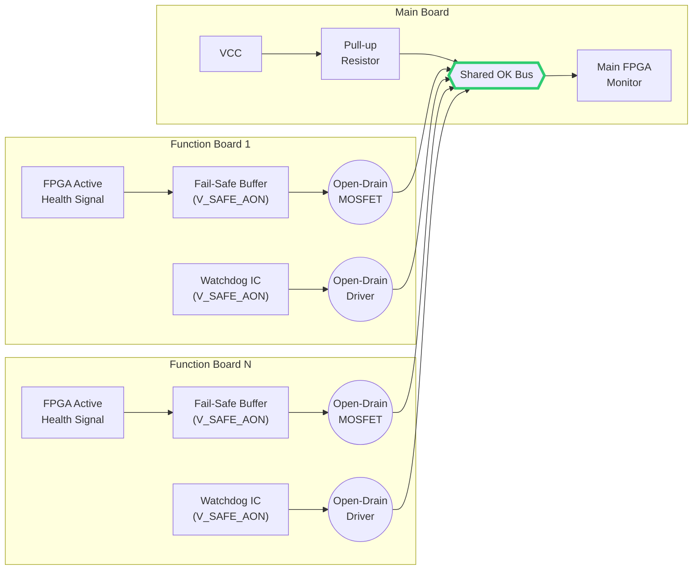

# ADR-001: Board Health Detection and Fault Visibility Strategy

**Status:** Resolved
**Last updated:** 2026-08-14

---

## Context

The system is a modular controller with one main board and multiple function boards across one or more backplanes. The core goal is:

> **A detected safety-relevant fault on any board must place the complete system in a safe state through a hardware interlock path that does not depend on host software.**

> **Core Decision:** Use two complementary paths: a passive copper loop for physical disconnects, and a shared open-drain `OK` bus for electronic/timing/software faults.

The failure modes to cover:

| # | Failure Mode | Description |
|---|---|---|
| F1 | Continuity loop broken | The passive continuity loop path is physically interrupted (board absent, cable/connector discontinuity, or equivalent open path), so `LOOP_IN` drops. |
| F2a | Brain dead (power/reset) | The FPGA/SoC loses its digital rails or is held in reset while `V_SAFE_AON` remains valid. |
| F2b | Brain dead (logic frozen) | The board logic brain is fully powered (driving outputs) but the firmware/clock has frozen and cannot execute logic. |
| F3 | Internal electronic fault | A board-local monitored fault is detected (e.g., over-current, over-temperature, PLL loss), and the board actively asserts the fault path. |
| F4 | OK driver damaged | The board fault-output driver path is damaged (typically stuck open), so a local fault may fail to propagate onto the shared interlock bus. |
| F5 | CLOCK timing-path fault | The distributed timing path is invalid (missing/invalid `CLOCK` and/or failure in downstream divider/pet generation). |
| F6 | Loss of local safety-support power | An active board loses `V_SAFE_AON`, the local supply that powers its watchdog, fail-safe driver, relay-reset path, and safety-supply supervisor. |

The table above defines the hardware fault taxonomy only. Detection paths and propagation behavior are defined in `R1`-`R9` below and in ADR-003/ADR-004. Supervisory interlock events (armed host-supervision timeout) are a separate category defined in R10 below.

**Taxonomy note on F6:** `V_SAFE_AON` is defined in R9. Its held-up voltage supervisor asserts a direct open-drain `OK` contribution before the local safety hardware loses operating power. Physical removal or connector discontinuity is also detected by the passive continuity loop (F1). Loss of an FPGA/processor rail while `V_SAFE_AON` remains valid is F2a, not F6.

**Fault detection and response summary:**

| # | Failure Mode | Detected By | Propagated Via | Safety Action / Diagnostic |
|:---|:---|:---|:---|:---|
| **F1** | Continuity loop broken | Main board (`LOOP_IN` drops) | Main latches fault and pulls `OK` LOW | All boards → `ERROR.run` |
| **F2a** | Brain dead (power/reset) | Fail-safe hardware buffer/path | Local fail-safe driver pulls `OK` LOW | All boards → `ERROR.run` |
| **F2b** | Brain dead (logic frozen) | External hardware watchdog | Watchdog pulls `OK` LOW | All boards → `ERROR.run`; watchdog evidence retained |
| **F3** | Internal electronic fault | FPGA logic / sensors | Faulty board pulls `OK` LOW | All boards → `ERROR.run` |
| **F4** | OK driver damaged | Board self-read / host verification | Ethernet telemetry / maintenance test | Detected during maintenance or when loopback fails at fault assertion |
| **F5** | CLOCK / pet-path fault | Independent clock-activity monitor and external watchdog | Clock-loss trip or watchdog pulls `OK` LOW, whichever occurs first | All boards → `ERROR.run`; enough evidence retained to distinguish clock loss from watchdog-only activation |
| **F6** | Loss of local `V_SAFE_AON` | Local safety-supply supervisor; passive loop if physically disconnected | Held-up supervisor pulls `OK` LOW; loop break also trips through main | All boards → `ERROR.run`; normally-open relay also de-energizes if local power disappears |
| **S1** | Armed host-supervision timeout | Board-local supervision timer | Timed-out board pulls `OK` LOW | All boards → `ERROR.run` |

**Taxonomy separation:** F1–F6 are hardware faults. S1 is a supervisory interlock event active only while armed (`EN=1`). Both use the same physical trip path (`OK` LOW → `ERROR.run`), but their root causes and active conditions differ. See R10.

---

## Considered and Rejected

### Active SSR loop

Each board places a solid-state relay in the loop path, driven by the board's FPGA. Would have covered both F2a/F2b brain-dead cases.

**Rejected because:**
- If the SSR is tied to FSM state, a fault causes all boards to drop their SSRs, breaking the loop permanently — a system-wide latch with no recovery path
- If the SSR is independent of FSM state, it adds a strict guardrail that is easy to violate in firmware
- Series on-resistance of SSRs accumulates across the chain, limiting the number of boards
- Startup sequencing becomes complex (loop open during FPGA boot)

The added complexity is not justified. KISS principle applies.

---

## Resolved Constraints

### R1: Both a passive continuity loop and the open-drain OK bus are required

They are complementary — neither alone covers all failure modes:

| Signal | F1: Loop broken | F2a: Brain dead (power/reset) | F2b: Brain dead (logic frozen) | F3: Electronic fault | F4: Driver damaged | F5: CLOCK/pet-path fault | F6: input power lost |
|---|---|---|---|---|---|---|---|
| OK bus (FPGA registered fault-driver path) | No | No | No | Yes | No | Yes (via independent clock monitor) | No |
| Fail-safe power/reset path -> OK bus | No | Yes | No | No | No | No | No |
| Passive loop (PCB trace) | Yes | No | No | No | No | No | No |
| OK bus + fail-safe + hardware watchdog | No | Yes | Yes | Yes | No | Yes | No |
| Cascaded external watchdog path → OK bus | No | No | Yes | No | No | Yes (via hardware timeout) | No |
| OK loopback + Ethernet report | No | No | No | No | Yes (slow) | No | No |
| Shared connector discontinuity -> F1 path | No | No | No | No | No | No | Yes (connector/cable discontinuity case) |
| Safety-supply supervisor + hold-up -> OK bus | No | No | No | No | No | No | Yes |
| **Combined** | **Yes** | **Yes** | **Yes** | **Yes** | **Yes (maintenance detection)** | **Yes** | **Yes** |

### R2: OK bus behavior

The `OK` bus is open-drain (wired-AND) with one pull-up resistor on the main board. Function boards never pull up `OK`; they only pull it low. When all boards are healthy, `OK` stays HIGH passively. Any board with an internal fault (F3) pulls `OK` LOW. Faults that do not naturally drive the bus are explicitly converted to LOW by dedicated paths: F1 (continuity loop broken) via main-board `LOOP_IN -> OK` conversion (R4), F2a (brain dead, power/reset) via the local fail-safe path, F2b (brain dead, logic frozen) via watchdog timeout (R5), and F6 via the local safety-supply supervisor (R9). Compatible open-drain power-good outputs from the backplane utility converters also contribute directly to this bus as defined in ADR-005.

```mermaid
flowchart LR
    subgraph Main ["Main Board"]
        VCC["VCC"] --> PULLUP["Pull-up\nResistor"]
        PULLUP --> OK_BUS
        OK_BUS --> MON["Main FPGA\nMonitor"]
    end

    subgraph FB1 ["Function Board 1"]
        FPGA1["FPGA Active\nHealth Signal"] --> FS1["Fail-Safe Buffer\n(V_SAFE_AON)"]
        FS1 --> MOS1(("Open-Drain\nMOSFET"))
        WD1["Watchdog IC\n(V_SAFE_AON)"] --> WD1_OD(("Open-Drain\nDriver"))
        MOS1 --> OK_BUS
        WD1_OD --> OK_BUS
    end

    subgraph FB2 ["Function Board N"]
        FPGA2["FPGA Active\nHealth Signal"] --> FS2["Fail-Safe Buffer\n(V_SAFE_AON)"]
        FS2 --> MOS2(("Open-Drain\nMOSFET"))
        WD2["Watchdog IC\n(V_SAFE_AON)"] --> WD2_OD(("Open-Drain\nDriver"))
        MOS2 --> OK_BUS
        WD2_OD --> OK_BUS
    end

    OK_BUS{{"Shared OK Bus"}}

    style OK_BUS stroke:#2ECC71,stroke-width:4px
```

All healthy: every MOSFET is off, pull-up holds OK HIGH. Any single board turning on its MOSFET (FPGA fault or watchdog timeout) pulls the entire bus LOW — all boards see the fault simultaneously.

**Hardware Fail-Safe Constraint (Normative):**
The physical path between FPGA and `OK` bus must be fail-safe. If the FPGA loses configuration, is held in reset, or loses digital rail power (I/O floats or drops to 0V), the path must inherently turn ON and pull `OK` LOW.

- The FPGA must actively drive a signal (e.g., logic HIGH) to declare health and keep the driver in a high-impedance (Hi-Z) state.
- Relying on an active signal from the FPGA to assert a fault is prohibited.
- **Power supply independence and isolation:** The fail-safe driver circuit shall use `V_SAFE_AON` as defined by R9. It shall not use FPGA/processor rails or the shared `+3.3V_DIG_AUX` rail and shall not back-power FPGA I/O pins when FPGA rails are down.

This ensures an FPGA power/reset collapse (F2a) trips the interlock without waiting for watchdog timeout. Loss of `V_SAFE_AON` is separately classified as F6 and handled by R9.

### R3: Passive loop behavior

A PCB trace routed through every backplane slot and across all inter-backplane extension cables. The main board drives one end (LOOP_OUT) and reads the return (LOOP_IN). Any physical interruption (F1) breaks the trace and LOOP_IN drops.

### R4: Main board converts loop breaks to the OK bus via registered FPGA logic

Function boards do not monitor loop continuity directly. They only observe `OK` and `EN`. The main board converts `LOOP_IN` status into `OK` behavior inside FPGA fabric.

**FPGA logic is allowed in the OK safety path.** Synthesized FPGA logic (combinational/registered) is deterministic and acceptable here. Firmware running on a softcore is not allowed because it can hang or be delayed.

| Logic type | Allowed in OK path | Reason |
|---|---|---|
| FPGA registered logic (flip-flop) | Yes | Deterministic, glitch-free |
| FPGA combinational logic (internal) | Yes, but must feed a register before the OK driver | Glitches filtered by the output register |
| FPGA firmware / softcore | No | Can hang, schedule-dependent |
| External discrete logic | Yes | Fully independent of FPGA |

**The OK open-drain driver must be registered, not raw combinational logic.** Raw combinational paths can glitch while signals settle through unequal delays. Because `OK` is shared across all boards, one glitch can briefly pull the whole system LOW and cause a false global ERROR. Registering the output filters this: only faults present at a clock edge are asserted.

**Loop-break (F1) handling sequence:**

1. **Detection & Latching:** If `LOOP_IN` drops, the main board sets the loop-break source bit (`fault_vector[F1_LOOP_BREAK]`, level-sensitive set).
2. **Propagation:** This asserts `local_trip_summary` and pulls `OK` LOW through the registered hardware interlock path without intentional firmware delay. Detection, FPGA propagation, bus propagation, relay release, and analog settling budgets are verified in the system safety analysis and board design.
3. **Fleet-wide Visibility:** All boards see `OK` drop simultaneously — the exact same mechanism as F3 (internal electronic fault). This intentionally eliminates the need for function boards to monitor the loop directly.
4. **Clear Semantics:** Clearing follows ADR-003 R6: the F1 bit in `fault_vector` is primed to `0` on `ERROR.clear` entry and re-sets immediately while `LOOP_IN` remains unhealthy (level-sensitive set); `local_trip_summary` releases only at the successful `ERROR.clear → START.wait` boundary. Net effect: the fault cannot clear while the loop is still broken, and intermittent connector bounces cannot self-clear.

ADR-003 R5 owns canonical interlock logic (`ok_fault`, relay fast-open/slow-close behavior, and the injected-fault-authorized `OK` assertion path); this ADR defines the physical fault sources that feed it.

Per-failure detection and propagation are summarized once in the **fault detection and response summary** table in the Context section and are intentionally not repeated here.

**Classification note:** If connector/cable discontinuity causes `LOOP_IN` to drop, the interlock trigger is F1. If diagnostics also confirm loss of safety-support power, both F1 and F6 may be reported as contributing causes.
**Detector note:** For F5, the failure mode is the `CLOCK -> divider -> pet` timing path becoming invalid. Post-qualification diagnostics retain independent clock-loss and watchdog-activation evidence so the host can classify the root cause after the system has safely tripped. See R6.

### R5: Hardware watchdog and cross-domain pet generation

F2a (digital-rail loss/reset collapse) is handled by the fail-safe `OK` driver rule in R2. F2b is different: the board remains powered, but logic/clock/firmware freezes and may keep stale "healthy" outputs. To detect F2b, each board uses a hardware watchdog. If FPGA petting stops, the watchdog pulls `OK` LOW so all boards trip through the existing interlock path.

**Design (normative):**
- Every board (main and function) must implement a dedicated external hardware watchdog IC whose timeout output can independently pull `OK` LOW.
- The watchdog IC and its open-drain `OK` driver shall be powered from `V_SAFE_AON` as defined in R9, independently of FPGA digital rails.
- The watchdog-to-`OK` interlock path is intentionally **not** hardware-latched. When valid petting resumes and timeout clears, the watchdog output may release `OK`.
- **Cross-domain pet liveness (required):** Valid pet transitions must cease if *either* the management clock domain *or* the timing clock domain stops — a frozen management FSM and a missing timing clock must both starve the watchdog. The reference pattern (non-normative) is a cascaded pet source: the safety FSM emits a continuous toggle in the management domain (`wd_pet_toggle_mgmt`, board-local independent oscillator), and the role-specific timing-domain clock synchronously samples that toggle before driving the watchdog pet pin. Alternative implementations are acceptable if they preserve the same two-domain liveness property.
- **Timing-domain source by board role:**
  1. Main board: sample using the raw external `CLOCK` source domain (the same domain monitored by `main_clock_edge_detected()` in ADR-003).
  2. Function boards: sample using the dedicated watchdog divider (÷M from the 2 MHz baseline) derived from distributed backplane `CLOCK` (ADR-004 R4).
- **Watchdog status indication:** The external watchdog must provide a status indication that the board can retain for diagnostics, separate from the shared `OK` bus. The shared bus is wired-AND and cannot identify which source pulled it LOW.
- An FPGA-internal watchdog may be used in combination with the external one for defense in depth.

**Power supply requirement:** The watchdog, fail-safe output stages, and relay-reset path use `V_SAFE_AON`. R9 owns the supply definition and its collapse-detection behavior.

**Secondary detection via Ethernet:** If a board stops responding to polls, the host can infer brain-dead behavior. This is diagnostic only and is not the primary interlock protection.

The supporting watchdog/clock-monitor diagram is kept in [ADR-001_fault_detection_reference.md](reference/ADR-001_fault_detection_reference.md).

### R6: Clock-loss and watchdog diagnostic differentiation

Each board retains enough evidence for the host to classify the root cause *after* the system has safely tripped into `ERROR.run`. Hardware safety (pulling `OK` LOW) and software diagnostics (classifying the fault) are decoupled; classification is not a prerequisite for entering the safe state.

**Normative diagnostic behavior:**

- A function board uses its independent management clock to monitor activity of the distributed 100 MHz `CLOCK`. Detected loss both enters the normal local trip path and records clock-loss evidence.
- The main board similarly monitors its external clock source and records a clock-source fault.
- Every board records whether its external watchdog activated, using a dedicated local status indication rather than attempting to infer this from the shared wired-AND bus.
- Clock-loss and watchdog evidence are retained through `ERROR.run` and cleared only through the recovery semantics defined by ADR-003. The exact bit names and register organization are implementation details.

**F5 (CLOCK/pet-path fault) / F2b (brain dead, logic frozen) diagnostic interpretation:**

After the system trips into `ERROR.run`, the host reads the diagnostic latches via Ethernet and applies the following truth table:

| Clock-loss evidence | Watchdog-activation evidence | Ethernet | Classification | Root Cause |
|---|---|---|---|---|
| 1 | 1 | Responding | **F5** | CLOCK loss cascaded into pet-path stop → watchdog also tripped |
| 1 | 0 | Responding | **F5** | Clock monitor caught CLOCK loss before watchdog timeout expired |
| 0 | 1 | Responding | **F2b** | Distributed CLOCK is healthy; FPGA logic/pet-path frozen |
| 0 | 0 | Responding | **No local timing-path fault** | Board entered ERROR due to another board's `OK` assertion, or tripped itself via S1. Read the full `fault_vector` per R10. |
| X | X | Unresponsive | **F2a** (or severe F2b) | Board completely dead; fail-safe path or watchdog pulled `OK` LOW |

**Scope note:** This table classifies hardware fault modes (F1–F6) only. For boards reporting `(0, 0, Responding)`, read the full `fault_vector` to differentiate S1 (dedicated S1 bit set, R10) from "dragged into ERROR by another board" (`fault_vector == 0`).

**Corrective action:** If clock-loss evidence is set, restore distributed `CLOCK` first, then inspect divider/pet-path integrity. If only watchdog evidence is set, investigate FPGA logic and the pet-signal path.

Key properties:
- The clock monitor runs on the independent local management clock and its clock-loss result participates in the normal trip path.
- The watchdog indication is diagnostic; the external watchdog already owns its independent physical path to `OK`.

---

### R7: F4 (OK driver damaged) is mitigated by certified component selection and detected via OK loopback

**Primary mitigation — quantified driver reliability:** The probability of F4 must be quantifiably low, and the board design package must record the supporting reliability argument. The default way to demonstrate this is selecting a driver IC from a safety-certified portfolio with a published FIT rate (Failures In Time, per 10⁹ hours; relevant standards are IEC 61508 and ISO 26262), but an equivalent documented argument — for example, a discrete open-drain stage with established reliability data — is acceptable. Full certification of the system to these standards is not required.

**Secondary detection — OK loopback at fault time:** When a real fault — F3 (internal electronic fault) — occurs, the board asserts its driver and immediately reads OK back. If OK remains HIGH, the driver is broken — F4 (OK driver damaged) — and the board reports it via Ethernet telemetry. F3 + F4 simultaneously is the dangerous combination: a real fault occurs but is not propagated, leaving the system running in a damaged state. The Ethernet report must alert the operator immediately.

**Proactive detection — injected-fault verification in `ERROR.run`:** F4 is verified using host-controlled `set_injected_fault` / `clear_injected_fault` commands without a dedicated FSM test state. Verification begins from `IDLE` with an intentional trip; remaining boards are tested sequentially while latched in `ERROR.run` with no CLEAR pulse until all boards pass. This promotes F4 from "only detectable at fault time" to "proactively testable at any time."

Normative command semantics and legal state windows are defined in ADR-003 R7 (F4 Driver Verification). The full step-by-step host-side verification sequence is defined in the system ICD.

**Implication:** F4 is kept as a documented failure mode because it justifies the certified component selection requirement, the OK loopback verification, and the injected-fault maintenance verification procedure. Without F4, none of these design decisions have a recorded rationale.

---

### R8: Empty slots and inter-backplane extension require specific continuity loop handling

Two slot conditions affect continuity-loop behavior and must be handled explicitly:

**Passive terminator (truly empty slot)**
A simple passive PCB bridges the continuity-loop pins through the connector so unused slots stay in-circuit. No power is required. Without this terminator, an empty slot breaks the loop and permanently reports F1.

**Bridge board (inter-backplane extension)**
A bridge board extends signals to a secondary backplane. The continuity loop remains one series circuit and must physically return to main `LOOP_IN`. The bridge board must carry both directions:

- Forwards the outgoing loop signal (LOOP_OUT side) to the secondary backplane
- Returns the loop signal from the secondary backplane back toward the main (LOOP_IN side)
- Physically extends the unbuffered wired-AND `OK` bus to the secondary backplane (secondary open-drain drivers pull directly against the same single main-board pull-up resistor)

Loop continuity signals are passive copper paths driven only by the main board. The bridge board carries `LOOP_OUT` and `LOOP_IN` as traces and does not need power to conduct them. Therefore:

- **Cable severance** breaks the copper path → LOOP_IN drops → main detects F1.
- **Bridge board power loss** does not break the loop because the passive traces still conduct. Its `V_SAFE_AON` supervisor therefore asserts `OK` during local power collapse, as required by R9.

Route the loop so the full return path physically traverses the extension cable and bridge connector on the way back to main. This guarantees cable severance is detected as F1.

Active signal replication (SYNC, CLOCK, EN, CLEAR) on the secondary backplane may be performed by the bridge board, but those signals are outside the scope of the continuity loop.

**Hot-swap stance (normative):** Live insertion or removal of boards is not supported. Removing or inserting a board necessarily interrupts the continuity loop and trips F1 — by design. Board replacement is a service action performed with the system latched in `ERROR` or powered down. "Hot-plug" references in ADR-005 (connector inrush, contact sequencing) concern electrical robustness of the mating event, not operational hot-swap.

LVDS clock forwarding and board identification concerns are outside the scope of this ADR.

The supporting continuity-loop routing diagram is kept in [ADR-001_fault_detection_reference.md](reference/ADR-001_fault_detection_reference.md).

---

### R9: Every active board has one local always-on safety supply

Every active board shall derive one low-power local safety supply named `V_SAFE_AON` from its received `+12V_RAW`. `V_SAFE_AON` is not a backplane-distributed utility rail and shall not power the FPGA, processor, memory, analog signal chain, or detector load. It supplies only the independent safety hardware: the external watchdog, fail-safe `OK` driver, relay-reset circuitry where applicable, and the local safety-supply supervisor. Passive terminators do not implement this supply.

A hardware voltage supervisor shall monitor `V_SAFE_AON`. Its open-drain output shall connect directly to the shared `OK` bus without passing through the FPGA. While `V_SAFE_AON` is valid, the supervisor releases `OK`; below the valid threshold, it pulls `OK` LOW.

The supervisor and its open-drain output stage shall receive short-term energy from a diode-isolated hold-up capacitor. The stored energy is not intended to keep the board operational. It only keeps the fault-reporting path alive long enough to assert `OK` and allow the fleet interlock to trip and latch safe. The isolation shall prevent the hold-up capacitor from back-powering the failed `V_SAFE_AON` node.

This single monitor covers loss of the board's `+12V_RAW` contact or branch and failure of the local safety regulator. If FPGA/processor power fails while `V_SAFE_AON` remains valid, the fail-safe driver or watchdog covers F2 instead. If the board is physically removed or the continuity path opens, F1 also trips. Complete power loss ultimately de-energizes the normally-open relay.

The board hardware design specification shall define the actual safety-supply voltage, supervisor threshold and tolerance, hold-up capacitance, isolation and discharge paths, operating-temperature limits, and verified time budget. Board telemetry may report `+12V_RAW`, `V_SAFE_AON`, and other local rails while logic remains powered, but telemetry does not replace the direct supervisor-to-`OK` path.

The supporting diagram is kept in [ADR-001_fault_detection_reference.md](reference/ADR-001_fault_detection_reference.md).

---

### R10: S1 is an armed host-supervision interlock event

S1 is classified separately from the hardware fault taxonomy (F1–F6):

| Property | F1–F6 (hardware faults) | S1 (supervisory) |
|---|---|---|
| Root cause | Physical/electrical failure | Host communication loss |
| Active condition | Always (any FSM state) | Only while armed (`EN=1`) |
| Detection mechanism | Hardware (loops, watchdogs, sensors) | Software/protocol (Ethernet lease timer) |

ADR-003 owns the host-supervision timer, qualifying interaction, response, timeout, trip, and clear behavior. At the fault-taxonomy level, S1 means that an armed board detected loss of valid host supervision, recorded the S1 diagnostic source, and used its normal local trip path to pull `OK` LOW. ADR-006 defines how acquisition traffic interacts with this rule.

Host supervision is not the primary protection for a frozen main board. The external watchdog path defined in R5 independently pulls `OK` LOW; host supervision cannot override a hardware interlock assertion.

**Diagnostic differentiation in ERROR.run:** Diagnosis is uniform — the host reads `fault_vector` over Ethernet:

| `fault_vector` | Ethernet | Classification |
|---|---|---|
| S1 bit set | Responding | **S1** — host-supervision timeout while armed |
| Any other bit set | Responding | Hardware fault (F1–F6); classify per R6 truth table |
| `fault_vector == 0` | Responding | No local fault — dragged into ERROR by another board |
| X | Unresponsive | F2a or severe F2b — board dead |

S1 intentionally uses the same physical trip path as F1–F6 even though its root cause is supervisory rather than hardware.

---

## Decision

Resolved. All failure modes in the hardware taxonomy (F1, F2a/F2b, F3, F4, F5, F6) and the supervisory interlock event (S1) are covered. F1–F5 use the passive continuity loop, shared open-drain `OK` bus, fail-safe FPGA-to-OK path, external hardware watchdog, independent clock monitor, retained diagnostic evidence, registered FPGA logic, and reliable open-drain components. F6 is covered by the held-up `V_SAFE_AON` supervisor and by the F1 loop when physical continuity is lost. S1 is covered by board-local host-supervision timers pulling `OK` LOW when host communication is lost while armed.

Board identification and host inventory are configuration concerns, not health or fault detection concerns. They are out of scope for this ADR and are addressed in ADR-002.

---

## Consequences

- Every active board shall include an `OK` open-drain contribution and continuity-loop routing; passive terminators provide continuity-loop routing only.
- The main board FPGA implementation must keep the OK output registered to avoid glitch-induced global trips.
- Every active board requires a fail-safe FPGA-to-OK driver path, an external watchdog path to `OK`, and one local `V_SAFE_AON` supervisor with isolated hold-up energy. These safety elements use `V_SAFE_AON`; processors and FPGAs do not.
- Each function board additionally requires an independent management-domain clock-activity monitor whose detected clock loss enters the normal trip path, plus retained clock/watchdog evidence and F4 loopback diagnostics.
- F6 is detected by the safety-supply supervisor even when connector continuity remains intact; physical removal also invokes the F1 path.
