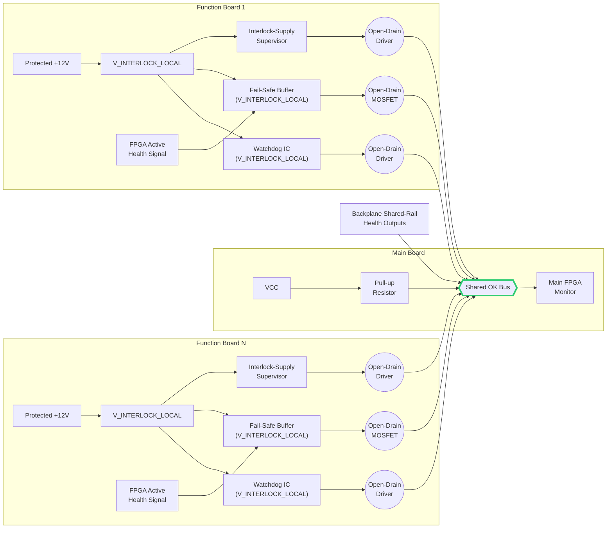

# ADR-001: Board Health Detection and Fault Visibility Strategy

**Status:** Resolved
**Last updated:** 2026-08-16

---

## Context

The system is a modular controller with one main board and multiple function boards across one or more backplanes. The core goal is:

> **A detected safety-relevant fault on any board must place the complete system in a safe state through a hardware interlock path that does not depend on host software.**

> **Core Decision:** Use two complementary paths: a passive copper loop for physical disconnects, and a shared open-drain `OK` bus for electronic/timing/software faults.

The failure modes to cover:

| # | Failure Mode | Description |
|---|---|---|
| F1 | Continuity loop broken | The passive continuity loop path is physically interrupted (board absent, cable/connector discontinuity, or equivalent open path), so `LOOP_IN` drops. |
| F2a | Brain dead (power/reset) | The FPGA/SoC loses its digital rails or is held in reset while `V_INTERLOCK_LOCAL` remains valid. |
| F2b | Brain dead (logic frozen) | The board logic brain is fully powered (driving outputs) but the firmware/clock has frozen and cannot execute logic. |
| F3 | Internal electronic fault | A board-local monitored fault is detected (e.g., over-current, over-temperature, PLL loss), and the board actively asserts the fault path. |
| F4 | OK driver damaged | The board fault-output driver path is damaged (typically stuck open), so a local fault may fail to propagate onto the shared interlock bus. |
| F5 | CLOCK timing-path fault | The distributed timing path is invalid (missing/invalid `CLOCK` and/or failure in downstream divider/pet generation). |
| F6 | Loss of local interlock power | An active board loses `V_INTERLOCK_LOCAL`, the board-local supply that powers its watchdog, fail-safe driver, relay-reset path, and interlock-supply supervisor. |

The table above defines the hardware fault taxonomy only. Detection paths and propagation behavior are defined in `R1`-`R9` below and in ADR-003/ADR-004. Supervisory interlock events (armed host-supervision timeout) are a separate category defined in R10 below.

**Taxonomy note on F6:** `V_INTERLOCK_LOCAL` is defined in R9. Its hardware power-loss reporting path asserts a direct open-drain `OK` contribution before the local interlock hardware loses operating power. Physical removal or connector discontinuity is also detected by the passive continuity loop (F1). Loss of an FPGA/processor rail while `V_INTERLOCK_LOCAL` remains valid is F2a, not F6.

**Fault detection and response summary:**

| # | Failure Mode | Detected By | Propagated Via | Safety Action / Diagnostic |
|:---|:---|:---|:---|:---|
| **F1** | Continuity loop broken | Main board (`LOOP_IN` drops) | Main latches fault and pulls `OK` LOW | All boards → `ERROR.run` |
| **F2a** | Brain dead (power/reset) | Fail-safe hardware buffer/path | Local fail-safe driver pulls `OK` LOW | All boards → `ERROR.run` |
| **F2b** | Brain dead (logic frozen) | External hardware watchdog | Watchdog pulls `OK` LOW | All boards → `ERROR.run`; watchdog evidence retained |
| **F3** | Internal electronic fault | FPGA logic / sensors | Faulty board pulls `OK` LOW | All boards → `ERROR.run` |
| **F4** | OK driver damaged | Board self-read / host verification | Ethernet telemetry / maintenance test | Detected during maintenance or when loopback fails at fault assertion |
| **F5** | CLOCK / pet-path fault | Independent clock-activity monitor and external watchdog | Clock-loss trip or watchdog pulls `OK` LOW, whichever occurs first | All boards → `ERROR.run`; enough evidence retained to distinguish clock loss from watchdog-only activation |
| **F6** | Loss of local `V_INTERLOCK_LOCAL` | Local interlock-supply supervisor; passive loop if physically disconnected | Supervisor reporting path pulls `OK` LOW while able; loop break also trips through main | All boards → `ERROR.run`; normally-open relay also de-energizes if local power disappears |
| **S1** | Armed host-supervision timeout | Board-local supervision timer | Timed-out board pulls `OK` LOW | All boards → `ERROR.run` |

**Taxonomy separation:** F1–F6 are hardware faults. S1 is a supervisory interlock event active only while armed (`EN=1`). Both use the same physical trip path (`OK` LOW → `ERROR.run`), but their root causes and active conditions differ. See R10.

---

## Considered and Rejected

### Active SSR loop

Each board places a solid-state relay in the loop path, driven by the board's FPGA. Would have covered both F2a/F2b brain-dead cases.

**Rejected because:**
- If the SSR is tied to FSM state, a fault causes all boards to drop their SSRs, breaking the loop permanently — a system-wide latch with no recovery path
- If the SSR is independent of FSM state, it adds a strict guardrail that is easy to violate in firmware
- Series on-resistance of SSRs accumulates across the chain, limiting the number of boards
- Startup sequencing becomes complex (loop open during FPGA boot)

The added complexity is not justified. KISS principle applies.

---

## Resolved Constraints

### R1: Both a passive continuity loop and the open-drain OK bus are required

They are complementary — neither alone covers all failure modes:

| Signal | F1: Loop broken | F2a: Brain dead (power/reset) | F2b: Brain dead (logic frozen) | F3: Electronic fault | F4: Driver damaged | F5: CLOCK/pet-path fault | F6: input power lost |
|---|---|---|---|---|---|---|---|
| OK bus (local fault-driver path) | No | No | No | Yes | No | Yes (via independent clock monitor) | No |
| Fail-safe power/reset path -> OK bus | No | Yes | No | No | No | No | No |
| Passive loop (PCB trace) | Yes | No | No | No | No | No | No |
| OK bus + fail-safe + hardware watchdog | No | Yes | Yes | Yes | No | Yes | No |
| Cascaded external watchdog path → OK bus | No | No | Yes | No | No | Yes (via hardware timeout) | No |
| OK loopback + Ethernet report | No | No | No | No | Yes (slow) | No | No |
| Shared connector discontinuity -> F1 path | No | No | No | No | No | No | Yes (connector/cable discontinuity case) |
| Interlock-supply power-loss reporting -> OK bus | No | No | No | No | No | No | Yes |
| **Combined** | **Yes** | **Yes** | **Yes** | **Yes** | **Yes (maintenance detection)** | **Yes** | **Yes** |

### R2: OK bus behavior

The `OK` bus is open-drain (wired-AND) with one pull-up resistor on the main board. Function boards never pull up `OK`; they only pull it low. When all boards are healthy, `OK` stays HIGH passively. Any board with an internal fault (F3) pulls `OK` LOW. Faults that do not naturally drive the bus are explicitly converted to LOW by dedicated paths: F1 (continuity loop broken) via main-board `LOOP_IN -> OK` conversion (R4), F2a (brain dead, power/reset) via the local fail-safe path, F2b (brain dead, logic frozen) via watchdog timeout (R5), and F6 via the local interlock-supply supervisor (R9). Qualified rail-health outputs for shared backplane power also contribute directly to this bus as defined in ADR-005.

The power and liveness paths are deliberately separate:

| Path | Location | What it detects | Clarification |
|---|---|---|---|
| Shared rail-health output | Backplane board | Invalid protected `+12V` or common utility rail | May use a verified native converter PGOOD or a dedicated voltage supervisor. |
| Interlock-supply supervisor | Each active board | Collapse of that board's `V_INTERLOCK_LOCAL` | Hardware reporting remains valid long enough to trip the fleet; it is not the watchdog. |
| Fail-safe power/reset path | Each active board | FPGA/processor rail loss or reset collapse while `V_INTERLOCK_LOCAL` remains valid | Uses interlock-powered hardware so it does not depend on the failed digital rail. |
| External watchdog | Each active board | Missing pet transitions caused by frozen logic or an invalid clock/pet path | A liveness monitor, not a converter PGOOD or voltage monitor. |
| Board-specific local monitor | Only where required | A safety-relevant local rail or hazardous output outside the coverage above | Enters the board's normal local-fault path; every local converter need not be monitored. |

```mermaid
flowchart LR
    subgraph Main ["Main Board"]
        VCC["VCC"] --> PULLUP["Pull-up\nResistor"]
        PULLUP --> OK_BUS
        OK_BUS --> MON["Main FPGA\nMonitor"]
    end

    subgraph FB1 ["Function Board 1"]
        RAW1["Protected +12V"] --> VINT1["V_INTERLOCK_LOCAL"]
        VINT1 --> SUP1["Interlock-Supply\nSupervisor"]
        VINT1 --> FS1
        VINT1 --> WD1
        SUP1 --> SUP1_OD(("Open-Drain\nDriver"))
        FPGA1["FPGA Active\nHealth Signal"] --> FS1["Fail-Safe Buffer\n(V_INTERLOCK_LOCAL)"]
        FS1 --> MOS1(("Open-Drain\nMOSFET"))
        WD1["Watchdog IC\n(V_INTERLOCK_LOCAL)"] --> WD1_OD(("Open-Drain\nDriver"))
        SUP1_OD --> OK_BUS
        MOS1 --> OK_BUS
        WD1_OD --> OK_BUS
    end

    subgraph FB2 ["Function Board N"]
        RAW2["Protected +12V"] --> VINT2["V_INTERLOCK_LOCAL"]
        VINT2 --> SUP2["Interlock-Supply\nSupervisor"]
        VINT2 --> FS2
        VINT2 --> WD2
        SUP2 --> SUP2_OD(("Open-Drain\nDriver"))
        FPGA2["FPGA Active\nHealth Signal"] --> FS2["Fail-Safe Buffer\n(V_INTERLOCK_LOCAL)"]
        FS2 --> MOS2(("Open-Drain\nMOSFET"))
        WD2["Watchdog IC\n(V_INTERLOCK_LOCAL)"] --> WD2_OD(("Open-Drain\nDriver"))
        SUP2_OD --> OK_BUS
        MOS2 --> OK_BUS
        WD2_OD --> OK_BUS
    end

    BP["Backplane Shared-Rail\nHealth Outputs"] --> OK_BUS

    OK_BUS{{"Shared OK Bus"}}

    style OK_BUS stroke:#2ECC71,stroke-width:4px
```

All healthy: every open-drain contribution is released, so the pull-up holds `OK` HIGH. Any rail-health, supervisor, fail-safe, watchdog, or local-fault contribution pulling LOW trips the shared bus so every board enters the safe response.

**Hardware Fail-Safe Constraint (Normative):**
The physical path between FPGA and `OK` bus must be fail-safe. If the FPGA loses configuration, is held in reset, or loses digital rail power (I/O floats or drops to 0V), the path must inherently turn ON and pull `OK` LOW.

- The FPGA must actively drive a signal (e.g., logic HIGH) to declare health and keep the driver in a high-impedance (Hi-Z) state.
- Relying on an active signal from the FPGA to assert a fault is prohibited.
- **Power supply independence and isolation:** The fail-safe driver circuit shall use `V_INTERLOCK_LOCAL` as defined by R9. It shall not use FPGA/processor rails or the shared `+3.3V_DIG_AUX` rail and shall not back-power FPGA I/O pins when FPGA rails are down.

This ensures an FPGA power/reset collapse (F2a) trips the interlock without waiting for watchdog timeout. Loss of `V_INTERLOCK_LOCAL` is separately classified as F6 and handled by R9.

### R3: Passive loop behavior

A PCB trace routed through every backplane slot and across all inter-backplane extension cables. The main board drives one end (LOOP_OUT) and reads the return (LOOP_IN). Any physical interruption (F1) breaks the trace and LOOP_IN drops.

### R4: Main board converts loop breaks to the OK bus through deterministic hardware logic

Function boards do not monitor loop continuity directly. They only observe `OK` and `EN`. The main board converts `LOOP_IN` status into `OK` behavior inside FPGA fabric.

Synthesized FPGA logic or external hardware may perform this conversion, but processor software shall not be the safety path. The output shall be deterministic and resistant to glitches so normal signal settling cannot create a false global trip. A registered output is a normal implementation, not the only permitted one.

If `LOOP_IN` becomes unhealthy, main shall retain diagnostic evidence and assert its `OK` contribution without intentional software delay. The contribution cannot be released through recovery while the loop remains broken. Exact latches, register names, and clear sequencing belong to the firmware design specification; ADR-003 owns the externally visible recovery behavior.

Per-failure detection and propagation are summarized once in the **fault detection and response summary** table in the Context section and are intentionally not repeated here.

**Classification note:** If connector/cable discontinuity causes `LOOP_IN` to drop, the interlock trigger is F1. If diagnostics also confirm loss of local interlock power, both F1 and F6 may be reported as contributing causes.
**Detector note:** For F5, the failure mode is the `CLOCK -> divider -> pet` timing path becoming invalid. Post-qualification diagnostics retain independent clock-loss and watchdog-activation evidence so the host can classify the root cause after the system has safely tripped. See R6.

### R5: Hardware watchdog and two-domain liveness

F2a (digital-rail loss/reset collapse) is handled by the fail-safe `OK` driver rule in R2. F2b is different: the board remains powered, but logic/clock/firmware freezes and may keep stale "healthy" outputs. To detect F2b, each board uses a hardware watchdog. If FPGA petting stops, the watchdog pulls `OK` LOW so all boards trip through the existing interlock path.

Every active board shall implement an external hardware watchdog whose timeout can independently pull `OK` LOW. It and its output path use `V_INTERLOCK_LOCAL`, independently of FPGA/processor rails.

Valid watchdog petting shall demonstrate progress of both the management/safety logic and the board's required timing/pet path. Petting shall stop if either path stops progressing. The exact pet frequency, divider ratios, cross-domain logic, and signal names belong to the firmware and hardware design specifications. The cascaded toggle-and-sample circuit in the reference document is one compliant implementation.

Each board shall retain watchdog-activation evidence separately from the shared wired-AND bus. An internal watchdog may be added for defense in depth but does not replace the external path.

The watchdog detects missing activity; it is not the power-good monitor for `V_INTERLOCK_LOCAL`. The watchdog output may release electrically when valid petting resumes, but ADR-003 keeps the system latched safe until explicit recovery.

**Secondary detection via Ethernet:** If a board stops responding to polls, the host can infer brain-dead behavior. This is diagnostic only and is not the primary interlock protection.

The supporting watchdog/clock-monitor diagram is kept in [ADR-001_fault_detection_reference.md](reference/ADR-001_fault_detection_reference.md).

### R6: Clock-loss and watchdog diagnostic differentiation

Each board retains enough evidence for the host to classify the root cause *after* the system has safely tripped into `ERROR.run`. Hardware safety (pulling `OK` LOW) and software diagnostics (classifying the fault) are decoupled; classification is not a prerequisite for entering the safe state.

**Normative diagnostic behavior:**

- A function board uses its independent management clock to monitor activity of the distributed 100 MHz `CLOCK`. Detected loss both enters the normal local trip path and records clock-loss evidence.
- The main board similarly monitors its external clock source and records a clock-source fault.
- Every board records whether its external watchdog activated, using a dedicated local status indication rather than attempting to infer this from the shared wired-AND bus.
- Clock-loss and watchdog evidence are retained through `ERROR.run` and cleared only through the recovery semantics defined by ADR-003. The exact bit names and register organization are implementation details.

**F5 (CLOCK/pet-path fault) / F2b (brain dead, logic frozen) diagnostic interpretation:**

After the system trips into `ERROR.run`, the host reads the diagnostic latches via Ethernet and applies the following truth table:

| Clock-loss evidence | Watchdog-activation evidence | Ethernet | Classification | Root Cause |
|---|---|---|---|---|
| 1 | 1 | Responding | **F5** | CLOCK loss cascaded into pet-path stop → watchdog also tripped |
| 1 | 0 | Responding | **F5** | Clock monitor caught CLOCK loss before watchdog timeout expired |
| 0 | 1 | Responding | **F2b** | Distributed CLOCK is healthy; FPGA logic/pet-path frozen |
| 0 | 0 | Responding | **No local timing-path fault** | Board entered ERROR due to another participant or a different locally reported event. Read its complete diagnostics. |
| X | X | Unresponsive | **F2a** (or severe F2b) | Board completely dead; fail-safe path or watchdog pulled `OK` LOW |

**Scope note:** This table classifies timing and liveness evidence only. Complete board diagnostics distinguish S1, another local fault, and a board that only observed the shared trip.

**Corrective action:** If clock-loss evidence is set, restore distributed `CLOCK` first, then inspect divider/pet-path integrity. If only watchdog evidence is set, investigate FPGA logic and the pet-signal path.

Key properties:
- The clock monitor runs on the independent local management clock and its clock-loss result participates in the normal trip path.
- The watchdog indication is diagnostic; the external watchdog already owns its independent physical path to `OK`.

---

### R7: F4 (OK driver damaged) is addressed by robust design and maintenance verification

The `OK` driver shall use components and ratings appropriate to the instrument environment and service life. The board hardware design shall document its behavior in powered, unpowered, reset, and relevant fault conditions. Quantitative reliability targets apply only when a project reliability allocation defines them; this ADR does not require a particular certification, component portfolio, or FIT value.

Every active board shall support a safe maintenance action that asserts its `OK` contribution while the host verifies that the shared bus goes LOW. Tests occur only while disarmed or already latched safe. Commands, sequencing, cadence, acceptance timing, and operator response belong to the system ICD and maintenance plan.

A board may also compare a commanded assertion with the observed bus and report a mismatch when communication remains available. This diagnostic support does not replace the maintenance test.

---

### R8: Empty slots and inter-backplane extension require specific continuity loop handling

Two slot conditions affect continuity-loop behavior and must be handled explicitly:

**Passive terminator (truly empty slot)**
A simple passive PCB bridges the continuity-loop pins through the connector so unused slots stay in-circuit. No power is required. Without this terminator, an empty slot breaks the loop and permanently reports F1.

**Bridge board (inter-backplane extension)**
A bridge board extends signals to a secondary backplane. The continuity loop remains one series circuit and must physically return to main `LOOP_IN`. The bridge board must carry both directions:

- Forwards the outgoing loop signal (LOOP_OUT side) to the secondary backplane
- Returns the loop signal from the secondary backplane back toward the main (LOOP_IN side)
- Physically extends the unbuffered wired-AND `OK` bus to the secondary backplane (secondary open-drain drivers pull directly against the same single main-board pull-up resistor)

Loop continuity signals are passive copper paths driven only by the main board. The bridge board carries `LOOP_OUT` and `LOOP_IN` as traces and does not need power to conduct them. Therefore:

- **Cable severance** breaks the copper path → LOOP_IN drops → main detects F1.
- **Bridge board power loss** does not break the loop because the passive traces still conduct. Its `V_INTERLOCK_LOCAL` supervisor therefore asserts `OK` during local power collapse, as required by R9.

Route the loop so the full return path physically traverses the extension cable and bridge connector on the way back to main. This guarantees cable severance is detected as F1.

Active signal replication (SYNC, CLOCK, EN, CLEAR) on the secondary backplane may be performed by the bridge board, but those signals are outside the scope of the continuity loop.

**Hot-swap stance (normative):** Live insertion or removal of boards is not supported. Removing or inserting a board necessarily interrupts the continuity loop and trips F1 — by design. Board replacement is a service action performed with the system latched in `ERROR` or powered down. "Hot-plug" references in ADR-005 (connector inrush, contact sequencing) concern electrical robustness of the mating event, not operational hot-swap.

LVDS clock forwarding and board identification concerns are outside the scope of this ADR.

The supporting continuity-loop routing diagram is kept in [ADR-001_fault_detection_reference.md](reference/ADR-001_fault_detection_reference.md).

---

### R9: Every active board has one local interlock supply

Every active board shall derive one low-power supply named `V_INTERLOCK_LOCAL` from its received protected `+12V`. The name means that the supply is local to the board and powers hardware interlock functions; it does not imply that power survives loss of `+12V`. `V_INTERLOCK_LOCAL` is not a backplane-distributed utility rail and shall not power the FPGA, processor, memory, analog signal chain, or detector load. It supplies only the independent interlock hardware: the external watchdog, fail-safe `OK` driver, relay-reset circuitry where applicable, and the local interlock-supply supervisor. Passive terminators do not implement this supply.

A hardware voltage supervisor shall monitor `V_INTERLOCK_LOCAL`. Its open-drain output shall connect directly to the shared `OK` bus without passing through the FPGA. While `V_INTERLOCK_LOCAL` is valid, the supervisor releases `OK`; below the valid threshold, it pulls `OK` LOW. This supervisor is the power-valid detector for the interlock supply. The external watchdog, which uses the same interlock supply, monitors pet activity rather than supply voltage.

If one board loses `V_INTERLOCK_LOCAL` while the shared interlock system remains powered, its hardware reporting path shall remain valid long enough to assert `OK` and place the fleet in the safe state. Exact implementation and any required stored energy belong to the board hardware design specification. A diode-isolated hold-up capacitor is one compliant implementation, not an architectural requirement.

This single monitor covers loss of the board's protected `+12V` contact or branch and failure of the local interlock regulator. If FPGA/processor power fails while `V_INTERLOCK_LOCAL` remains valid, the fail-safe driver covers the power/reset collapse and the watchdog covers loss of pet activity. If the board is physically removed or the continuity path opens, F1 also trips. Complete power loss ultimately de-energizes the normally-open relay.

The architecture does not require independent PGOOD supervision for every board-local converter. A board shall add a local voltage or output monitor only when loss or incorrect behavior of that function could create a hazardous condition not already covered by the fail-safe or watchdog paths. Such a monitor shall enter the board's normal local-fault trip path. The term PGOOD is reserved for a native converter power-good output and shall not be used for the watchdog timeout or interlock-supply supervisor output.

Continued `OK` signaling is not required after the central backplane eFuse removes power from the complete system because normally-open relays and powered outputs de-energize directly. The board hardware design shall define the interlock-supply voltage, supervisor behavior, operating limits, and verified reporting time. Telemetry does not replace the hardware supervisor path.

The supporting diagram is kept in [ADR-001_fault_detection_reference.md](reference/ADR-001_fault_detection_reference.md).

---

### R10: S1 is an armed host-supervision interlock event

S1 is classified separately from the hardware fault taxonomy (F1–F6):

| Property | F1–F6 (hardware faults) | S1 (supervisory) |
|---|---|---|
| Root cause | Physical/electrical failure | Host communication loss |
| Active condition | Always (any FSM state) | Only while armed (`EN=1`) |
| Detection mechanism | Hardware (loops, watchdogs, sensors) | Software/protocol (Ethernet lease timer) |

ADR-003 owns the host-supervision behavior. At the fault-taxonomy level, S1 means that an armed board detected loss of valid host supervision, retained diagnostic evidence, and used its normal local trip path to pull `OK` LOW. ADR-006 defines how acquisition traffic interacts with this rule.

Host supervision is not the primary protection for a frozen main board. The external watchdog path defined in R5 independently pulls `OK` LOW; host supervision cannot override a hardware interlock assertion.

**Diagnostic differentiation in ERROR.run:** A responding board reports whether it observed S1, a local hardware fault, or only the shared trip from another participant. An unresponsive board is investigated as F2a or severe F2b. Exact diagnostic fields belong to the communication and firmware specifications.

S1 intentionally uses the same physical trip path as F1–F6 even though its root cause is supervisory rather than hardware.

---

## Decision

Resolved. F1–F6 and S1 are covered by the passive continuity loop, shared `OK` bus, fail-safe power/reset path, external watchdog, independent clock monitoring, local interlock-power supervision, retained evidence, and armed host supervision. Circuit topology and internal register structure remain design-specification scope.

Board identification and host inventory are configuration concerns, not health or fault detection concerns. They are out of scope for this ADR and are addressed in ADR-002.

---

## Consequences

- Every active board shall include an `OK` open-drain contribution and continuity-loop routing; passive terminators provide continuity-loop routing only.
- Every `OK` contribution must be deterministic and resistant to glitch-induced global trips.
- Every active board requires a fail-safe FPGA-to-OK driver path, an external watchdog path to `OK`, and one local `V_INTERLOCK_LOCAL` supervisor. These interlock elements use `V_INTERLOCK_LOCAL`; processors and FPGAs do not.
- Each function board additionally requires an independent management-domain clock-activity monitor whose detected clock loss enters the normal trip path, plus retained clock/watchdog evidence and F4 loopback diagnostics.
- F6 is detected by the interlock-supply supervisor even when connector continuity remains intact; physical removal also invokes the F1 path.
