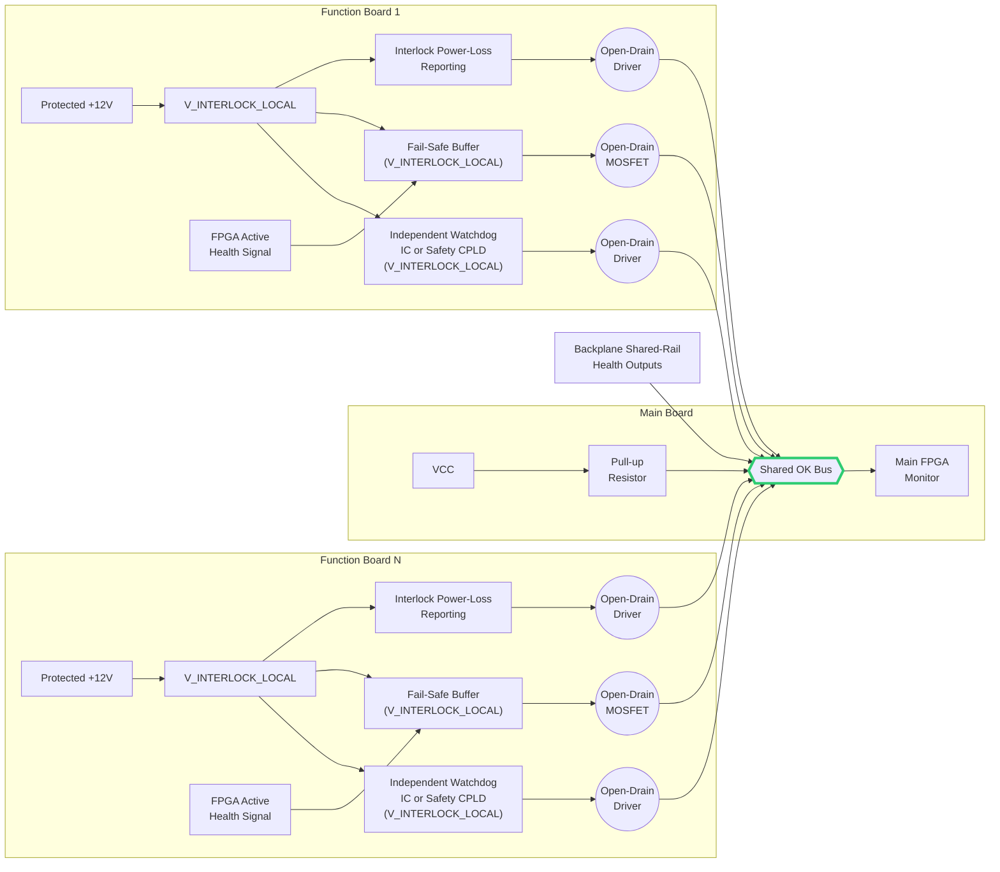

# ADR-001: Board Health Detection and Fault Visibility Strategy

**Status:** Resolved
**Last updated:** 2026-09-07

---

## Context

The system is a modular controller with one main board and multiple function boards across one or more backplanes. The core goal is:

> **A detected safety-relevant fault on any board must place the complete system in a safe state through a hardware interlock path that does not depend on host software.**

> **Core Decision:** Use two complementary paths: a continuity loop using passive copper or unconditional active forwarding for physical disconnects and, where qualified, local interlock-power loss, and a shared open-drain `OK` bus for electronic/timing/software faults.

The failure modes to cover:

| # | Failure Mode | Description |
|---|---|---|
| F1 | Continuity loop broken | The continuity loop path is physically interrupted (board absent, cable/connector discontinuity, or equivalent open path), so `LOOP_IN` drops. |
| F2a | Brain dead (power/reset) | The FPGA/SoC loses its digital rails or is held in reset while `V_INTERLOCK_LOCAL` remains valid. |
| F2b | Brain dead (logic frozen) | The board logic brain is fully powered (driving outputs) but the firmware/clock has frozen and cannot execute logic. |
| F3 | Internal electronic fault | A board-local monitored fault is detected (e.g., over-current, over-temperature, PLL loss), and the board actively asserts the fault path. |
| F4 | OK driver damaged | The board fault-output driver path is damaged (typically stuck open), so a local fault may fail to propagate onto the shared interlock bus. |
| F5 | CLOCK timing-path fault | The required external or distributed acquisition `CLOCK` is missing or invalid; clock loss is detected separately from watchdog timeout. |
| F6 | Loss of local interlock power | An active board loses `V_INTERLOCK_LOCAL`, the board-local supply that powers its watchdog, fail-safe driver, relay-reset path, and power-loss protection hardware. |

The table above defines the hardware fault taxonomy only. Detection paths and propagation behavior are defined in `R1`-`R9` below and in ADR-003/ADR-004. Supervisory interlock events (armed host-supervision timeout) are a separate category defined in R10 below.

**Taxonomy note on F6:** `V_INTERLOCK_LOCAL` is defined in R9. Its hardware power-loss reporting path causes an `OK` trip either through qualified active loop forwarding and main-board conversion or through a direct local open-drain contribution. A LOW loop return alone does not distinguish F1 from F6. Physical removal or connector discontinuity is also detected by the continuity loop (F1). Loss of an FPGA/processor rail while `V_INTERLOCK_LOCAL` remains valid is F2a, not F6.

**Fault detection and response summary:**

| # | Failure Mode | Detected By | Propagated Via | Safety Action / Diagnostic |
|:---|:---|:---|:---|:---|
| **F1** | Continuity loop broken | Main board (`LOOP_IN` drops) | Main latches fault and pulls `OK` LOW | All boards → `ERROR.run` |
| **F2a** | Brain dead (power/reset) | Fail-safe hardware buffer/path | Local fail-safe driver pulls `OK` LOW | All boards → `ERROR.run` |
| **F2b** | Brain dead (logic frozen) | Independent hardware watchdog | Watchdog pulls `OK` LOW | All boards → `ERROR.run`; watchdog evidence retained |
| **F3** | Internal electronic fault | Board safety logic / sensors | Faulty board pulls `OK` LOW | All boards → `ERROR.run` |
| **F4** | OK driver damaged | Board self-read / host verification | Ethernet telemetry / maintenance test | Detected during maintenance or when loopback fails at fault assertion |
| **F5** | Acquisition-clock loss | Independent clock-activity monitor | Clock monitor enters the local trip path and pulls `OK` LOW | All boards → `ERROR.run`; clock-loss evidence retained separately from watchdog timeout |
| **F6** | Loss of local `V_INTERLOCK_LOCAL` | Qualified active forwarding or direct hardware power-loss reporting | Main converts loop LOW to `OK` LOW, or local hardware asserts `OK` directly | All boards → `ERROR.run`; normally-open relay also de-energizes if local power disappears |
| **S1** | Armed host-supervision timeout | Board-local supervision timer | Timed-out board pulls `OK` LOW | All boards → `ERROR.run` |

**Taxonomy separation:** F1–F6 are hardware faults. S1 is a supervisory interlock event active only while armed (`EN=1`). Both use the same physical trip path (`OK` LOW → `ERROR.run`), but their root causes and active conditions differ. See R10.

---

## Considered and Rejected

### State-controlled SSR loop

Each board places a solid-state relay in the loop path, driven by the board's FPGA. Would have covered both F2a/F2b brain-dead cases.

**Rejected because:**
- If the SSR is tied to FSM state, a fault causes all boards to drop their SSRs, breaking the loop permanently — a system-wide latch with no recovery path
- If the SSR is independent of FSM state, it adds a strict guardrail that is easy to violate in firmware
- Series on-resistance of SSRs accumulates across the chain, limiting the number of boards
- Startup sequencing becomes complex (loop open during FPGA boot)

The state-controlled loop is rejected. This does not prohibit unconditional combinational forwarding under R3: forwarding is independent of `OK`, `EN`, and operating state, so a retained trip does not prevent the chain from recovering when power returns.

---

## Resolved Constraints

### R1: Both a continuity loop and the open-drain OK bus are required

They are complementary — neither alone covers all failure modes:

| Signal | F1: Loop broken | F2a: Brain dead (power/reset) | F2b: Brain dead (logic frozen) | F3: Electronic fault | F4: Driver damaged | F5: acquisition-clock loss | F6: interlock power lost |
|---|---|---|---|---|---|---|---|
| OK bus (local fault-driver path) | No | No | No | Yes | No | Yes (via independent clock monitor) | No |
| Fail-safe power/reset path -> OK bus | No | Yes | No | No | No | No | No |
| Passive loop (PCB trace) | Yes | No | No | No | No | No | No |
| Qualified active loop forwarding -> main -> OK | Yes | No | No | No | No | No | Yes |
| OK bus + fail-safe + hardware watchdog | No | Yes | Yes | Yes | No | Yes | No |
| Independent hardware watchdog path → OK bus | No | No | Yes | No | No | No | No |
| OK loopback + Ethernet report | No | No | No | No | Yes (slow) | No | No |
| Shared connector discontinuity -> F1 path | No | No | No | No | No | No | Yes (connector/cable discontinuity case) |
| Interlock-supply power-loss reporting -> OK bus | No | No | No | No | No | No | Yes |
| **Combined** | **Yes** | **Yes** | **Yes** | **Yes** | **Yes (maintenance detection)** | **Yes** | **Yes** |

### R2: OK bus behavior

The `OK` bus is open-drain (wired-AND) with one pull-up resistor on the main board. Function boards never pull up `OK`; they only pull it low. When all boards are healthy, `OK` stays HIGH passively. Any board with an internal fault (F3) pulls `OK` LOW. Faults that do not naturally drive the bus are explicitly converted to LOW by dedicated paths: F1 (continuity loop broken) via main-board `LOOP_IN -> OK` conversion (R4), F2a (brain dead, power/reset) via the local fail-safe path, F2b (brain dead, logic frozen) via watchdog timeout (R5), and F6 via the hardware interlock-power-loss reporting path (R9). Qualified rail-health outputs for shared backplane power also contribute directly to this bus as defined in ADR-005.

The power and liveness paths are deliberately separate:

| Path | Location | What it detects | Clarification |
|---|---|---|---|
| Shared rail-health output | Backplane board | Invalid protected `+12V` or common utility rail | May use a verified native converter PGOOD or a dedicated voltage supervisor. |
| Interlock-power-loss reporting path | Each active board | Collapse of that board's `V_INTERLOCK_LOCAL` | Direct local reporting or qualified forwarding through main trips the fleet; it is not the watchdog. |
| Fail-safe power/reset path | Each active board | FPGA/processor rail loss or reset collapse while `V_INTERLOCK_LOCAL` remains valid | Uses interlock-powered hardware so it does not depend on the failed digital rail. |
| Independent hardware watchdog | Each active board | Missing refreshes from the supervised processor or control logic | A liveness monitor, not a converter PGOOD or voltage monitor. |
| Board-specific local monitor | Only where required | A safety-relevant local rail or hazardous output outside the coverage above | Enters the board's normal local-fault path; every local converter need not be monitored. |

The following example uses direct local F6 contributions. Qualified active forwarding may instead report F6 through main under R3.

```mermaid
flowchart LR
    subgraph Main ["Main Board"]
        VCC["VCC"] --> PULLUP["Pull-up\nResistor"]
        PULLUP --> OK_BUS
        OK_BUS --> MON["Main FPGA\nMonitor"]
    end

    subgraph FB1 ["Function Board 1"]
        RAW1["Protected +12V"] --> VINT1["V_INTERLOCK_LOCAL"]
        VINT1 --> SUP1["Interlock Power-Loss\nReporting"]
        VINT1 --> FS1
        VINT1 --> WD1
        SUP1 --> SUP1_OD(("Open-Drain\nDriver"))
        FPGA1["FPGA Active\nHealth Signal"] --> FS1["Fail-Safe Buffer\n(V_INTERLOCK_LOCAL)"]
        FS1 --> MOS1(("Open-Drain\nMOSFET"))
        WD1["Independent Watchdog\nIC or Safety CPLD\n(V_INTERLOCK_LOCAL)"] --> WD1_OD(("Open-Drain\nDriver"))
        SUP1_OD --> OK_BUS
        MOS1 --> OK_BUS
        WD1_OD --> OK_BUS
    end

    subgraph FB2 ["Function Board N"]
        RAW2["Protected +12V"] --> VINT2["V_INTERLOCK_LOCAL"]
        VINT2 --> SUP2["Interlock Power-Loss\nReporting"]
        VINT2 --> FS2
        VINT2 --> WD2
        SUP2 --> SUP2_OD(("Open-Drain\nDriver"))
        FPGA2["FPGA Active\nHealth Signal"] --> FS2["Fail-Safe Buffer\n(V_INTERLOCK_LOCAL)"]
        FS2 --> MOS2(("Open-Drain\nMOSFET"))
        WD2["Independent Watchdog\nIC or Safety CPLD\n(V_INTERLOCK_LOCAL)"] --> WD2_OD(("Open-Drain\nDriver"))
        SUP2_OD --> OK_BUS
        MOS2 --> OK_BUS
        WD2_OD --> OK_BUS
    end

    BP["Backplane Shared-Rail\nHealth Outputs"] --> OK_BUS

    OK_BUS{{"Shared OK Bus"}}

    style OK_BUS stroke:#2ECC71,stroke-width:4px
```

All healthy: every open-drain contribution is released, so the pull-up holds `OK` HIGH. Any rail-health, power-loss, fail-safe, watchdog, or local-fault contribution pulling LOW trips the shared bus so every board enters the safe response.

**Hardware Fail-Safe Constraint (Normative):**
The physical path between FPGA and `OK` bus must be fail-safe. If the FPGA loses configuration, is held in reset, or loses digital rail power (I/O floats or drops to 0V), the path must inherently turn ON and pull `OK` LOW.

- The FPGA must actively drive a signal (e.g., logic HIGH) to declare health and keep the driver in a high-impedance (Hi-Z) state.
- Relying on an active signal from the FPGA to assert a fault is prohibited.
- **Power supply independence and isolation:** The fail-safe driver circuit shall use `V_INTERLOCK_LOCAL` as defined by R9. It shall not use FPGA, processor, or other ordinary digital rails and shall not back-power FPGA I/O pins when FPGA rails are down.

This ensures an FPGA power/reset collapse (F2a) trips the interlock without waiting for watchdog timeout. Loss of `V_INTERLOCK_LOCAL` is separately classified as F6 and handled by R9.

### Dedicated safety CPLD option

Board-local always-on interlock functions may be combined in a dedicated safety CPLD powered from `V_INTERLOCK_LOCAL`. These functions include the independent watchdog defined by R5, fault aggregation and retention, `OK` contribution control, unconditional loop forwarding, main-board continuity-loop conversion, clock monitoring, relay permissive logic, and evaluation of voltage/current-monitor indications. Appropriate analog sensing circuitry remains part of voltage/current monitoring. “Always-on” means available while the interlock supply is valid, independently of ordinary digital supplies and acquisition state.

Combining functions shall preserve the required fault coverage, bounded response, safe defaults, and recovery behavior. A watchdog inside the safety CPLD does not independently supervise failure of that same CPLD. The board hardware design shall address CPLD power, reset, configuration, clock, and stale-permission failures so hazardous outputs cannot remain enabled beyond the applicable safety-response bound. The implementation shall preserve independent interlock-supply supervision and relay de-energization without continued CPLD state progression. Exact component partition and failure-response implementation belong to the board design; a separate watchdog IC is not universally required.

### R3: Continuity loop with passive or active forwarding

The main board originates `LOOP_OUT` and reads the complete series return as `LOOP_IN`. The path shall traverse every slot and all inter-backplane extension cables so physical interruption produces a LOW return. Each active board may use either passive copper continuity or unconditional combinational hardware forwarding, including a dedicated safety CPLD. Both implementations shall meet the same backplane electrical interface and may coexist in a chain.

During normal operation, active forwarding shall copy the incoming logic level independently of `OK`, `EN`, operating state, processor software, and clock activity. On loss of local interlock power, it shall establish a LOW toward the next receiver within the required response bound. An output verified to become high impedance with an external pull-down is one implementation. The design shall verify startup, configuration, shutdown, partial supply loss, and prevention of back-powering. It shall not assume that an unpowered output inherently drives LOW.

When active forwarding is used, the board may also make `LOOP_OUT` resolve LOW to report a detected condition that prevents its safety hardware from performing its role. Device selection and circuit design shall support the intended safe response; coverage of every possible internal device failure is not required. This reporting shall remain independent of `OK`, `EN`, and operating state.

A function board using active forwarding may use incoming `LOOP_IN` LOW to remove its local detector-facing permission directly in hardware, without waiting for main to assert `OK` or for a state-machine transition. LOW propagates downstream to main, which asserts `OK` so all powered boards, including those upstream of the fault, enter the shared safe response. Entering the safe state or observing the shared trip shall not itself force `LOOP_OUT` LOW. Forwarding shall continue to copy the input unless local power or a detected safety-hardware condition requires LOW.

Forwarding shall resume when its power and configuration are valid and the detected safety-hardware condition has cleared, without requiring the shared trip to be cleared first. Startup shall allow the complete chain to become valid before arming. Retained fault clearing and recovery remain governed by ADR-003. Static forwarding does not demonstrate execution progress or replace watchdog coverage of CPLD failures.

The backplane ICD shall define loop logic voltage, input HIGH/LOW thresholds, output drive, leakage and loading limits, pull-down placement and values, powered and unpowered pin behavior, and the total propagation/response bound for the supported chain. Verification shall include consecutive passive boards and terminators, whose pull-down loads are not isolated by active buffers. The architecture does not select a nominal loop voltage.

A board using passive copper shall provide a separate hardware F6 reporting path to `OK`. Qualified active forwarding may provide that board's F6 reporting through main; a separate local F6 contribution is then not required. Loss of main-board interlock power still requires a verified shared-trip path under R9; main shall not rely on its own failed conversion logic.

### R4: Main board converts loop breaks to the OK bus through deterministic hardware logic

Function boards use `OK` and `EN` for the shared safety response. Active boards may forward the loop and remove local permission on incoming LOW under R3; main owns interpretation of the complete return and propagation of the shared trip through `OK`. The main board converts `LOOP_IN` status into `OK` behavior through deterministic hardware logic.

FPGA logic, a dedicated safety CPLD, or other hardware may perform this conversion, but processor software shall not be the safety path. The output shall be deterministic and resistant to glitches so normal signal settling cannot create a false global trip. A registered output is a normal implementation, not the only permitted one.

If `LOOP_IN` becomes unhealthy, main shall retain diagnostic evidence and assert its `OK` contribution without intentional software delay. The contribution cannot be released through recovery while the loop remains broken. Exact latches, register names, and clear sequencing belong to the firmware design specification; ADR-003 owns the externally visible recovery behavior.

Per-failure detection and propagation are summarized once in the **fault detection and response summary** table in the Context section and are intentionally not repeated here.

**Classification note:** A LOW return alone does not establish whether physical discontinuity (F1) or an active forwarder reporting interlock-power loss (F6) or a detected safety-hardware problem caused it. The return does not identify the affected board. If connector/cable discontinuity causes `LOOP_IN` to drop, the interlock trigger is F1. If diagnostics also confirm loss of local interlock power, both F1 and F6 may be reported as contributing causes.
**Detector note:** F5 clock loss and F2b watchdog timeout use separate detection paths and retained indications. Each detector reports its own failure condition.

### R5: Independent hardware watchdog for processor or control-logic activity

F2a (digital-rail loss/reset collapse) is handled by the fail-safe `OK` driver rule in R2. F2b is different: the board remains powered, but logic/clock/firmware freezes and may keep stale "healthy" outputs. To detect F2b, each board uses a hardware watchdog. If FPGA petting stops, the watchdog pulls `OK` LOW so all boards trip through the existing interlock path.

Every active board shall implement an independent hardware watchdog whose timeout can pull `OK` LOW independently of the supervised FPGA/processor and timing paths. A dedicated watchdog IC or a dedicated safety CPLD may implement this function. The watchdog and its trip-output path shall use `V_INTERLOCK_LOCAL`, independently of ordinary FPGA/processor rails. Its timeout time base shall remain operational when the supervised clocks stop.

The supervised processor or control logic shall refresh (pet) the watchdog as part of its normal execution. Refreshes shall stop if that execution freezes; autonomous refresh generation that continues after the supervised logic stops is insufficient. Watchdog refresh shall use local clocking. The independent clock monitor under R6 detects acquisition-clock loss.

For noise control, a board may optionally align refresh transitions to the external/distributed acquisition clock while it is valid. If that clock is absent, refresh timing shall use local clocking. Loss or return of the optional reference shall neither cause a spurious watchdog timeout nor produce refreshes that hide frozen logic. The watchdog timeout time base remains independent of the supervised logic and acquisition clock. Exact refresh rate, alignment, fallback, and circuit implementation belong to the board design and ICD.

Each board shall retain watchdog-activation evidence separately from the shared wired-AND bus. A watchdog internal to the supervised FPGA/processor may supplement but shall not replace the independent hardware watchdog.

The watchdog detects missing activity; it is not the power-good monitor for `V_INTERLOCK_LOCAL`. The watchdog output may release electrically when valid petting resumes, but ADR-003 keeps the system latched safe until explicit recovery.

**Secondary detection via Ethernet:** If a board stops responding to polls, the host can report that it is unreachable; communication silence alone does not distinguish power, logic, or communication failure. This is diagnostic only and is not the primary interlock protection.

The supporting watchdog/clock-monitor diagram is kept in [ADR-001_fault_detection_reference.md](reference/ADR-001_fault_detection_reference.md).

### R6: Clock-loss and watchdog diagnostic differentiation

Each board retains timing and watchdog evidence for diagnosis *after* the system has safely tripped into `ERROR.run`. Reports shall distinguish observed evidence from inferred causes and leave the root cause unresolved when the available evidence is insufficient. Hardware safety (pulling `OK` LOW) and software diagnostics (classifying the fault) are decoupled; classification is not a prerequisite for entering the safe state.

**Normative diagnostic behavior:**

- A function board uses its independent local management or safety clock to monitor activity of the distributed 100 MHz `CLOCK`. Detected loss both enters the normal local trip path and records clock-loss evidence.
- The main board similarly monitors its external clock source and records a clock-source fault.
- Every board records whether its independent hardware watchdog activated, using a dedicated local status indication rather than attempting to infer this from the shared wired-AND bus.
- Clock-loss and watchdog evidence are retained through `ERROR.run` and cleared only through the recovery semantics defined by ADR-003. The exact bit names and register organization are implementation details.

**Separate F5 clock-loss and F2b watchdog-timeout evidence:**

After the system trips into `ERROR.run`, the host reads the diagnostic latches via Ethernet and uses the following evidence interpretation:

| Clock-loss evidence | Watchdog-activation evidence | Ethernet | Supported interpretation | Follow-up |
|---|---|---|---|---|
| 1 | 1 | Responding | **Clock loss and watchdog timeout:** both detected | Investigate the clock path and processor/control-logic refresh path separately; the evidence does not establish event order or the precise failed component. |
| 1 | 0 | Responding | **F5 evidence:** clock loss detected without recorded watchdog activation | Investigate the clock source/distribution. |
| 0 | 1 | Responding | **Watchdog timeout; cause unresolved** | Investigate the supervised processor/control logic and its refresh connection; this is not a clock-loss indication. |
| 0 | 0 | Responding | **No recorded local clock-loss or watchdog activation** | Read complete diagnostics for another local event or a shared trip; absence of these bits does not prove absence of a fault. |
| X | X | Unresponsive | **Board unreachable; local evidence unavailable** | Investigate power, logic, and communication using other available evidence; Ethernet silence alone does not establish F2a or F2b. |

**Scope note:** This table classifies timing and liveness evidence only. Complete board diagnostics distinguish S1, another local fault, and a board that only observed the shared trip.

**Corrective action:** If clock-loss evidence is set, investigate the acquisition-clock source and distribution. If watchdog evidence is set, investigate the supervised processor/control logic and its refresh path separately.

Key properties:
- The clock monitor runs on the independent local management or safety clock and its clock-loss result participates in the normal trip path.
- The watchdog indication is diagnostic; the independent hardware watchdog already owns its independent physical path to `OK`.

---

### R7: F4 (OK driver damaged) is addressed by robust design and maintenance verification

The `OK` driver shall use components and ratings appropriate to the instrument environment and service life. The board hardware design shall document its behavior in powered, unpowered, reset, and relevant fault conditions. Quantitative reliability targets apply only when a project reliability allocation defines them; this ADR does not require a particular certification, component portfolio, or FIT value.

Every active board shall support safe maintenance verification that its tested `OK` contribution causes the shared bus to transition from HIGH to LOW while the system remains safely disarmed. A bus already held LOW by another source shall not be accepted as evidence of successful assertion. Testing shall not override active protection. Commands, sequencing, cadence, acceptance timing, safe test/recovery behavior, result reporting, and operator response belong to the system ICD and maintenance plan.

A board may also compare a commanded assertion with the observed bus and report a mismatch when communication remains available. This diagnostic support does not replace the maintenance test.

---

### R8: Empty slots and inter-backplane extension require specific continuity loop handling

Two slot conditions affect continuity-loop behavior and must be handled explicitly:

**Passive terminator (truly empty slot)**
A simple passive PCB bridges the continuity-loop pins through the connector so unused slots stay in-circuit. No power is required. Without this terminator, an empty slot breaks the loop and permanently reports F1.

**Bridge board (inter-backplane extension)**
A bridge board extends signals to a secondary backplane. The continuity loop remains one series circuit and must physically return to main `LOOP_IN`. The bridge board must carry both directions:

- Forwards the outgoing loop signal (LOOP_OUT side) to the secondary backplane
- Returns the loop signal from the secondary backplane back toward the main (LOOP_IN side)
- Physically extends the unbuffered wired-AND `OK` bus to the secondary backplane (secondary open-drain drivers pull directly against the same single main-board pull-up resistor)

A bridge board may use passive copper or qualified active forwarding under R3. Cable severance makes the return LOW and invokes the main-board trip path. Bridge interlock-power loss shall also trip: through active forwarding if qualified for F6, or through a separate local hardware contribution to `OK` when continuity is passive.

Route the loop so the full return path physically traverses the extension cable and bridge connector on the way back to main. This guarantees cable severance is detected as F1.

Active signal replication (SYNC, CLOCK, EN, CLEAR) on the secondary backplane may be performed by the bridge board, but those signals are outside the scope of the continuity loop.

**Hot-swap stance (normative):** Live insertion or removal of boards is not supported. Removing or inserting a board necessarily interrupts the continuity loop and trips F1 — by design. Board replacement is a service action performed with the system latched in `ERROR` or powered down. "Hot-plug" references in ADR-005 (connector inrush, contact sequencing) concern electrical robustness of the mating event, not operational hot-swap.

LVDS clock forwarding and board identification concerns are outside the scope of this ADR.

The supporting continuity-loop routing diagram is kept in [ADR-001_fault_detection_reference.md](reference/ADR-001_fault_detection_reference.md).

---

### R9: Every active board has one local interlock supply

Every active board shall derive one low-power supply named `V_INTERLOCK_LOCAL` from its received protected `+12V`. The name means that the supply is local to the board and powers hardware interlock functions; it does not imply that power survives loss of `+12V`. `V_INTERLOCK_LOCAL` is not a backplane-distributed utility rail and shall not power the ordinary processing/acquisition FPGA, processor, memory, analog signal chain, or detector load. It supplies only the independent interlock hardware, including an optional dedicated safety CPLD: the independent hardware watchdog, fail-safe `OK` driver, relay-reset circuitry where applicable, and power-loss protection hardware. Passive terminators do not implement this supply.

Loss of `V_INTERLOCK_LOCAL` shall disable the detector protection relay permission and remove relay drive independently of processor software, FPGA/CPLD state progression, and distributed `CLOCK`, as required by ADR-003 R9. This behavior shall remain safe as the supply collapses, including when relay-driver power remains available from another rail.

If one board loses `V_INTERLOCK_LOCAL` while the shared interlock system remains powered, a hardware power-loss reporting path shall cause `OK` LOW, either directly or through qualified active forwarding and main-board conversion, long enough to place the powered fleet in the safe state (F6). Local relay release alone does not satisfy this shared-trip requirement. Reporting shall not depend on continued operation of logic whose supply is failing.

A dedicated interlock-supply supervisor is not mandatory. The board design shall choose and verify the hardware that provides both local relay disable and F6 reporting. Qualified active forwarding under R3 or a voltage supervisor with an isolated hold-up supply are possible implementations; neither that component nor stored energy is prescribed.

These requirements cover loss of the board's protected `+12V` contact or branch and failure of the local interlock regulator. If FPGA/processor power fails while `V_INTERLOCK_LOCAL` remains valid, the fail-safe driver covers the power/reset collapse and the watchdog covers loss of pet activity. If the board is physically removed or the continuity path opens, F1 also trips.

The architecture does not require independent PGOOD supervision for every board-local converter. A board shall add a local voltage or output monitor only when loss or incorrect behavior of that function could create a hazardous condition not already covered by the fail-safe or watchdog paths. Such a monitor shall enter the board's normal local-fault trip path. The term PGOOD is reserved for a native converter power-good output and shall not be used for the watchdog timeout or interlock-supply supervisor output.

Continued `OK` signaling is not required after the central backplane eFuse removes power from the complete system because normally-open relays and powered outputs de-energize directly. The board hardware design shall define the interlock-supply voltage, power-loss behavior, operating limits, and bounded relay-disable and reporting times. Verification shall demonstrate local relay release and capture of the shared trip by the powered fleet during interlock-supply loss. Telemetry does not replace the hardware power-loss reporting path.

The supporting diagram is kept in [ADR-001_fault_detection_reference.md](reference/ADR-001_fault_detection_reference.md).

---

### R10: S1 is an armed host-supervision interlock event

S1 is classified separately from the hardware fault taxonomy (F1–F6):

| Property | F1–F6 (hardware faults) | S1 (supervisory) |
|---|---|---|
| Root cause | Physical/electrical failure | Host communication loss |
| Active condition | Always (any FSM state) | Only while armed (`EN=1`) |
| Detection mechanism | Hardware (loops, watchdogs, sensors) | Software/protocol (Ethernet lease timer) |

ADR-003 owns the host-supervision behavior. At the fault-taxonomy level, S1 means that an armed board detected loss of valid host supervision, retained diagnostic evidence, and used its normal local trip path to pull `OK` LOW. ADR-006 defines how acquisition traffic interacts with this rule.

S1 protects against continued armed operation when host interaction is lost, whether due to an unresponsive host or a communication failure. Bidirectional telemetry may provide the qualifying interaction. Host disconnection alone while disarmed does not assert `OK`.

Host supervision is not the primary protection for a frozen main board. The independent hardware watchdog path defined in R5 independently pulls `OK` LOW; host supervision cannot override a hardware interlock assertion.

**Diagnostic differentiation in ERROR.run:** A responding board reports whether it observed S1, a local hardware fault, or only the shared trip from another participant. An unresponsive board is reported as unreachable with local evidence unavailable; investigation considers power, logic, and communication failure. Exact diagnostic fields belong to the communication and firmware specifications.

S1 intentionally uses the same physical trip path as F1–F6 even though its root cause is supervisory rather than hardware.

---

## Decision

Resolved. F1–F6 and S1 are covered by the continuity loop, shared `OK` bus, fail-safe power/reset path, independent hardware watchdog, independent clock monitoring, local interlock-power supervision, retained evidence, and armed host supervision. Circuit topology and internal register structure remain design-specification scope.

Board identification and host inventory are configuration concerns, not health or fault detection concerns. They are out of scope for this ADR and are addressed in ADR-002.

---

## Consequences

- Every active board shall include an `OK` open-drain contribution and continuity-loop routing; passive terminators provide continuity-loop routing only.
- Every `OK` contribution must be deterministic and resistant to glitch-induced global trips.
- Every active board requires a fail-safe FPGA-to-OK driver path, an independent hardware watchdog path to `OK`, and hardware protection against loss of `V_INTERLOCK_LOCAL`. A dedicated supply supervisor is optional. These interlock elements use `V_INTERLOCK_LOCAL`; ordinary processors and processing/acquisition FPGAs do not; a dedicated safety CPLD may.
- Each function board additionally requires an independent management- or safety-domain clock-activity monitor whose detected clock loss enters the normal trip path, plus retained clock/watchdog evidence and F4 loopback diagnostics.
- F6 is reported by the hardware interlock-power-loss path even when connector continuity remains intact; physical removal also invokes the F1 path.
