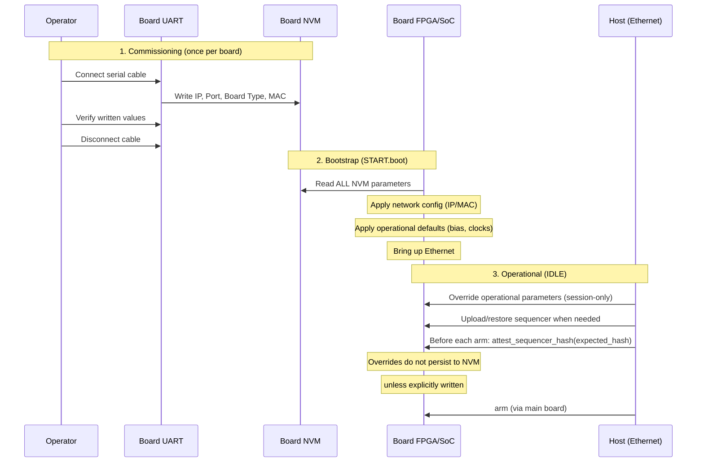

# ADR-002: Backplane Board Identification and Configuration Strategy

**Status:** Resolved
**Last updated:** 2026-03-27

---

## Context

Every board (main and function) has its own Ethernet port and must be uniquely identifiable on the network. Slot mapping is maintained by the host from commissioning records; boards do not report slot position at runtime.

This is a configuration and identification concern, distinct from fault detection (covered in ADR-001).

Core challenge: Ethernet cannot be the bootstrap channel, because Ethernet itself must be configured first. We need a network-independent bootstrap path.

> **Core Decision:** Bootstrap each board over dedicated UART (baseline identity + network fields), then use Ethernet for normal operational orchestration.

---

## Considered and Rejected

### Ethernet-based discovery (UDP broadcast + TCP)

Boards broadcast their identity via UDP at boot; main assigns configuration and switches to TCP for normal operation.

**Rejected because:** Circular dependency — Ethernet cannot configure itself. Reconfiguration of stale addresses from previous sessions has no clean solution. Adds protocol complexity.

---

### I2C backplane bus

A 2-wire bus shared across all slots. Main scans at boot to identify boards and configure their Ethernet settings via I2C registers.

**Rejected because:** UART + NVM on every board already solves the same problem more simply. I2C adds backplane wiring, signal integrity concerns across extension cables, and an addressing scheme — all for a problem that commissioning-time UART configuration handles cleanly. Violates KISS principle.

---

## Resolved Constraints

### R1: All boards have a UART auxiliary port — always accessible

Every board — the main board and all function boards — has a dedicated UART port. It serves two roles:

- **Commissioning and reconfiguration:** writing NVM parameters (IP, port, board type)
- **Fallback diagnostics:** when Ethernet fails, UART is the only remaining communication channel to inspect board state, read fault logs, and diagnose the failure

The UART port must remain physically accessible in normal operation. It is the last-resort path when Ethernet is unavailable.

**Physical interface:** Each board must expose an externally accessible UART. Connector type, electrical standard (TTL, RS-232, USB-UART, etc.), and mechanical details are ICD items and are intentionally out of ADR scope.

**Disconnected cable requirement:** A disconnected UART cable must not cause spurious command reception. The electrical implementation that guarantees this is an ICD concern.

**Protocol constraint — request-response only:** Boards never send unsolicited UART traffic. They respond only to received commands. With no cable attached, boards remain silent.

**Firmware constraint — command validation:** Firmware must validate all received bytes before acting. Partial frames, malformed commands, and garbage bytes must be discarded silently.

**UART command set:** A minimum catalog of UART commands must be shared by all boards — covering at least NVM read/write for network parameters and basic diagnostic queries. This common command set is defined in the ICD. Board-type specific commands may extend it but cannot replace it.

### R2: All boards have non-volatile memory (NVM)

Every board stores its configuration persistently in onboard NVM. At minimum, NVM holds:

| Parameter | Main | Function boards |
|---|---|---|
| Ethernet IP address | Yes | Yes |
| Ethernet port | Yes | Yes |
| Board type | Yes | Yes |
| MAC address | Yes | Yes |

MAC address is mandatory for any Ethernet device and must be unique per board. It is typically stored in a dedicated EEPROM pre-programmed at manufacturing with a guaranteed unique address (e.g. Microchip 24AA02E48 or equivalent).

Additional NVM contents (calibration data, operational parameters) are board-type specific and defined in the ICD.

### R3: Configuration is written once at commissioning via UART

At manufacturing or initial deployment, each board is configured individually via its UART port. The operator writes the minimum bootstrap parameters needed for deterministic network bring-up. This is a one-time baseline operation per board.

Commissioning sequence per board:
1. Connect to board UART
2. Write NVM: IP, port, board type, MAC (if not pre-programmed)
3. Verify written values
4. Disconnect

No network connection is required during commissioning.

### R4: At boot, each board fully configures itself from NVM

During `START.boot` (ADR-003), each board reads all NVM parameters, not only network fields. This includes operational defaults (bias, clocks, calibration, etc.). Boot runs from the board's independent local management clock and does not depend on distributed backplane `CLOCK`. By `IDLE`, the board is fully configured and can operate without Ethernet.

The remote host may override operational parameters via Ethernet during IDLE before arming. These overrides apply to the current session only and do not automatically persist to NVM unless explicitly written.

### R5: UART is the reconfiguration path

If a bootstrap network parameter needs to change (IP reassignment, board replacement), the operator connects directly to the board's UART and rewrites the relevant NVM fields. No network access required.

### R6: Main topology is host-managed, not board-reported

Boards are identified by MAC (hardware identity) and IP (network identity). The host owns the authoritative topology map (`IP -> board type -> expected slot`). Boards do not report slot position; slot assignment is a host-side commissioning artifact, not an NVM field.

Topology verification is performed by the remote host by polling expected board IPs. The main board uses backplane electrical signals only (EN, OK, LOOP) and does not perform Ethernet discovery of function boards.

The main board drives `CLOCK` and `SYNC` to all slots regardless of occupancy — empty slots have no electrical effect on signal integrity (ADR-004 R1), so no per-slot enable/disable is needed and the main board requires no topology knowledge.

If a board is replaced, the replacement is configured with the same IP and board type via UART and the host topology map remains valid without changes.

### R7: Every board has a dedicated Ethernet port connected to the host network

Every board has a dedicated Ethernet port on the same host network (direct or through switches). Ethernet control is host-centric: main does not command function boards over Ethernet, and function boards do not command each other.
Armed communication supervision is keep_alive-lease based (ADR-003); protocol framing/cadence/timeout details are ICD-defined.
Transport/session implementation (for example TCP vs UDP, client/server role per board, ports, framing, and reconnect/retry behavior) is ICD-defined and out of ADR scope.

**Speed requirements by board type:**

| Board type | Required Ethernet speed |
|---|---|
| Video function board | 1000 Mbps (Gigabit) — sequencer upload and image data transfer demand higher throughput |
| All other boards (main, clock, bias, bridge, etc.) | 10/100 Mbps sufficient — only control, telemetry, and configuration traffic |

This keeps the main board firmware simple and allows the remote host to address each board directly by IP for control, diagnostics, and injected-fault F4 driver verification sequencing in `IDLE`/`ERROR.run` (ADR-003).

---

### R8: NVM contents are split by configuration channel

UART is the bootstrap channel for the minimum parameters required to bring a board onto the network:

| Parameter | Configured via |
|---|---|
| IP address | UART |
| Ethernet port | UART |
| Board type | UART |
| MAC address | UART (or pre-programmed at manufacturing) |
| All other parameters | Ethernet |

Additional NVM fields (calibration, bias defaults, clock settings, other operational data) are board-type specific. Their layout is defined per board type and documented in ICDs. These fields are configured/updated via Ethernet.

This keeps UART minimal and stable for identity/bootstrap tasks. UART remains available for reconfiguration and fallback diagnostics; richer operational workflows stay on Ethernet.

#### Board configuration lifecycle

---

### R9: Sequencer hash is validated before every arm (including the first arm after boot)

Sequencer payloads are board-type specific (for example, video and clock boards need different patterns). To guarantee freshness at scale without adding a new intra-system bus, each arm cycle uses hash attestation over existing per-board Ethernet links.

**Sequencer storage model:**

- After a successful upload, the sequencer is held in **volatile memory** on the board. It persists as long as the board is powered.
- A power cycle clears volatile sequencer state. After boot, sequencer state is `missing` until a complete payload is loaded and validated (from NVM restore or Ethernet upload).
- Boards **may** explicitly save the sequencer to NVM on operator request. On next boot, the board may restore NVM bytes into volatile memory (consistent with R4) and use them for attestation.
- NVM save is optional and not required for correct operation. At large board counts (100+), NVM persistence eliminates upload latency for sessions where the sequencer is unchanged.

**Rules (Normative):**
1. **Arm-attestation command:** Before every arm command — including the first arm after boot — the remote host must send `attest_sequencer_hash(expected_hash)` to each required function board while in `IDLE`. **Definition of *required*:** A "required" board is any function board that implements a sequencer and is actively needed for the current acquisition session. Boards without sequencers (e.g., static bias boards) are explicitly excluded from this attestation loop; their hardware readiness gate is passively tied off (see ADR-003 R7).
2. **On-demand attestation:** On `attest_sequencer_hash(expected_hash)`, the board must compute `sequencer_hash` from the active volatile sequencer buffer at that moment. Using a cached hash as the attestation source is prohibited.
3. **Attestation response contract:** The board response must be one of: `hash_match`, `hash_mismatch`, or `missing/invalid`. `hash_match` is allowed only when local payload is valid and computed hash equals `expected_hash`.
4. **Payload validity gate:** Each board must maintain a `sequencer_valid` state. It is set only after complete payload receipt/restoration plus local validation (`board_type`, format/version, bounds). If `sequencer_valid == 0`, attestation must report `missing/invalid` and arm must be blocked for that board.
5. **Dirty on write:** Any sequencer-buffer write attempt (upload start, partial transfer, maintenance write, DMA write path, etc.) must clear `sequencer_valid` until full payload validation succeeds.
6. **Armed immutability:** The sequencer volatile buffer must be immutable while armed (`EN = 1`). All write paths (CPU, DMA, service command paths) must be blocked while armed.
7. **Local trust only:** The board must compute hash from bytes physically stored in local memory. Host-provided hash values are never trusted as truth.
8. **No additional management bus required:** Sequencer freshness is guaranteed over existing per-board Ethernet links; no extra main-to-board management bus is required.

**Hash algorithm and command format:** The hash algorithm (for example SHA-256), payload framing, attestation request/response schema, and error codes are ICD-defined. Implementation runs in C on the board processor (soft-core or bare-metal) and must be lightweight enough to run without OS services or hardware acceleration.

The exact host-side Ethernet orchestration sequence (polling boards, evaluating mismatches, and executing sequencer payload uploads) to satisfy this attestation gate is defined in the system ICD.

**Cross-reference to FSM enforcement:** ADR-003 R7 enforces this per-arm flow with `sequencer_hash_valid_current_arm` on each function board. The flag is cleared on `IDLE` entry, set only by `hash_match` in `IDLE`, and cleared again immediately after EN-rise acceptance into `RUN.init`.

---

## Decision

*Resolved. Core bootstrap/configuration strategy (UART + NVM + host-driven Ethernet orchestration), board identity via MAC/IP (no slot-position NVM field), no intra-system Ethernet (R7), and per-arm sequencer hash attestation over per-board Ethernet (R9) are settled.*

---

## Consequences

- Manufacturing and service workflows must provide physical UART access to every board for bootstrap configuration and recovery.
- The remote host software is responsible for topology verification and per-board reachability checks; this is not a main-board duty.
- ICDs must define two clear configuration channels: UART for bootstrap identity/network fields, Ethernet for extended operational parameters.
- ICDs must define the sequencer payload schema, validation rules, and host-side per-arm hash-attestation workflow.
- ICDs must define keep_alive supervision details used while armed (message framing, cadence, lease timeout, and jitter/debounce policy) per ADR-003.
