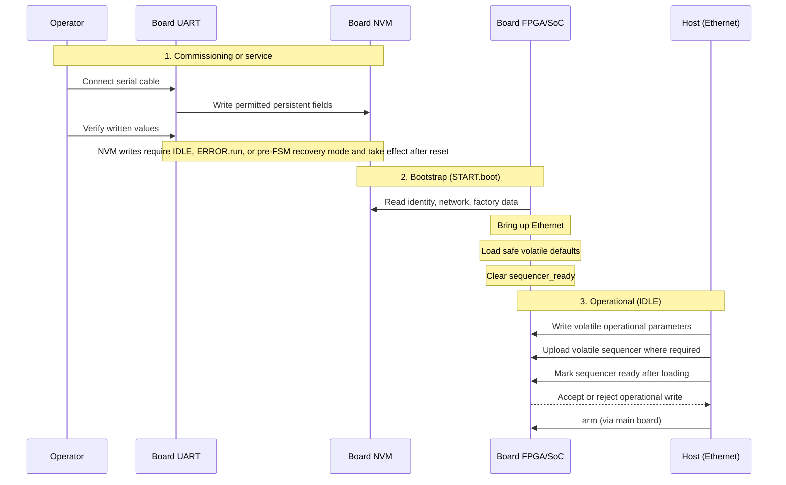

# ADR-002: Backplane Board Identification and Configuration Strategy

**Status:** Resolved
**Last updated:** 2026-08-14

---

## Context

Every board (main and function) has its own Ethernet port and must be uniquely identifiable on the network. Physical slot position is not operationally significant and is not reported by boards at runtime. The host instead needs a reliable way to associate a logical role with the intended physical board and network endpoint.

This is a configuration and identification concern, distinct from fault detection (covered in ADR-001).

Core challenge: Ethernet cannot be the bootstrap channel, because Ethernet itself must be configured first. We need a network-independent bootstrap path.

> **Core Decision:** UART is the only path for persistent identity and bootstrap-network configuration. Ethernet provides volatile operational configuration and sequencer loading for the current boot session and can never write NVM.

---

## Considered and Rejected

### Ethernet-based discovery (UDP broadcast + TCP)

Boards broadcast their identity via UDP at boot; main assigns configuration and switches to TCP for normal operation.

**Rejected because:** Circular dependency — Ethernet cannot configure itself. Reconfiguration of stale addresses from previous sessions has no clean solution. Adds protocol complexity.

---

### I2C backplane bus

A 2-wire bus shared across all slots. Main scans at boot to identify boards and configure their Ethernet settings via I2C registers.

**Rejected because:** UART + NVM on every board already solves the same problem more simply. I2C adds backplane wiring, signal integrity concerns across extension cables, and an addressing scheme — all for a problem that commissioning-time UART configuration handles cleanly. Violates KISS principle.

---

## Resolved Constraints

### R1: All boards have a UART auxiliary port — always accessible

Every board — the main board and all function boards — has a dedicated UART port. It serves two roles:

- **Commissioning and service:** reading and writing permitted NVM identity, network, and factory-data fields
- **Fallback diagnostics:** when Ethernet fails, UART is the only remaining communication channel to inspect board state, read fault logs, and diagnose the failure

The UART port must remain physically accessible in normal operation. It is the last-resort path when Ethernet is unavailable.

**Physical interface:** Each board must expose an externally accessible UART. Connector type, electrical standard (TTL, RS-232, USB-UART, etc.), and mechanical details are ICD items and are intentionally out of ADR scope.

**Disconnected cable requirement:** A disconnected UART cable must not cause spurious command reception. The electrical implementation that guarantees this is an ICD concern.

**Protocol constraint — request-response only:** Boards never send unsolicited UART traffic. They respond only to received commands. With no cable attached, boards remain silent.

**Firmware constraint — command validation:** Firmware must validate all received bytes before acting. Partial frames, malformed commands, and garbage bytes must be discarded silently.

**UART command set:** A minimum catalog of UART commands must be shared by all boards — covering at least NVM read/write and basic diagnostic queries. Command names, framing, and field layouts are defined in the ICD. Board-type-specific commands may extend the common set but cannot replace it.

### R2: NVM is limited to persistent bootstrap, identity, and necessary factory data

Every board has onboard NVM. At minimum, it holds:

| Parameter | Main | Function boards |
|---|---|---|
| Ethernet IP address | Yes | Yes |
| Ethernet port | Yes | Yes |
| Board type | Yes | Yes |
| MAC address | Yes | Yes |
| Unique board/serial ID | Yes | Yes |
| Hardware revision | Yes | Yes |

MAC address is mandatory for any Ethernet device and must be unique per board. It is typically stored in a dedicated EEPROM pre-programmed at manufacturing with a guaranteed unique address (e.g. Microchip 24AA02E48 or equivalent).

Board-local manufacturing trim or calibration data may also reside in NVM when required by the electronics. Normal operational settings — including bias, clock, timing, acquisition, enable-mask, and sequencer data — are not persistent board configuration. Software version is reported from the active firmware image and is not a writable configuration field. Exact NVM layout and any write-protected factory fields are ICD-defined.

### R3: Persistent configuration is commissioned and maintained via UART

At manufacturing or initial deployment, each board is configured individually via its UART port. Later persistent changes use the same UART path.
Commissioning requires no network connection: write permitted fields (MAC only if not factory-programmed), read them back, and verify them before service.

### R4: Boot loads persistent identity and network data; the host supplies operational configuration

During `START.boot` (ADR-003), each board reads and validates its persistent identity, network, and required factory data. Boot runs from the board's independent local management clock and does not depend on distributed backplane `CLOCK`. Volatile operational parameters initialize to firmware-defined safe values, such as disabled outputs and zero bias.

Operational configuration is held only in volatile memory. A boot session ends when the board resets, loses power, or otherwise re-enters `START.boot`; fault recovery and arm/disarm cycles do not end it. Reset restores the safe values and clears volatile sequencer state.

### R5: UART access follows an explicit state allowlist

Non-disruptive UART diagnostics and NVM reads may be accepted in any FSM state. UART NVM writes are accepted only in `IDLE`, `ERROR.run`, or a separate pre-FSM recovery mode; all other states reject them. A successful write changes persistent storage only and takes effect after the next board reset and boot.

Safety transitions always take priority over NVM service. If a transition occurs during a write, the implementation must preserve either the previous valid record or the complete validated new record; partially written configuration must never become valid. The pre-FSM recovery mode provides UART access when invalid bootstrap data prevents normal firmware from reaching `IDLE` or `ERROR.run`; its entry mechanism is ICD-defined.

### R6: Board inventory and identity are host-managed

Boards are identified by unique serial ID and MAC address (hardware identity), board type/revision (capability identity), and IP address (network endpoint). The host owns the authoritative inventory mapping:

```text
logical role <-> board type/revision <-> IP <-> MAC/serial
```

Physical slot is not an authoritative part of this mapping and is not an NVM field.

At commissioning and startup, the remote host polls each expected IP and verifies the returned board type, revision, MAC, and serial ID against the inventory. Reachability at the expected IP is insufficient if the identity does not match. The main board uses backplane electrical signals only (EN, OK, LOOP) and does not perform Ethernet discovery of function boards.

The main board drives `CLOCK` and `SYNC` to all slots regardless of occupancy — empty slots have no electrical effect on signal integrity (ADR-004 R1), so no per-slot enable/disable or board-inventory knowledge is needed on main.

If a board is replaced, its persistent network settings are commissioned through UART and the host inventory is explicitly updated for the replacement MAC/serial and revision. An optional `identify_board` command may flash a visible board LED so an operator can locate the physical unit associated with a host inventory record. Ethernet discovery may be added as a commissioning convenience, but UART remains the recovery path and the inventory remains authoritative.

### R7: Every board has a dedicated Ethernet port connected to the host network

Every board has a dedicated Ethernet port on the same host network (direct or through switches). Ethernet control is host-centric: main does not command function boards over Ethernet, and function boards do not command each other.
Armed communication uses the protocol-neutral host-supervision rule in ADR-003. The qualifying interaction, returned response, cadence, retry policy, and timeout are ICD-defined; a dedicated heartbeat command is not architecturally required.
Except for the TCP sequencer-transfer requirement in R9, transport/session implementation (client/server role per board, ports, framing, and reconnect/retry behavior) is ICD-defined and out of ADR scope.

**Speed requirements by board type:**

| Board type | Required Ethernet speed |
|---|---|
| Video function board | 1000 Mbps (Gigabit) — sequencer upload and image data transfer demand higher throughput (acquisition data path architecture: ADR-006) |
| All other boards (main, clock, bias, bridge, etc.) | 10/100 Mbps sufficient — only control, telemetry, and configuration traffic |

This keeps the main board firmware simple and allows the remote host to address each board directly by IP for control, diagnostics, and injected-fault F4 driver verification sequencing in `IDLE`/`ERROR.run` (ADR-003).

**Security and trust model (normative):** The control network is assumed to be a physically and/or logically isolated instrument LAN. Any host with access to that network is trusted: commands (`arm`, `clear_error`, `set_injected_fault`, operational-configuration writes, etc.) carry no per-command authentication, and protection is provided by network isolation, not by the protocol. Likewise, physical access to a board's UART port implies trust. This is a deliberate simplicity trade-off. The hardware interlock layer (OK bus, watchdogs, fail-safe paths, relay reset logic) protects against faults regardless of command origin, but it does not protect against well-formed hazardous commands (for example, arming with wrong operational parameters) — a trusted network peer can command anything an operator can. Network isolation is therefore a hard deployment requirement, not a convenience. Instruments that cannot guarantee isolation must add compensating controls at the ICD/deployment level; message-integrity checking (e.g., framing checksums) remains an ICD option for corruption protection, not authentication.

---

### R8: Persistent and operational configuration channels are separate

| Data or operation | Channel and storage |
|---|---|
| Persistent identity, bootstrap-network, and permitted factory data | UART to NVM |
| Operational parameters | Ethernet to volatile active configuration, `IDLE` only |
| Sequencer payload | Ethernet/TCP to volatile sequencer memory, `IDLE` only |
| NVM readback and fallback diagnostics | UART |

Ethernet commands must never write NVM. Operational-configuration and sequencer command framing, parameter catalogs, memory addressing, transfer segmentation, and completion signaling are ICD-defined.

Each operational-configuration command must validate the proposed value and all affected board-specific safety constraints before atomically applying it. Invalid commands are rejected and leave the previous active values unchanged. The board therefore always retains a safe operational configuration; no configuration hash, completion transaction, or `operational_config_valid` flag is required. At arm, the main rejects locally unsafe conditions and each function board independently trips on any applicable local readiness or safety failure (ADR-003 R7).

#### Board configuration lifecycle


```mermaid
sequenceDiagram
    participant Op as Operator
    participant UART as Board UART
    participant NVM as Board NVM
    participant Board as Board FPGA/SoC
    participant Eth as Host (Ethernet)

    Note over Op,NVM: 1. Commissioning or service
    Op->>UART: Connect serial cable
    UART->>NVM: Write permitted persistent fields
    Op->>UART: Verify written values
    Note over UART,NVM: NVM writes require IDLE, ERROR.run, or pre-FSM recovery mode and take effect after reset

    Note over NVM,Board: 2. Bootstrap (START.boot)
    Board->>NVM: Read identity, network, factory data
    Note over Board: Bring up Ethernet
    Note over Board: Load safe volatile defaults
    Note over Board: Clear sequencer_ready

    Note over Board,Eth: 3. Operational (IDLE)
    Eth->>Board: Write volatile operational parameters
    Eth->>Board: Upload volatile sequencer where required
    Eth->>Board: Mark sequencer ready after loading
    Board-->>Eth: Accept or reject operational write
    Eth->>Board: arm (via main board)
```

---

### R9: Sequencers are volatile and the host must mark them ready before arm

Sequencer payloads are board-type-specific and are loaded by the host over TCP into the board's defined volatile sequencer-memory window. They are never stored in configuration NVM. TCP supplies reliable ordered delivery; no sequencer hash or board-side content-completeness check is required.

**Rules (normative):**
1. Each sequencer board maintains `sequencer_ready`: reset and every accepted memory write clear it; only an explicit host ready command in `IDLE` sets it. A partial transfer therefore remains not ready.
2. The flag records only that the trusted host declared loading complete; it does not validate BRAM contents. A required sequencer board with `sequencer_ready == 0` on EN rise trips per ADR-003 R7.
3. Sequencer-memory and ready commands are accepted only in `IDLE`; all write paths are blocked while armed. Boards without sequencers do not implement this gate.
4. Old unused BRAM contents may remain. Logical addressing, transfer segmentation, ready-command framing, and execution length/termination are ICD or sequencer-engine scope.

---

## Decision

*Resolved. UART-only persistent bootstrap/identity configuration, host-driven volatile Ethernet operation, host inventory based on logical role plus board type/IP/MAC/serial rather than slot position, no intra-system Ethernet (R7), and volatile TCP sequencer loading with a host-controlled readiness interlock (R9) are settled.*

---

## Consequences

- Manufacturing and service workflows must provide physical UART access to every board for persistent configuration and recovery.
- The remote host software is responsible for inventory/identity verification and per-board reachability checks; this is not a main-board duty.
- ICDs must keep UART/NVM persistence separate from Ethernet volatile operational configuration.
- ICDs must define operational-command validation and sequencer payload/transfer rules.
- ICDs must define the qualifying host-supervision interactions, returned response, cadence, retry policy, and timeout used while armed per ADR-003.
