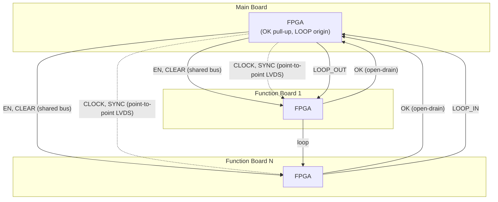
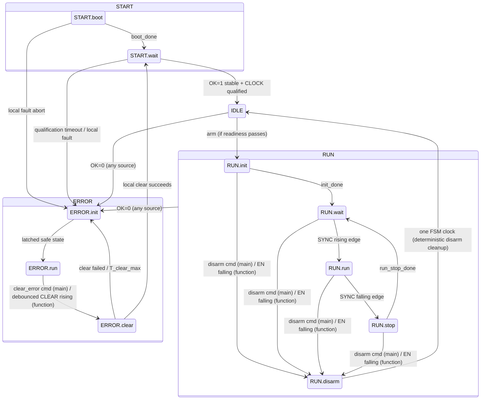
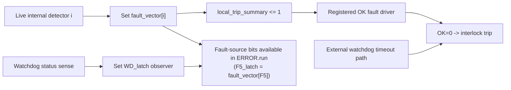
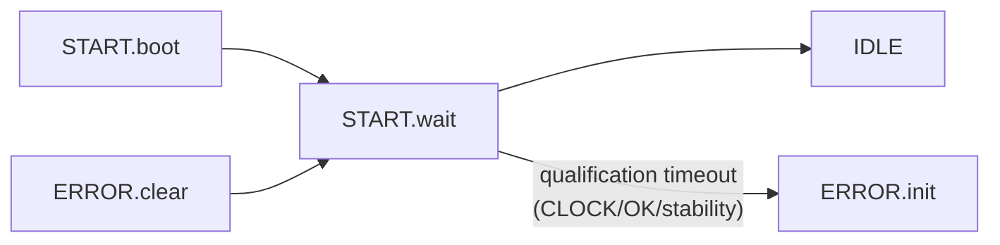

# ADR-003: Hierarchical State Machine Definition

**Status:** Resolved
**Last updated:** 2026-04-09

---

## Context

The system uses a hierarchical Moore state machine. In START/RUN/ERROR entry flows, the main FPGA drives shared backplane control signals (`EN`, `CLEAR`, `SYNC`) to coordinate all function boards. Recovery progress inside `ERROR.clear` is local to each board, while F4 driver verification is host-orchestrated through injected-fault commands (not a separate state).

This ADR defines all states, entry/exit conditions, sub-states, backplane signals, and kill-switch logic. It incorporates decisions from ADR-001 (fault detection), ADR-002 (configuration), and ADR-005 (utility-voltage distribution).

**Reader guide:** R1-R6 define the core architectural rules and shared terminology. R7 gives the readable state behavior. R8 points to the exhaustive transition reference used by implementers and test authors.

---

## Resolved Constraints

### R1: Main board scope

The main board is a PLC gateway. Its FSM responsibilities are strictly limited to the following functions:

| Function | Mechanism |
|---|---|
| Arm / disarm the system | Drives EN on the backplane |
| Generate and distribute clock and sync | Generates CLOCK and SYNC LVDS signals and distributes them point-to-point to all backplane slots |
| Monitor errors and recovery | Monitors OK bus and LOOP_IN, drives CLEAR |
| Provide utility converter sync reference when implemented | Drives the ICD-defined backplane utility DC-DC sync reference per ADR-005 |

The main board has no sequencer and no FSM coordination outputs beyond `EN`/`CLEAR`/`SYNC`. Infrastructure outputs (`CLOCK`, `LOOP_OUT`, and optional utility-converter sync) are also main-board signals and are defined here or in ADR-005. Other control functions (shutter, timing outputs, auxiliary signals) belong to function boards and are intentionally outside this ADR's scope; board-specific behavior for those outputs must be defined in function-board ICDs and future ADRs. Adding sequencer logic to main is explicitly out of scope.

### R2: Core philosophy

> **Go to safe state fast. Go to not-safe state slow.**

Every signal and state transition in this architecture follows this principle:

- Any fault condition (OK drop, EN drop, loop break) → relays open within two clock cycles or faster (function-board relays open in external latch propagation delay via async RESET, R9), no conditions
- Arming the system (EN rising, relay closure) → deliberate, gated by initialization completion
- Fault recovery → requires explicit operator action through ERROR.clear sequence
- Missing pre-arm readiness (e.g., unsynchronized local converter phase where implemented) is **Not Ready**, not a physical fault, while `EN=0`
- If armed operation is attempted while Not Ready (`EN=1`), it is treated as an interlock violation and becomes a fault

This asymmetry is intentional. A false safe-state trip costs observing time; a false not-safe transition can damage hardware. The architecture is intentionally biased toward safety.

The system uses two distinct layers:

- **Hardware Interlock Layer (sub-microsecond):** Deterministic hardware — open-drain OK fault bus, passive continuity loop, and external relay latch/flip-flop stage (R9). OK bus faults are asserted via registered FPGA logic (one clock cycle, no software). Function-board relay cutoff is enforced by external async RESET hardware independent of FPGA clock state.
- **FSM Implementation Constraint (Normative):** Implement the full hierarchical Moore FSM (`START`, `IDLE`, `RUN`, `ERROR`) in FPGA fabric logic (for example Verilog/VHDL) to guarantee deterministic one-clock transitions. Software FSM implementations (soft-core/SoC) are prohibited because they cannot guarantee sub-microsecond gates or one-clock fault response.
- **FSM Clock Domain Constraint (Normative):** The FSM, all registered safety-path outputs (`OK` driver, `relay_drive`, `EN`), and the internal clock monitor must be clocked from a **board-local management clock** generated by an independent on-board oscillator or crystal. This clock must **not** be derived from, or depend on, the distributed backplane `CLOCK` signal (100 MHz LVDS) used for sequencer timing, watchdog pet qualification, and optional local-converter divider chains. If the distributed `CLOCK` stops (F5), the FSM and its safety outputs must continue operating normally to detect and respond to the fault. The maximum management clock period is **`T_mgmt_max` ≤ 100 ns** (equivalent to ≥ 10 MHz), providing adequate margin for the sub-microsecond registered fault-assertion requirement including I/O propagation delays. Each board may use any management clock frequency that satisfies `T_mgmt_max`; the specific oscillator frequency is a board-level design choice, not a system-wide constant. All timeouts and timing parameters in this architecture are defined in real-time units (seconds, milliseconds), so boards with different management clock frequencies produce identical real-time behavior. See ADR-004 R5 for additional management clock independence rules.
- **FSM State Register Constraint (Normative):** The hierarchical FSM must be implemented in the FPGA using a single, unified state register (e.g., a flattened enumeration). Firmware implementations must not maintain separate `top_state` and `substate` registers, even if updated in the same clock block. A unified register prevents "logical desync" where combinational logic bugs update one tier of the hierarchy but fail to update the other, creating illegal state combinations. `top_state` should be extracted combinationally from the unified register's bits.

  Reference implementation (Flattened Encoding):

  ```verilog
  // Top-state constants (2-bit)
  localparam [1:0] 
      TOP_START = 2'b00,
      TOP_IDLE  = 2'b01,
      TOP_RUN   = 2'b10,
      TOP_ERROR = 2'b11;

  // Flattened state vector constants (5-bit)
  // Uses concatenation {top_state, sub_state} for foolproof alignment
  localparam [4:0] 
      START_BOOT  = {TOP_START, 3'b000},
      START_WAIT  = {TOP_START, 3'b001},
      IDLE        = {TOP_IDLE,  3'b000},
      RUN_INIT    = {TOP_RUN,   3'b000},
      RUN_WAIT    = {TOP_RUN,   3'b001},
      RUN_RUN     = {TOP_RUN,   3'b010},
      RUN_STOP    = {TOP_RUN,   3'b011},
      RUN_DISARM  = {TOP_RUN,   3'b100},
      ERROR_INIT  = {TOP_ERROR, 3'b000},
      ERROR_RUN   = {TOP_ERROR, 3'b001},
      ERROR_CLEAR = {TOP_ERROR, 3'b010};

  reg [4:0] current_state, next_state;

  // Top-state is extracted combinationally
  wire [1:0] top_state = current_state[4:3]; 

  // Single synchronous update guarantees no logical tearing or illegal states
  always @(posedge clk) begin
      current_state <= next_state;
  end
  ```

- **Ethernet Telemetry Layer (diagnostic):** Slower, software-driven. Read-only during RUN. Writable during IDLE only.

### R3: Backplane signal reference

This table is the authoritative behavioral definition for backplane signals. Other ADR/ICD sections should reference it instead of redefining signal behavior. Electrical details (voltage levels, drive strength, termination, pinout) remain ICD scope.

| Signal | Driver | Topology | Trigger | Description |
|---|---|---|---|---|
| `OK` | Any board (open-drain) / pull-up on main | Shared bus | Level (0 = Fault, 1 = Healthy) | Active fault bus. Pulled HIGH by main board resistor. Any board detecting a fault drives LOW. While armed (`EN=1`), any board may also pull LOW on keep_alive lease timeout (communication supervision fault). |
| `LOOP_OUT` | Main FPGA | Daisy-chain | Level (continuous 1) | Origin of the continuity loop. Routes through every slot and extension cable. |
| `LOOP_IN` | Main FPGA (received) | Daisy-chain | Level (0 = broken, 1 = healthy) | Return path of the continuity loop. Drop triggers main to pull OK LOW. |
| `EN` | Main FPGA | Shared bus | Level (0 = safe, 1 = armed) | Global arm signal. HIGH in armed RUN substates (`RUN.init`/`RUN.wait`/`RUN.run`/`RUN.stop`), LOW in `RUN.disarm` and all non-RUN states. Main asserts `EN` only after readiness checks pass. On function boards, `EN` is sampled in the local FSM clock domain: arm entry uses a debounced rising-edge qualifier (`N_en_rise_debounce` consecutive samples of `EN == 1` plus readiness/attestation gates), while `EN` falling is not debounced and forces immediate disarm handling. FPGA `relay_drive` ARM control is generated from local sub-state (asserted in RUN.wait/run/stop, de-asserted in RUN.disarm and all non-RUN states), and the external stage in R9 drives the relay coil. |
| `CLEAR` | Main FPGA | Shared bus | Level (held HIGH for `T_clear_hold`); function boards debounce and trigger on rising edge of debounced output | Synchronized recovery signal. Normally LOW. Main asserts HIGH for `T_clear_hold` (1 ms) to command all function boards to simultaneously drop fault latches and re-evaluate sensors. Function boards sample with a synchronous debouncer (`N_clear_debounce` consecutive FSM clock samples of HIGH) before transitioning. |
| `CLOCK` | Main-board clock generator/driver (outside FPGA) | Point-to-point LVDS | Level (continuous) | High-frequency sequencer clock (100 MHz), distributed point-to-point LVDS per slot. Used directly by function boards without PLL multiplication. In `START.wait`, function boards must observe watchdog pet-source activity derived from distributed `CLOCK`, and main must observe activity from its external clock-source monitor, both within `T_clock_present_max = 1 s` (timeout path). After `START.wait` completes, missing/invalid distributed `CLOCK` or failure in the `CLOCK -> divider -> pet` path is classified as F5 (CLOCK/pet-path fault) and propagates through the existing interlock fault path. See ADR-004. |
| `SYNC` | Main FPGA | Point-to-point LVDS | Edge + state-qualified | Point-to-point LVDS per slot. Generated with fixed 180° phase offset relative to `CLOCK` (`SYNC` rising aligned to `CLOCK` falling) to avoid uncertain cycle capture. `IDLE` + rising edge (`EN=0`) → reset watchdog divider phase and any implemented synchronized local DC-DC divider phase (pre-arm sync). `RUN.wait` + rising edge → RUN.run (start acquisition). `RUN.run` + falling edge → RUN.stop (graceful stop). Main must enforce minimum SYNC HIGH/LOW dwell `T_sync_min` (R6) for IDLE pre-arm and RUN pulses to guarantee capture in all function-board management domains. SYNC edges during `START.*` and `ERROR.*` are ignored by all boards. |

Utility voltages (`+3.3V_DIG`, `+6V_ANA`, `-6V_ANA`, `+16V_ANA`, `-16V_ANA`) and the optional main-board utility DC-DC sync reference are power-infrastructure resources, not FSM state signals. Their generation, naming, connector allocation, and optional synchronization are defined by ADR-005 and the relevant ICD/design package.

#### Signal flow diagram



### R4: Top-level state diagram

START.wait is the single stability gate shared by both boot and fault recovery paths. IDLE ↔ RUN indicates arm (IDLE → RUN) and disarm (Any RUN.* → RUN.disarm → IDLE). Fault from IDLE or any RUN.* sub-state (including RUN.disarm) goes directly to ERROR.init. START.boot intentionally ignores OK during startup grace. Recovery from ERROR always passes through ERROR.clear → START.wait → IDLE — there is no direct ERROR → IDLE path.

### Visual State Flow



**Diagram simplification note:** Fault transitions are shown at state level. `OK=0 (any source)` means the shared OK bus was pulled LOW either by an external source (another board/global bus condition) or by an internal source on the local board (for example local hardware fault, supervision timeout, or authorized injected fault). `RUN --> ERROR.init` applies to all `RUN.*` sub-states (including `RUN.disarm`). `START.boot` intentionally ignores the shared OK bus to allow fleet power-up, but it still enforces immediate abort to `ERROR.init` if a local internal fault occurs (`local_trip_summary == 1`).

### R5: Kill-switch logic

All relay control follows the core philosophy: **go to safe state fast, go to not-safe state slow.**

```
FAST path (safe):   any fault → relay de-energizes within two clock cycles, no conditions
SLOW path (armed):  FSM in RUN.wait/RUN.run/RUN.stop with `EN=1` → relay energizes deliberately
```

**Signal naming convention (normative):**
1. Unprefixed common signal names (for example `fault_vector`, `local_trip_summary`, `boot_pulldown_active`, `injected_fault`, `latched_supervision_fault`, `ok_fault`, `pull_ok_low`, `clear_summary_strobe`) are board-local instances present on both the main board and function boards.
2. Prefixes are reserved only for board-role-specific signals that are not shared semantics.

**Normative logic constraints (all boards):**

1. **Registered OK driver (mandatory):** The `ok_fault` output driving the open-drain MOSFET must be a registered flip-flop output clocked from the board-local management clock. Raw combinational paths to the OK bus are prohibited (glitch prevention).
2. **Exactly four FPGA-internal OK sources:** Only the following may contribute to `ok_fault`:
   - `local_trip_summary` — hardware-fault summary latch (derived from `fault_vector`)
   - `boot_pulldown_active` — boot hold-down latch (released after CLOCK qualification in `START.wait`)
   - `injected_fault` — explicit host-authorized maintenance bit
   - `latched_supervision_fault` — armed keep_alive lease timeout latch
3. **External hardware paths are independent:** The fail-safe driver (F2a) and external watchdog (F2b/F5) pull OK LOW through their own open-drain drivers, outside the FPGA `ok_fault` register.
4. **`boot_pulldown_active` lifecycle:** Initializes to `1` on FPGA power-up/reset; remains asserted through `START.boot` and early `START.wait`; clears only after CLOCK qualification succeeds in `START.wait`. Intentionally not re-asserted on recovery entry (see R7 design rationale).
5. **`latched_supervision_fault`:** Produced by the board's ICD-defined communication supervision monitor. The `EN=1` gate is internal to the supervision monitor (R6 rule 2), not in the `ok_fault` OR expression. Cleared only by `clear_summary_strobe` at the successful `ERROR.clear → START.wait` boundary.

**Main board EN output (normative micro-snippet):**

```verilog
// EN is the sole arming output of the main board.
// top_state is extracted combinationally from the unified state register (R2 FSM State Register Constraint).
assign EN = (top_state == TOP_RUN) && (current_state != RUN_DISARM);
```

**Function board relay_drive (normative micro-snippet):**

```verilog
// relay_drive is the FPGA ARM control for the external relay D flip-flop stage (R9).
// Must be registered to prevent combinational glitches from clocking the external flip-flop.
// current_state is the unified flattened state register (R2 FSM State Register Constraint).
always @(posedge clk) begin
    relay_drive <= (current_state == RUN_WAIT)
                 | (current_state == RUN_RUN)
                 | (current_state == RUN_STOP);
end
```

The holistic integration of the diagnostic layer (`fault_vector`), trip layer (`local_trip_summary`), and registered safety outputs (`ok_fault`, `pull_ok_low`) — showing how all signals wire together in one module for both main and function boards — is documented in the Firmware Reference Appendix.

The Golden Rule: a healthy board must never pull OK LOW because the FSM entered ERROR. A board may deliberately drive `OK = 0` only through explicit host-authorized injected-fault control (`set_injected_fault`) used for maintenance verification.

**Key property of the relay logic:**
- Main board: `EN = (top_state == TOP_RUN) && (current_state != RUN_DISARM)` is the complete arming output — no separate relay signal
- Function boards: FPGA `relay_drive` is a pure Moore ARM-control output from sub-state; asserted only in RUN.wait/run/stop (after RUN.init), de-asserted in RUN.disarm and every other state
- Physical relay de-energizing is enforced by external RESET-dominant latch/flip-flop logic (`RESET = NOT(EN) OR NOT(OK)`, R9); FSM Moore outputs provide the synchronized control path, and relay physical switching time still dominates end-to-end cutoff

### R6: Timing constants and global FSM rules

**Timing constants (normative):**

| Constant | Nominal value | Meaning |
|---|---|---|
| `T_clock_present_max` | `1 s` | Maximum time in `START.wait` to observe CLOCK-qualification evidence (function: first `watchdog_pet_edge_detected()`; main: first `main_clock_edge_detected()`) |
| `T_pet` | ICD-defined; must satisfy `T_pet ≪ T_clock_present_max` | Period of the watchdog pet signal, derived from the 2 MHz baseline via the dedicated watchdog divider ÷M (ADR-004 R4/R5). The divider ratio that determines `T_pet` is specified in the board ICD. |
| `T_ok_rise_max` | `5 s` | Maximum time in `START.wait` to observe first `OK == 1` |
| `T_clear_hold` | `1 ms` | Duration the main board holds `CLEAR` HIGH on the backplane. Must be long enough for all function boards to complete debounce sampling. At `T_mgmt_max ≤ 100 ns`, 1 ms provides ≥10,000 clock cycles of margin. |
| `N_clear_debounce` | ICD-defined (minimum 2) | Number of consecutive FSM clock samples where `CLEAR == 1` required before the function board's debouncer output asserts. Filters backplane glitches. |
| `N_en_rise_debounce` | ICD-defined (minimum 2) | Number of consecutive FSM clock samples where `EN == 1` required on function boards before accepting arm entry from IDLE. EN falling is not debounced and must take effect immediately. |
| `T_clear_max` | ICD-defined, with `T_clear_max < T_ok_rise_max` (recommended `T_clear_max <= 0.1 * T_ok_rise_max`) | Maximum allowed duration of local `ERROR.clear` routine on a faulty board (main or function) |
| `T_start_stable` | `5 s` | Continuous `OK == 1` stability window required before IDLE |
| `T_settle` | ICD-defined (expected order: milliseconds; recommended initial value `1 ms`) | Minimum settle time after IDLE `SYNC` phase-reset before arm is valid for boards with synchronized local converters; board characterization may justify lower/higher values. Boards without synchronized local converters may define this as not applicable. |
| `T_sync_min` | `>= 3 * T_mgmt_max` (therefore `>= 300 ns` when `T_mgmt_max = 100 ns`) | Minimum required SYNC pulse-segment duration (both HIGH and LOW dwell). Main must enforce this for IDLE pre-arm SYNC and RUN SYNC windows so all boards guarantee synchronous edge capture in the management-clock domain. |
| `T_run_init_max` | ICD-defined (recommended initial value `1 ms`) | Worst-case maximum time for any board to complete `RUN.init` after `EN` rises. Main must enforce this as the minimum delay before emitting the first acquisition `SYNC` rising edge in each arm cycle. |
| `T_keepalive_lease_max` | ICD-defined | Maximum elapsed time since the last valid host keep_alive message before a board pulls `OK` LOW (active only while armed, `EN=1`). Each board maintains a local lease timer refreshed by periodic host Ethernet traffic; if the timer exceeds `T_keepalive_lease_max` without a refresh, the board treats it as loss of host communication supervision (S1) and trips the interlock. |
| `T_WD_HW_max` | ICD-defined | Maximum expected time for watchdog IC to assert `OK` LOW after pet signal ceases (dependent on watchdog IC timeout setting) |
| `T_WD_RELEASE_max` | ICD-defined | Maximum allowed time after `resume_watchdog_pets` for a tested board's watchdog path to release and for `OK` to return HIGH (assuming no other active fault source) |

These constants are authoritative for FSM behavior and should be referenced by other ADRs/ICDs rather than redefined.

**Local synchronization readiness (`local_sync_ready`) (normative):**
- `local_sync_ready` is a board-local readiness flag shared by main and function board implementations.
- Boards with synchronized local converters force `local_sync_ready = 0` on IDLE `SYNC` rising edge and set it to `1` only after local `T_settle` expires.
- Boards without synchronized local converters may tie `local_sync_ready = 1` after watchdog timing-domain qualification. This keeps the EN-rise gate uniform without requiring every board to implement a local converter sync path.

**Internal fault-latching architecture on each board (Normative):**
- `fault_vector` (diagnostic layer): per-source sticky bits set by board-local internal fault/event sources (for example over-current detector, CLOCK-loss monitor, PLL lock lost). On function boards, `F5_latch` is the dedicated F5 source bit in this vector (set by the internal clock monitor when distributed CLOCK stops). On the main board, a dedicated external-CLOCK-source fault bit serves the equivalent role (set by a continuous CLOCK-source monitor running on the management clock domain when the external clock generator stops).
- `local_trip_summary` (trip layer): single local hardware-fault summary latch. This is the only local-hardware signal that feeds the registered FPGA `OK` fault driver.
- `WD_latch`: separate observer latch set from the dedicated watchdog status sense line (external watchdog path observer).

**Fault-path and clear semantics (normative):**
1. If any live internal detector trips, its corresponding `fault_vector` bit is set to `1`.
2. Function-board EN-rise readiness gate violation (`local_sync_ready == 0` for boards that require local synchronization readiness, or `sequencer_hash_valid_current_arm == 0`, at accepted EN rising) must set a dedicated interlock-violation bit in `fault_vector`.
3. Whenever `fault_vector != 0`, `local_trip_summary` must be set to `1`, regardless of current FSM state.
4. `local_trip_summary` drives local interlock assertion through the registered `OK` fault driver (`OK` LOW).
5. Late-arriving-fault rule: if a board is parked in `ERROR.run` due to another board and a local detector trips, `fault_vector` sets and `local_trip_summary` asserts; that board then actively contributes to `OK` LOW and is treated as locally faulty during recovery.
6. On `ERROR.run → ERROR.clear` entry, the board must clear `fault_vector = 0` (prime-for-recheck), force `injected_fault = 0`, and resume watchdog petting as failsafe cleanup.
7. On `ERROR.run → ERROR.clear` entry, `local_trip_summary` must **not** be cleared.
8. During `ERROR.clear`, live detectors continue running; any still-present or new fault re-sets the corresponding `fault_vector` bit(s).
9. On the `ERROR.clear` exit evaluation boundary: if `fault_vector == 0`, transition to `START.wait` and assert `clear_summary_strobe` exactly on that transition boundary (clears `local_trip_summary` and `latched_supervision_fault`); clear `WD_latch` at this success boundary as well.
10. On the `ERROR.clear` exit evaluation boundary: if `fault_vector > 0`, transition to `ERROR.init`; keep `local_trip_summary = 1` and retain `fault_vector` / `WD_latch` for host diagnosis in the next `ERROR.run`.
11. `fault_vector`/`F5_latch` and `WD_latch` are source-diagnosis signals; they do not directly drive `OK`.



**Armed keep_alive supervision rule (normative):**
1. Each board must maintain an ICD-defined keep_alive lease refreshed only by a dedicated `keep_alive` command from the host. No other Ethernet traffic resets the lease timer.
2. Supervision timeout is enforced only while armed (`EN=1`).
3. If lease age exceeds `T_keepalive_lease_max`, that board must pull `OK` low and force global transition to `ERROR.init`.
4. The `keep_alive` command is a minimal heartbeat: the board acknowledges receipt but does not return status or telemetry data in the reply. Board status is available through separate polling commands.
5. Keep_alive message format, refresh/debounce behavior, and exact timing values are ICD-defined.
6. Supervision-latch clear policy is boundary-only: board-local `latched_supervision_fault` (main or function) may clear only on successful `ERROR.clear -> START.wait` boundary via `clear_summary_strobe`.

**EN edge handling rule on function boards (normative):**
1. Sample/synchronize backplane `EN` in the local FSM clock domain.
2. Accept arm-entry from IDLE only on debounced `EN` rising (`N_en_rise_debounce` consecutive samples where `EN == 1`) together with the existing readiness/attestation guards.
3. Do not debounce `EN` falling. The first sampled `EN == 0` from any `RUN.*` state must trigger immediate `RUN.disarm` transition logic.

### R7: State definitions and phase guards

#### START
**EN = 0 | Safe**

This is the initial power-up phase. During `START.boot`, `OK` is intentionally ignored because boards may legitimately hold it LOW while booting. Reacting to `OK` here would cause false ERROR trips on simultaneous startup. Each board keeps `boot_pulldown_active = 1` through `START.boot` and into early `START.wait`. Release is allowed only after START.wait CLOCK qualification succeeds (function: `watchdog_pet_edge_detected()`, main: `main_clock_edge_detected()`).

| Sub-state | Description |
|---|---|
| START.boot | FPGA/SoC boots using a local independent management clock domain. Reads ALL NVM parameters (network + operational). Applies network config and brings Ethernet up. Applies operational defaults (bias voltages, clock settings, etc.). Watchdog pet source belongs to the 2 MHz baseline ÷M watchdog divider (per ADR-004 R4), while startup grace keeps CLOCK-loss/qualification fault handling out of this sub-state. Keeps `boot_pulldown_active` asserted and transitions to START.wait with OK still held LOW. |
| START.wait | Timeout-driven qualification gate shared by boot and recovery. Three independent gates must all pass within an absolute deadline. See gate summary below. |

**START.wait qualification gates:**

START.wait enforces three independent conditions. All three must pass within the absolute deadline (`T_ok_rise_max + T_start_stable` = 10 s) before the board may transition to IDLE.

| # | Gate | Condition | Individual timeout | Reset behavior |
|---|------|-----------|-------------------|----------------|
| 1 | CLOCK qualification | Function boards: ≥1 pet edge detected since START.wait entry. Main board: ≥1 edge detected on external CLOCK-source monitor since START.wait entry (`main_clock_edge_detected()`). | `T_clock_present_max` (1 s) → ERROR.init | Once qualified, stays qualified permanently for this START.wait pass |
| 2 | OK first-rise | `OK == 1` sampled at least once | `T_ok_rise_max` (5 s) → ERROR.init | Once seen, permanently passed — grants full absolute deadline for fleet convergence |
| 3 | OK stability | `OK == 1` continuously for `T_start_stable` (5 s) | Bounded by absolute deadline only | Each `OK` drop restarts the stability counter; absolute deadline is unchanged |

**Local-fault fast-abort rule (normative):**
While in `START.boot` or `START.wait`, a board must abort immediately to `ERROR.init` if `local_trip_summary == 1`. START tolerance for `OK == 0` applies only to fleet-level/external bus behavior, not to known local faults.

**Absolute deadline** = `T_ok_rise_max + T_start_stable` = 10 s. This is the hard backstop. If all three gates have not passed by this time → ERROR.init. The absolute deadline starts on START.wait entry and never resets.

**Qualification scenarios:**

| Scenario | What happens | Outcome | Caught by |
|----------|-------------|---------|-----------|
| **Clean boot** | CLOCK qualifies (~ms), OK rises (~1 s), stays stable for 5 s | → IDLE at ~6 s | — |
| **No CLOCK** | Required CLOCK evidence never detected (function: no pet edge, main: no external-clock monitor edge) | → ERROR.init at 1 s | Gate 1 (`T_clock_present_max`) |
| **No OK rise** | OK never goes HIGH | → ERROR.init at 5 s | Gate 2 (`T_ok_rise_max`) |
| **OK oscillation** | OK rises at 2 s (gate 2 passes), drops at 4 s, rises at 6 s — stability counter restarts each drop | → ERROR.init at 10 s | Absolute deadline (stability never completes in remaining time) |
| **Late fleet convergence** | CLOCK already qualified (gate 1 passed); OK rises briefly at 1 s (gate 2 passes), stays LOW until 4 s, then stable from 4 s | → IDLE at 9 s (4 s + 5 s stability) | — (succeeds within deadline) |

**Design rationale — No early abort for stability window:** Because the absolute deadline is 10 s and stability requires 5 s, any OK rise that occurs after $t = 5\text{ s}$ is mathematically guaranteed to hit the absolute deadline before stability completes. However, firmware implementations must not add an "early abort" check (e.g., if ok_high_since > 5s then ERROR.init). The FSM must simply wait for the abs_deadline to naturally expire. This maintains minimal, simple logic for the FPGA comparator and is perfectly safe because the system remains unarmed (EN=0) during START.wait.

The reference firmware implementation of the START.wait qualification loop (timer initialization, gate evaluation ordering, and transition logic) is documented in the Firmware Reference Appendix. Firmware implementations must strictly adhere to the qualification gates, scenarios, design rationales, and timer boundary convention defined above, and must satisfy the R8 transition specification.

**Design rationale - boot_pulldown_active asymmetry:** `boot_pulldown_active` is asserted only on physical FPGA power-up/reset and is intentionally **not** re-asserted when entering `START.wait` from `ERROR.clear`. This allows a clean `OK` release exactly at the successful `ERROR.clear -> START.wait` boundary without introducing an artificial extra hold-down phase. Safety is preserved because no board can reach `IDLE` without passing the `clock_qualified` gate, and missing CLOCK during recovery still deterministically trips via `T_clock_present_max` timeout back to `ERROR.init`. Implementations must not "symmetrize" this latch by re-asserting it on recovery entry.

**START.wait is shared between two paths:**



**Nominal deadline note:** With `T_clock_present_max = 1 s`, `T_ok_rise_max = 5 s`, and `T_start_stable = 5 s`, the absolute START.wait deadline is `10 s`.

**Design rationale — gate 2 permanently passing on first OK rise:** The first `OK == 1` sample proves at least one board has completed boot/recovery. After that, `T_ok_rise_max` no longer applies — the remaining time is granted for fleet convergence. If no board ever drives `OK` HIGH, `T_ok_rise_max` catches that fundamentally different failure (all boards dead or misconfigured). The absolute deadline catches oscillation cases where OK rises but never stays stable long enough.

**Timer boundary convention (normative):** In this ADR, "within `T_x`" means `t_event <= T_x` (inclusive). Timeout applies when `t_event > T_x`.

#### IDLE
**EN = 0 | Safe**

Default resting state with all relays open. Boards arrive fully configured from NVM. Before arming, the host may override operational parameters over Ethernet. These overrides are session-only unless explicitly persisted.

- Operational parameters writable via Ethernet
- UART accessible for diagnostics and NVM reconfiguration
- Before every arm attempt (including the first arm after boot), the remote host performs sequencer hash attestation on all required function boards; only mismatched/missing boards are reprogrammed (ADR-002 R9)
- `SYNC` rising edge in IDLE (`EN=0`) resets the local divider chain (÷50 baseline, ÷M watchdog, and optional ÷N local DC-DC where implemented); main enforces SYNC pulse-width constraints (`T_sync_min`), then boards wait any required `T_settle` before arm is permitted (ADR-004 R4)
- IDLE pre-arm `SYNC` is host-driven: host sends `send_pre_arm_sync` to main; main emits one pulse and does not generate IDLE `SYNC` autonomously
- Operator sends `arm` via Ethernet to the main board only. Main checks its own `local_sync_ready` and, if ready, asserts `EN = 1` → RUN.init
- Operator may start F4 maintenance verification by sending `set_injected_fault` to a selected board (allowed only in IDLE/ERROR.run)
- Any fault (OK = 0) → ERROR.init

**SYNC behavior in IDLE (normative):**
1. Applies only when `top_state == TOP_IDLE` and `EN = 0`
2. IDLE pre-arm `SYNC` pulse is host-driven: remote host sends `send_pre_arm_sync` to main; main emits one pulse, must hold the HIGH segment for at least `T_sync_min`, and must not free-run/spam `SYNC` while in IDLE
3. On `SYNC` rising edge, each board resets the local divider chain (÷50 baseline, ÷M watchdog, and optional ÷N local DC-DC where implemented) via a one-shot reset strobe in its local clock domain
4. Each board updates `local_sync_ready` according to the R6 local synchronization readiness rule.
5. The host should arm only after required boards report ready, and each function board enforces its applicable readiness flags on `EN` rising (otherwise trips interlock)
6. `SYNC` falling edge in IDLE has no acquisition meaning and is ignored by boards while in IDLE
7. Before asserting `EN`, the main board must ensure `SYNC` is LOW so that function boards, once they reach `RUN.wait`, can detect a clean rising edge to start acquisition
8. Main must enforce `T_sync_min` on both HIGH and LOW SYNC dwell segments around the pre-arm pulse so all boards deterministically capture transitions

**Readiness and CLOCK semantics in IDLE (normative):**
1. `local_sync_ready == 0` in IDLE is a **Not Ready** condition, not a fault condition
2. While `EN=0`, a board in Not Ready does not pull `OK` low solely due to missing local converter phase sync
3. In `START.wait`, missing CLOCK is handled by timeout gating (`T_clock_present_max`), not by immediate fault transition
4. After `START.wait` completes, missing `CLOCK` is a fault condition on both board roles: function boards detect distributed CLOCK loss via their internal clock monitor (`F5_latch`); the main board detects external CLOCK-source failure via its continuous CLOCK-source monitor. Both propagate through the normal `OK == 0` fault path (R8)

*Main board readiness gate (soft reject):*

1. On Ethernet `arm`, main board checks its own `local_sync_ready`. If no main-local synchronization readiness applies, this condition is tied to `1`.

2. If not ready → rejects arm, remains in IDLE with `EN=0`

3. Returns explicit Ethernet response (e.g., `ARM_REJECTED_NOT_READY_MAIN`) with blocking reason(s)

*Function board readiness gate (hard interlock):*

1. Each function board independently tracks `local_sync_ready` and `sequencer_hash_valid_current_arm` in IDLE. On function boards that do not implement a sequencer (e.g., static bias/voltage boards), `sequencer_hash_valid_current_arm` must be permanently tied to `1` in hardware to passively pass the EN-rise gate.

2. No backplane signal carries function-board readiness — the main board cannot query or infer whether any function board is ready before asserting `EN`

3. Readiness is observable only by the remote host polling each function board directly via Ethernet (host ↔ function board, not host → main → function board)

4. Host must verify both flags on every required function board before sending `arm` to main
5. On `EN` rising edge, each function board enforces readiness locally. If either flag is `0`, the board must set a dedicated interlock-violation source bit in `fault_vector`; by rule (`fault_vector != 0` → `local_trip_summary = 1`) this asserts `OK` low and transitions to `ERROR.init` (R8 EN-rise safety gate)
6. This hardware gate cannot be bypassed; it is the last line of defense if the host polls incorrectly or skips polling

**Sequencer hash attestation semantics (normative):**
1. Before every arm command, including the first arm after boot, the host must send `attest_sequencer_hash(expected_hash)` to each required function board (ADR-002 R9)
2. Boards compute hash on demand from local volatile sequencer bytes and return exactly one result: `hash_match`, `hash_mismatch`, or `missing/invalid`
3. Any board with `hash_mismatch` or `missing/invalid` must be reprogrammed and must pass local payload validation before being considered ready
4. Arm is allowed only after all required boards report `hash_match` for the current session target
5. Disarm from `RUN.init` or `RUN.wait` before the first acquisition trigger (`SYNC` rising edge that would enter `RUN.run`) does not bypass this rule; the next arm still requires attestation
6. After each readout, the next arm again requires attestation (re-upload only where result is `missing/invalid` or `hash_mismatch`)

**`sequencer_hash_valid_current_arm` lifecycle (normative):**
1. Clear to `0` on IDLE entry and on any sequencer write/validation-fail event
2. Set to `1` only when the board returns `hash_match` to `attest_sequencer_hash(expected_hash)` while in IDLE
3. Clear to `0` immediately after EN-rise gate acceptance into `RUN.init` so the next arm requires a fresh attestation cycle

**Design rationale - consume-on-use defense-in-depth:** Step 3 is intentionally redundant with Step 1. Clearing the token immediately on accepted EN-rise destroys reuse possibility within the same arm cycle and protects against transition bugs or illegal EN bounce conditions. Implementations must not remove Step 3 as an optimization.

#### RUN
**EN = 1 while armed (`RUN.init`/`RUN.wait`/`RUN.run`/`RUN.stop`); `RUN.disarm` is EN=0 transient**

System is armed while `EN=1` (`RUN.init`/`RUN.wait`/`RUN.run`/`RUN.stop`). In `RUN.disarm`, `EN=0` and relays open immediately through the hardware reset path.

| Sub-state | Trigger | Description |
|---|---|---|
| RUN.init | EN rising accepted by local EN-rise qualifier (function boards use `N_en_rise_debounce`; main enters on accepted arm command) | Arm-entry initialization: flush ADCs, apply bias voltages, pre-load sequencers, reset counters. (Watchdog divider reset, and local DC-DC phase reset where implemented, is performed earlier in IDLE; see ADR-004 R4.) |
| RUN.wait | RUN.init complete | Hardware ready, monitoring SYNC continuously |
| RUN.run | SYNC rising edge | Sequencers fire and data acquisition begins. Boards with synchronized local converters have already established their phase relationship during IDLE pre-arm SYNC; utility-converter synchronization, when used, is handled by the main-board reference defined in ADR-005. |
| RUN.stop | SYNC falling edge | Graceful stop: halt capture, bleed integration capacitors, zero counters → return to RUN.wait |
| RUN.disarm | disarm command (main) / backplane `EN` falling edge (function, any `RUN.*`, no debounce) | Forced disarm path: relays open immediately via `EN=0` hardware reset path; run deterministic one-cycle bookkeeping, then transition to IDLE |

Any fault (OK = 0) during RUN → immediately ERROR.init.

Keep_alive supervision is mandatory while armed on all boards: if any board's keep_alive lease expires, that board asserts `OK` low and forces `ERROR.init` (global trip).

**First acquisition-trigger guard (normative):**
1. Let `t_en_rise` be the clock when main asserts `EN = 1` (IDLE → RUN.init arm boundary)
2. There is no backplane "all boards RUN.wait-ready" feedback signal
3. Therefore main must not emit the first acquisition `SYNC` rising edge of that arm cycle before `t_en_rise + T_run_init_max`
4. `T_run_init_max` must be selected to be greater than or equal to the worst-case RUN.init completion time among all boards in the fleet (ICD-defined)
5. If host requests trigger earlier, main must delay that first trigger until the guard is satisfied

`EN`-rise readiness checks are normative in the R8 transition reference.

#### ERROR
**EN = 0 | Latched fault**

Entered instantly on any transition to `ERROR.init` defined in R8. Main drops `EN = 0`.

**Important:** On function boards, physical relay cutoff is guaranteed by the external RESET-dominant latch/flip-flop stage (R9): RESET asserts when `EN = 0` or `OK = 0`, forcing coil drive LOW independently of FPGA clock progression. In parallel, FSM Moore outputs de-assert FPGA `relay_drive` one clock edge after fault sampling as sub-state leaves RUN.*. On the main board, `EN` drops when `top_state` leaves RUN.

| Sub-state | Description |
|---|---|
| ERROR.init | `EN` drops; external relay RESET is active (`EN=0` and/or `OK=0`) so coil drive is forced LOW. FPGA `relay_drive` de-asserts as Moore ARM control. Fault latches held; no latch clearing or OK release. System safe. |
| ERROR.run | Holding state. Operator polls diagnostics via Ethernet to identify the fault, including `F5_latch` and `WD_latch` diagnostic latches for F5/F2b differentiation (ADR-001 R6 truth table). Waits for `clear_error` command. |
| ERROR.clear | Recovery attempt. Behavior defined by R6 rules 1–11 and the R8 transition reference. |

**ERROR.clear sequence:**

The `ERROR.clear` recovery behavior for both main and function boards is fully defined by the fault-path and clear semantics (rules 1–11 above) and the R8 transition reference. The step-by-step procedural implementation of the `ERROR.clear` entry actions, exit boundary evaluator, and board-role-specific responsibilities is documented in the Firmware Reference Appendix.

**Operational note (F1 loop break):** `clear_error` cannot succeed while physical loop continuity remains broken. If `LOOP_IN` is still LOW, the main-board loop-fault latch cannot clear at the recovery boundary and the system returns to `ERROR.init` after the clear attempt.

**OK bus hold-down rule during ERROR (normative):**
Any board (main or function) that entered ERROR due to a local fault source must keep pulling `OK` LOW for the entire duration of `ERROR.*`. On function boards, this means `local_trip_summary` stays asserted for all of `ERROR.*` and is not cleared while remaining in `ERROR.clear`; it may clear only on a successful `ERROR.clear → START.wait` boundary where `fault_vector == 0`. This guarantees:
- No premature `OK` release during ERROR recovery
- `OK` releases exactly once, at `START.wait` entry, where `T_start_stable` acts as defense-in-depth
- If the fault reappears after release, `START.wait` catches it (stability counter restarts, absolute deadline enforced)
- Per-board fault sensor definitions (which detectors feed `fault_vector`, sampling method, hysteresis/threshold policy) are ICD-defined

**ERROR.clear timing rule (normative):**
1. `T_clear_max` is the local clear-routine budget for faulty boards (main or function) in `ERROR.clear`
2. `T_clear_max` is constrained by `START.wait` behavior on healthy boards, not by an independent global settle timer
3. Because boards may complete local clear at different times, a faulty board clear routine that runs too long can make earlier boards hit their `START.wait` `T_ok_rise_max` timeout first
4. Therefore `T_clear_max` must satisfy `T_clear_max < T_ok_rise_max`; recommended engineering target is `T_clear_max <= 0.1 * T_ok_rise_max`
5. No fixed microsecond settle constant is defined in this ADR for `ERROR.clear`
6. Fleet convergence is enforced by existing `START.wait` qualification (`OK` must rise and remain stable by the existing deadlines), not by an extra `ERROR.clear` settle gate

For an illustrative worked example of the fault-trip and `ERROR.clear` recovery lifecycle (including physical relay cutoff and host operator interaction), refer to the System Integration Guide.

#### F4 Driver Verification (No Separate State)
**EN = 0 | Maintenance (IDLE + ERROR.run flow)**

F4 verification uses command-controlled faults, not a dedicated FSM test state. Each function board has two independent open-drain `OK` drivers (FPGA-registered fault path and external watchdog path; ADR-001 R2/R5). Verification therefore has two phases to prove both paths can pull `OK` LOW.

**Command semantics (normative):**
1. `set_injected_fault` sets `injected_fault = 1` on the targeted board (tests the FPGA driver)
2. `clear_injected_fault` clears `injected_fault = 0` on the targeted board
3. `halt_watchdog_pets` forces the FPGA to deliberately stop toggling the watchdog pet signal (tests the watchdog driver and timer)
4. `resume_watchdog_pets` forces the FPGA to resume toggling the watchdog pet signal on the targeted board after a watchdog-path test
5. All four commands are legal only in `IDLE` and `ERROR.run`; commands in other states are rejected
6. `clear_injected_fault` never clears `local_trip_summary` or `fault_vector`
7. `clear_error`/`CLEAR` must force `injected_fault = 0` and resume watchdog petting as a failsafe
8. `clear_error`/`CLEAR` initiates the `ERROR.clear` evaluate-then-clear routine; it does not directly clear `local_trip_summary` while the board remains in `ERROR.clear`

**Verification sequence:**

F4 verification requires two phases: Phase 1 tests each board's FPGA-registered driver path (`set_injected_fault` / `clear_injected_fault`), and Phase 2 tests each board's watchdog driver and timer path (`halt_watchdog_pets` / `resume_watchdog_pets`). The step-by-step host-side test procedure (command ordering, expected OK bus responses, pass/fail criteria, and `T_WD_HW_max`/`T_WD_RELEASE_max` timing windows) is defined in the system ICD.

**Inherent assurance limitation:** `halt_watchdog_pets` requires a functioning FPGA to execute the halt. It verifies watchdog timer logic and physical open-drain drive, but it cannot prove behavior under true FPGA-dead conditions (F2a/F2b boundary cases). Brain-dead assurance comes from hardware architecture (independent `+12V_RAW`-derived watchdog/fail-safe supply or equivalent independent supply + fail-safe path) and certified component choice (ADR-001 R2/R7).

### R8: Transition and command reference

The exhaustive transition table, command split rules, clock-loss propagation note, and EN-rise safety-gate detail are kept in:

[ADR-003_transition_reference.md](reference/ADR-003_transition_reference.md)

That reference is authoritative when R7 summary text and detailed transition rules overlap.

For peer review of the architecture, the main invariants are:

1. Fault/interlock paths have priority over commanded transitions in `IDLE` and `RUN.*`.
2. Function boards enter RUN only from a debounced backplane `EN` rising edge plus local readiness and sequencer attestation.
3. Main-only Ethernet commands (`arm`, `disarm`, `clear_error`, `send_pre_arm_sync`) are not consumed as arming commands by function boards.
4. Maintenance fault-injection/watchdog-test commands are legal only in `IDLE` and `ERROR.run`.
5. `ERROR.clear` releases local fault summaries only at the successful `ERROR.clear -> START.wait` boundary.

### R9: External relay latch/flip-flop stage for function board relay drive

Each function board relay arm path uses an external latch/flip-flop with asynchronous reset as a hardware-independent de-arm mechanism. This closes the gap where a brain-dead FPGA condition can leave `relay_drive` asserted because Moore outputs cannot advance without clock progress, while the watchdog still pulls `OK` LOW and trips the rest of the system.

**Normative requirements:**

- **Q (output):** Sole driver of the relay coil. HIGH = relay armed.
- **ARM input:** Registered FPGA output (same guardrail as the OK driver, ADR-001 R4). Asserted only after `RUN.init` completes (at `RUN.wait` entry) — the same timing point as the existing `relay_drive` assertion.
- **Asynchronous RESET:** Active when `EN = 0` OR `OK = 0`. **RESET is dominant over ARM** — the output can only be HIGH when both `EN = 1` AND `OK = 1`.
- **Power supply:** Latch/flip-flop IC and all RESET-path logic must be powered from the always-on watchdog supply (`+12V_RAW` LDO or equivalent independent supply), not the FPGA digital rail — so RESET correctly tracks backplane signals even if local logic rails collapse.
- **Relay type:** Normally-open (energized to arm). Complete board power loss de-energizes the relay mechanically, independent of latch state.
- **FPGA `relay_drive`:** Becomes the ARM control signal. It no longer drives the relay coil directly.

For a reference schematic implementation using a D flip-flop and an open-drain wired-AND reset generator, refer to the Hardware Design Specification.

**Scope note:** This constraint applies to function board relay drive. The main board has no separate relay — `EN` is its sole arming output (R5); main board relay architecture is outside this constraint.

---

## Decision

*Resolved. Core states (START, IDLE, RUN, ERROR), transition priorities and reference rules, injected-fault maintenance command model, kill-switch logic, and external relay latch/flip-flop stage requirement for function boards (R9) are settled. While armed, keep_alive lease timeout on any board trips globally via `OK` pull-down.*

---

## Consequences

- Firmware on all boards must implement the transition priority model and guards exactly as specified.
- The main board Ethernet API must return explicit arm-rejection responses (Not Ready + reasons) when readiness checks fail.
- Function boards must enforce EN-rise readiness checks and convert violations into interlock faults via `OK` pull-down.
- ICD must define keep_alive protocol details (message framing, cadence, timeout tuning, and jitter/debounce policy) used by the ADR-level supervision rule.
- Verification must include transition-coverage tests for nominal flow, rejected arm attempts, and reboot-edge cases.
- Each function board must implement an external reset-dominant latch or D flip-flop stage (always-on supply) as the sole relay coil driver, with ARM from a registered FPGA output and asynchronous RESET from `NOT(EN) OR NOT(OK)` (R9).


