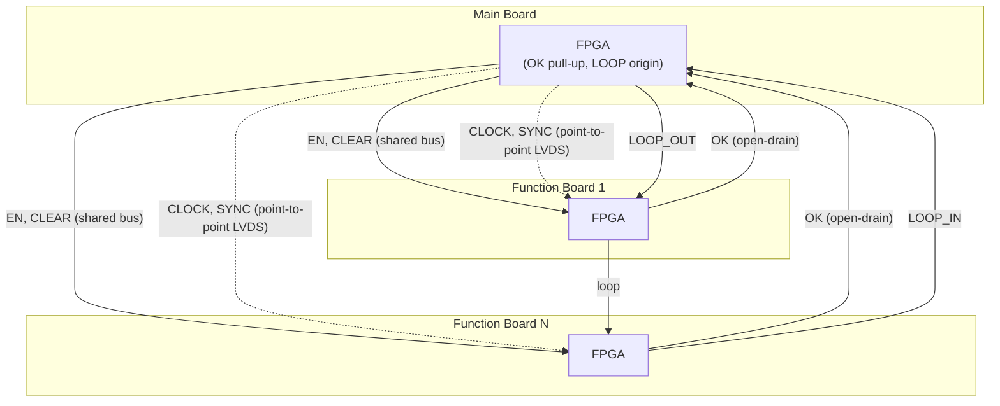
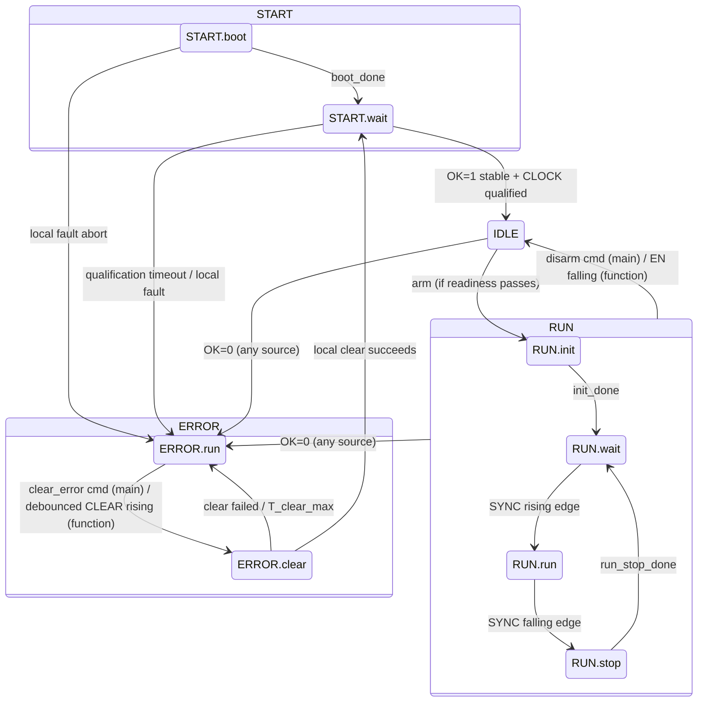
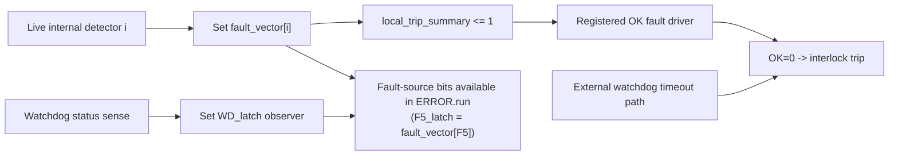
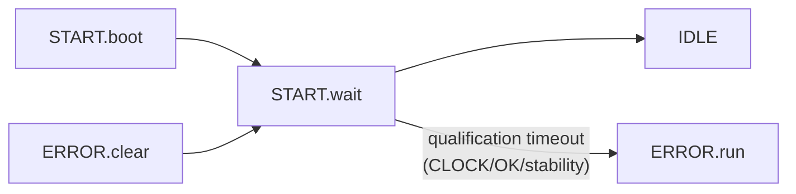

# ADR-003: Hierarchical State Machine Definition

**Status:** Resolved
**Last updated:** 2026-07-17

---

## Context

The system uses a hierarchical Moore state machine. In START/RUN/ERROR entry flows, the main FPGA drives shared backplane control signals (`EN`, `CLEAR`, `SYNC`) to coordinate all function boards. Recovery progress inside `ERROR.clear` is local to each board, while F4 driver verification is host-orchestrated through injected-fault commands (not a separate state).

This ADR defines all states, entry/exit conditions, sub-states, backplane signals, and kill-switch logic. It incorporates decisions from ADR-001 (fault detection), ADR-002 (configuration), and ADR-005 (utility-voltage distribution).

**Reader guide:** R1-R6 define the core architectural rules and shared terminology. R7 gives the readable state behavior. R8 points to the exhaustive transition reference used by implementers and test authors.

---

## Resolved Constraints

### R1: Main board scope

The main board is a PLC gateway. Its FSM responsibilities are strictly limited to the following functions:

| Function | Mechanism |
|---|---|
| Arm / disarm the system | Drives EN on the backplane |
| Generate and distribute clock and sync | Generates CLOCK and SYNC LVDS signals and distributes them point-to-point to all backplane slots |
| Monitor errors and recovery | Monitors OK bus and LOOP_IN, drives CLEAR |
| Provide utility converter synchronization capability | Provides the utility DC-DC sync capability defined in ADR-005; converter use and phase offset remain instrument options |

The main board has no sequencer and no FSM coordination outputs beyond `EN`/`CLEAR`/`SYNC`. Infrastructure outputs (`CLOCK`, `LOOP_OUT`, and the mandatory utility-converter sync capability) are also main-board signals and are defined here or in ADR-005. Whether a common-power implementation consumes those utility-sync outputs and applies phase offsets remains optional. Other control functions (shutter, timing outputs, auxiliary signals) belong to function boards and are intentionally outside this ADR's scope; board-specific behavior for those outputs must be defined in function-board ICDs and future ADRs. Adding sequencer logic to main is explicitly out of scope.

### R2: Core philosophy

> **Go to safe state fast. Go to not-safe state slow.**

Every signal and state transition in this architecture follows this principle:

- Any fault condition (OK drop, EN drop, loop break) → relays open within two clock cycles or faster (function-board relays open in external latch propagation delay via async RESET, R9), no conditions
- Arming the system (EN rising, relay closure) → deliberate, gated by initialization completion
- Fault recovery → requires explicit operator action through ERROR.clear sequence
- Missing pre-arm readiness (e.g., unsynchronized local converter phase where implemented) is **Not Ready**, not a physical fault, while `EN=0`
- If armed operation is attempted while Not Ready (`EN=1`), it is treated as an interlock violation and becomes a fault

This asymmetry is intentional. A false safe-state trip costs observing time; a false not-safe transition can damage hardware. The architecture is intentionally biased toward safety.

The architecture combines a hardware interlock, an FPGA FSM, and slower Ethernet management:

- **Hardware Interlock Layer (sub-microsecond):** Deterministic hardware — open-drain OK fault bus, passive continuity loop, and external relay latch/flip-flop stage (R9). OK bus faults are asserted via registered FPGA logic (one clock cycle, no software). Function-board relay cutoff is enforced by external async RESET hardware independent of FPGA clock state.
- **FSM Implementation Constraint (Normative):** Implement the full hierarchical Moore FSM (`START`, `IDLE`, `RUN`, `ERROR`) in FPGA fabric logic (for example Verilog/VHDL) to guarantee deterministic one-clock transitions. Software FSM implementations (soft-core/SoC) are prohibited because they cannot guarantee sub-microsecond gates or one-clock fault response.
- **FSM Clock Domain Constraint (Normative):** The FSM, all registered safety-path outputs (`OK` driver, `relay_drive`, `EN`), and the internal clock monitor must be clocked from the **board-local management clock** defined in ADR-004 R5 — independent of the distributed backplane `CLOCK`, with maximum period `T_mgmt_max` ≤ 100 ns. If the distributed `CLOCK` stops (F5), the FSM and its safety outputs must continue operating normally to detect and respond to the fault. ADR-004 R5 is the authoritative definition of management-clock independence, `T_mgmt_max`, and the real-time-units convention; those rules are not repeated here.
- **FSM State Register Constraint (Normative):** FSM state storage and update must be atomic: illegal `top_state`/sub-state combinations must be unreachable by construction. `top_state` must derive from the same state storage that determines sub-state behavior; independently updated duplicate state registers are prohibited. Encoding and reference HDL belong in the Firmware Reference Appendix.
- **Ethernet Management Layer:** Slower and software-driven. Operational writes are allowed only in IDLE. During RUN, Ethernet carries telemetry and the required control/supervision commands (`keep_alive`, `disarm`, and acquisition trigger requests to main); no configuration writes.

### R3: Backplane signal reference

This table is the authoritative behavioral definition for backplane signals. Other ADR/ICD sections should reference it instead of redefining signal behavior. Electrical details (voltage levels, drive strength, termination, pinout) remain ICD scope.

| Signal | Driver | Topology | Trigger | Description |
|---|---|---|---|---|
| `OK` | Any board (open-drain) / pull-up on main | Shared bus | Level (0 = Fault, 1 = Healthy) | Active fault bus. Pulled HIGH by main board resistor. Any board detecting a fault drives LOW. While armed (`EN=1`), any board may also pull LOW on keep_alive lease timeout (communication supervision fault). |
| `LOOP_OUT` | Main FPGA | Daisy-chain | Level (continuous 1) | Origin of the continuity loop. Routes through every slot and extension cable. |
| `LOOP_IN` | Main FPGA (received) | Daisy-chain | Level (0 = broken, 1 = healthy) | Return path of the continuity loop. Drop triggers main to pull OK LOW. |
| `EN` | Main FPGA | Shared bus | Level (0 = safe, 1 = armed) | Global arm signal. HIGH in all `RUN.*` sub-states, LOW in all non-RUN states. Main asserts `EN` only after readiness checks pass. On function boards, `EN` is sampled in the local FSM clock domain: arm entry uses a debounced rising-edge qualifier (`N_en_rise_debounce` consecutive samples of `EN == 1` plus local safety/readiness gates), while `EN` falling is not debounced and forces immediate disarm to IDLE. FPGA `relay_drive` ARM control is generated from local sub-state (asserted in RUN.wait/run/stop, de-asserted in all other states), and the external stage in R9 drives the relay coil. |
| `CLEAR` | Main FPGA | Shared bus | Level (held HIGH for `T_clear_hold`); function boards debounce and trigger on rising edge of debounced output | Synchronized recovery signal. Normally LOW. Main asserts HIGH for `T_clear_hold` (1 ms) to command all function boards to simultaneously drop fault latches and re-evaluate sensors. Function boards sample with a synchronous debouncer (`N_clear_debounce` consecutive FSM clock samples of HIGH) before transitioning. `CLEAR` edges are ignored in all states except `ERROR.run` (mirrors the SYNC ignore rule): a board that has already recovered to `START.wait`/`IDLE` while a retry `clear_error` pulses the shared bus must not react. |
| `CLOCK` | Main-board clock generator/driver (outside FPGA) | Point-to-point LVDS | Level (continuous) | High-frequency sequencer clock (100 MHz), distributed point-to-point LVDS per slot. Used directly by function boards without PLL multiplication. In `START.wait`, function boards must observe watchdog pet-source activity derived from distributed `CLOCK`, and main must observe activity from its external clock-source monitor, both within `T_clock_present_max = 1 s` (timeout path). After `START.wait` completes, missing/invalid distributed `CLOCK` or failure in the `CLOCK -> divider -> pet` path is classified as F5 (CLOCK/pet-path fault) and propagates through the existing interlock fault path. See ADR-004. |
| `SYNC` | Main FPGA | Point-to-point LVDS | Edge + state-qualified | Point-to-point LVDS per slot. Generated with fixed 180° phase offset relative to `CLOCK` (`SYNC` rising aligned to `CLOCK` falling) to avoid uncertain cycle capture. `IDLE` + rising edge (`EN=0`) → reset watchdog divider phase and any implemented synchronized local DC-DC divider phase (pre-arm sync). `RUN.wait` + rising edge → RUN.run (start acquisition). `RUN.run` + falling edge → RUN.stop (graceful stop). Main must enforce minimum SYNC HIGH/LOW dwell `T_sync_min` (R6) for IDLE pre-arm and RUN pulses to guarantee capture in all function-board management domains. SYNC edges during `START.*` and `ERROR.*` are ignored by all boards. |

**Backplane input handling (normative, all boards):** Every shared backplane input consumed by the FSM (`OK`, `EN`, `CLEAR`, `SYNC`) must be synchronized into the local management clock domain before use (metastability protection); per-signal debounce requirements are defined in the rows above and in R6.

**Undriven-bus safe bias (normative):** The backplane must bias `EN` and `CLEAR` to their safe LOW level whenever they are undriven (main board unpowered, in reset, or reconfiguring), just as `OK` has its defined pull-up on the main board. The electrical implementation (pull-downs, bus keepers) is ICD scope.

Utility voltages (`+3.3V_DIG`, `+6V_ANA`, `-6V_ANA`, `+16V_ANA`, `-16V_ANA`) and the main-board `UTILITY_DCDC_SYNC[0..4]` outputs are power-infrastructure resources, not FSM state signals. Their generation, naming, connector allocation, optional converter use, and optional phase plan are defined by ADR-005 and the relevant ICD/design package.

#### Signal flow diagram


```mermaid
flowchart TD
    subgraph main ["Main Board"]
        MP["FPGA\n(OK pull-up, LOOP origin)"]
    end

    subgraph fn1 ["Function Board 1"]
        F1[FPGA]
    end

    subgraph fnN ["Function Board N"]
        FN[FPGA]
    end

    MP -- "EN, CLEAR (shared bus)" --> F1 & FN
    MP -. "CLOCK, SYNC (point-to-point LVDS)" .-> F1
    MP -. "CLOCK, SYNC (point-to-point LVDS)" .-> FN
    F1 -- "OK (open-drain)" --> MP
    FN -- "OK (open-drain)" --> MP
    MP -- "LOOP_OUT" --> F1 -- "loop" --> FN -- "LOOP_IN" --> MP
```

### R4: Top-level state diagram

START.wait is the single stability gate shared by both boot and fault recovery paths. IDLE ↔ RUN indicates arm (IDLE → RUN.init) and disarm (Any RUN.* → IDLE). Fault from IDLE or any RUN.* sub-state goes directly to ERROR.run. START.boot intentionally ignores OK during startup grace. Recovery from ERROR always passes through ERROR.clear → START.wait → IDLE — there is no direct ERROR → IDLE path.

### Visual State Flow


```mermaid
stateDiagram-v2
    direction TB

    %% Main States
    state START {
        START.boot --> START.wait : boot_done
        START.boot --> ERROR.run : local fault abort
        START.wait --> ERROR.run : qualification timeout / local fault
    }

    state RUN {
        RUN.init --> RUN.wait : init_done
        RUN.wait --> RUN.run : SYNC rising edge
        RUN.run --> RUN.stop : SYNC falling edge
        RUN.stop --> RUN.wait : run_stop_done
    }

    state ERROR {
        ERROR.run --> ERROR.clear : clear_error cmd (main) / debounced CLEAR rising (function)
        ERROR.clear --> ERROR.run : clear failed / T_clear_max
    }

    %% Cross-State Transitions
    START.wait --> IDLE : OK=1 stable + CLOCK qualified

    IDLE --> RUN.init : arm (if readiness passes)
    RUN --> IDLE : disarm cmd (main) / EN falling (function)

    IDLE --> ERROR.run : OK=0 (any source)
    RUN --> ERROR.run : OK=0 (any source)

    ERROR.clear --> START.wait : local clear succeeds
```

**Diagram simplification note:** Fault transitions are shown at state level. `OK=0 (any source)` means the shared OK bus was pulled LOW either by an external source (another board/global bus condition) or by an internal source on the local board (for example local hardware fault, supervision timeout, or authorized injected fault). `RUN --> ERROR.run` applies to all `RUN.*` sub-states. `START.boot` intentionally ignores the shared OK bus to allow fleet power-up, but it still enforces immediate abort to `ERROR.run` if a local internal fault occurs (`local_trip_summary == 1`).

### R5: Kill-switch logic

All relay control follows the core philosophy: **go to safe state fast, go to not-safe state slow.**

```
FAST path (safe):   any fault → relay de-energizes within two clock cycles, no conditions
SLOW path (armed):  FSM in RUN.wait/RUN.run/RUN.stop with `EN=1` → relay energizes deliberately
```

**Signal naming convention (normative):**
1. Unprefixed common signal names (for example `fault_vector`, `local_trip_summary`, `boot_pulldown_active`, `injected_fault`, `ok_fault`, `clear_summary_strobe`) are board-local instances present on both the main board and function boards.
2. Prefixes are reserved only for board-role-specific signals that are not shared semantics.

**Normative logic constraints (all boards):**

1. **Registered OK driver (mandatory):** The `ok_fault` output driving the open-drain MOSFET must be a registered flip-flop output clocked from the board-local management clock. Raw combinational paths to the OK bus are prohibited (glitch prevention).
2. **Exactly three FPGA-internal OK sources:** Only the following may contribute to `ok_fault`:
   - `local_trip_summary` — trip-summary latch (derived from `fault_vector`, which includes both hardware fault sources and procedural/supervisory sources such as the EN-rise interlock violation and the armed keep_alive timeout S1)
   - `boot_pulldown_active` — boot hold-down latch (released after CLOCK qualification in `START.wait`)
   - `injected_fault` — explicit host-authorized maintenance bit
3. **External hardware paths are independent:** The fail-safe driver (F2a) and external watchdog (F2b/F5) pull OK LOW through their own open-drain drivers, outside the FPGA `ok_fault` register.
4. **`boot_pulldown_active` lifecycle:** Initializes to `1` on FPGA power-up/reset; remains asserted through `START.boot` and early `START.wait`; clears only after CLOCK qualification succeeds in `START.wait`. Intentionally not re-asserted on recovery entry (see R7 design rationale).
5. **Armed keep_alive timeout (S1) is a `fault_vector` source, not a separate OK source:** The board's ICD-defined supervision monitor — with its `EN=1` gate internal to the monitor (R6) — sets the dedicated S1 bit in `fault_vector`. Standard R6 fault-path and clear semantics apply; no separate supervision latch exists.

**Main board EN output (normative behavior):** `EN` must be asserted exactly while `top_state == RUN` and de-asserted in all other states.

**Function board relay_drive (normative behavior):** `relay_drive` must be a registered Moore output — no combinational glitches may reach the external relay stage (R9) — asserted only in `RUN.wait`/`RUN.run`/`RUN.stop` and de-asserted in every other state. Reference HDL belongs in the Firmware Reference Appendix.

The holistic integration of the diagnostic layer (`fault_vector`), trip layer (`local_trip_summary`), and registered safety outputs (`ok_fault`) — showing how all signals wire together in one module for both main and function boards — is documented in the Firmware Reference Appendix.

The Golden Rule: a healthy board must never pull OK LOW because the FSM entered ERROR. A board may deliberately drive `OK = 0` only through explicit host-authorized injected-fault control (`set_injected_fault`) used for maintenance verification.

**Key property of the relay logic:**
- Main board: `EN` (asserted exactly in armed RUN sub-states) is the complete arming output — no separate relay signal
- Function boards: FPGA `relay_drive` is a pure Moore ARM-control output from sub-state; asserted only in RUN.wait/run/stop (after RUN.init), de-asserted in every other state
- Physical relay de-energizing is enforced by external RESET-dominant latch/flip-flop logic (`RESET = NOT(EN) OR NOT(OK)`, R9); FSM Moore outputs provide the synchronized control path, and relay physical switching time still dominates end-to-end cutoff

### R6: Timing constants and global FSM rules

**Timing constants (normative):**

| Constant | Nominal value | Meaning |
|---|---|---|
| `T_clock_present_max` | `1 s` | Maximum time in `START.wait` to observe CLOCK-qualification evidence (function: first `watchdog_pet_edge_detected()`; main: first `main_clock_edge_detected()`) |
| `T_pet` | ICD-defined; must satisfy `T_pet ≪ T_clock_present_max` | Period of the watchdog pet signal, derived from the 2 MHz baseline via the dedicated watchdog divider ÷M (ADR-004 R4/R5). The divider ratio that determines `T_pet` is specified in the board ICD. |
| `T_start_deadline` | `10 s` | Absolute `START.wait` deadline: all qualification gates must pass within this time from `START.wait` entry; starts on entry and never resets |
| `T_clear_hold` | `1 ms` | Duration the main board holds `CLEAR` HIGH on the backplane. Must be long enough for all function boards to complete debounce sampling. At `T_mgmt_max ≤ 100 ns`, 1 ms provides ≥10,000 clock cycles of margin. |
| `N_clear_debounce` | ICD-defined (minimum 2) | Number of consecutive FSM clock samples where `CLEAR == 1` required before the function board's debouncer output asserts. Filters backplane glitches. |
| `N_en_rise_debounce` | ICD-defined (minimum 2) | Number of consecutive FSM clock samples where `EN == 1` required on function boards before accepting arm entry from IDLE. EN falling is not debounced and must take effect immediately. |
| `T_clear_max` | ICD-defined, with `T_clear_max <= T_start_deadline - T_start_stable` (recommended `T_clear_max <= 0.1 * (T_start_deadline - T_start_stable)`) | Maximum allowed duration of local `ERROR.clear` routine on a faulty board (main or function) |
| `T_start_stable` | `5 s` | Continuous `OK == 1` stability window required before IDLE |
| `T_settle` | ICD-defined (expected order: milliseconds; recommended initial value `1 ms`) | Minimum settle time after IDLE `SYNC` phase-reset before arm is valid for boards with synchronized local converters; board characterization may justify lower/higher values. Boards without synchronized local converters may define this as not applicable. |
| `T_sync_min` | `>= 3 * T_mgmt_max` (therefore `>= 300 ns` when `T_mgmt_max = 100 ns`) | Minimum required SYNC pulse-segment duration (both HIGH and LOW dwell). Main must enforce this for IDLE pre-arm SYNC and RUN SYNC windows so all boards guarantee synchronous edge capture in the management-clock domain. |
| `T_run_init_max` | ICD-defined (recommended initial value `1 ms`) | Worst-case maximum time for any board to complete `RUN.init` after `EN` rises. Main must enforce this as the minimum delay before emitting the first acquisition `SYNC` rising edge in each arm cycle. |
| `T_keepalive_lease_max` | ICD-defined | Maximum elapsed time since the last valid host keep_alive message before a board pulls `OK` LOW (active only while armed, `EN=1`). Each board maintains a local lease timer refreshed by periodic host Ethernet traffic; if the timer exceeds `T_keepalive_lease_max` without a refresh, the board treats it as loss of host communication supervision (S1) and trips the interlock. |
| `T_WD_HW_max` | ICD-defined | Maximum expected time for watchdog IC to assert `OK` LOW after pet signal ceases (dependent on watchdog IC timeout setting) |
| `T_WD_RELEASE_max` | ICD-defined | Maximum allowed time after `resume_watchdog_pets` for a tested board's watchdog path to release and for `OK` to return HIGH (assuming no other active fault source) |

These constants are authoritative for FSM behavior and should be referenced by other ADRs/ICDs rather than redefined.

**Local synchronization readiness (`local_sync_ready`) (normative):**
- `local_sync_ready` is a board-local readiness flag shared by main and function board implementations.
- Boards with synchronized local converters force `local_sync_ready = 0` on IDLE `SYNC` rising edge and set it to `1` only after local `T_settle` expires.
- Boards without synchronized local converters may tie `local_sync_ready = 1` after watchdog timing-domain qualification. This keeps the EN-rise gate uniform without requiring every board to implement a local converter sync path.

**Internal fault-latching architecture on each board (Normative):**
- `fault_vector` (diagnostic layer): per-source sticky bits set by board-local internal fault/event sources (for example over-current detector, CLOCK-loss monitor, PLL lock lost, EN-rise interlock violation, armed keep_alive timeout S1). On function boards, `F5_latch` is the dedicated F5 source bit in this vector (set by the internal clock monitor when distributed CLOCK stops). On the main board, a dedicated external-CLOCK-source fault bit serves the equivalent role (set by a continuous CLOCK-source monitor running on the management clock domain when the external clock generator stops).
- `local_trip_summary` (trip layer): single local trip-summary latch. This is the only fault-derived signal that feeds the registered FPGA `OK` fault driver.
- `WD_latch`: separate observer latch set from the dedicated watchdog status sense line (external watchdog path observer).

**Fault-path and clear semantics (normative):**
1. If any live internal detector trips, its corresponding `fault_vector` bit is set to `1`.
2. Function-board EN-rise readiness gate violation (any applicable local operational-safety check fails, `local_sync_ready == 0`, or `sequencer_ready == 0` on a sequencer board, at accepted EN rising) must set a dedicated interlock-violation bit in `fault_vector`.
3. Whenever `fault_vector != 0`, `local_trip_summary` must be set to `1`, regardless of current FSM state.
4. `local_trip_summary` drives local interlock assertion through the registered `OK` fault driver (`OK` LOW).
5. Late-arriving-fault rule: if a board is parked in `ERROR.run` due to another board and a local detector trips, `fault_vector` sets and `local_trip_summary` asserts; that board then actively contributes to `OK` LOW and is treated as locally faulty during recovery.
6. On `ERROR.run → ERROR.clear` entry, the board must clear `fault_vector = 0` (prime-for-recheck), force `injected_fault = 0`, and resume watchdog petting as failsafe cleanup.
7. On `ERROR.run → ERROR.clear` entry, `local_trip_summary` must **not** be cleared.
8. During `ERROR.clear`, live detectors continue running; any still-present or new fault re-sets the corresponding `fault_vector` bit(s).
9. On the `ERROR.clear` exit evaluation boundary: if `fault_vector == 0`, transition to `START.wait` and assert `clear_summary_strobe` exactly on that transition boundary (clears `local_trip_summary`); clear `WD_latch` at this success boundary as well. `WD_latch` is additionally cleared at the `START.wait → IDLE` qualification-success boundary, so watchdog trips that legitimately occurred during boot (before distributed `CLOCK` qualification) do not persist into IDLE/RUN diagnostics.
10. On the `ERROR.clear` exit evaluation boundary: if `fault_vector > 0`, transition to `ERROR.run`; keep `local_trip_summary = 1` and retain `fault_vector` / `WD_latch` for host diagnosis in the next `ERROR.run`.
11. `fault_vector`/`F5_latch` and `WD_latch` are source-diagnosis signals; they do not directly drive `OK`.


```mermaid
flowchart LR
    DET["Live internal detector i"] --> BFV["Set fault_vector[i]"]
    BFV --> SUM["local_trip_summary <= 1"]
    SUM --> OKDRV["Registered OK fault driver"]
    OKDRV --> TRIP["OK=0 -> interlock trip"]
    WDT["External watchdog timeout path"] --> TRIP
    BFV --> SRC["Fault-source bits available in ERROR.run\n(F5_latch = fault_vector[F5])"]
    WDS["Watchdog status sense"] --> WD["Set WD_latch observer"]
    WD --> SRC
```

**Armed keep_alive supervision rule (normative):**
1. Each board must maintain an ICD-defined keep_alive lease refreshed only by a dedicated `keep_alive` command from the host. No other Ethernet traffic resets the lease timer.
2. Supervision timeout is enforced only while armed (`EN=1`).
3. If lease age exceeds `T_keepalive_lease_max`, that board must set the dedicated S1 bit in `fault_vector`; the standard fault path (rules 3–4 of the fault-path semantics above) asserts `OK` low and forces global transition to `ERROR.run`.
4. The `keep_alive` command is a minimal heartbeat: the board acknowledges receipt but does not return status or telemetry data in the reply. Board status is available through separate polling commands.
5. Keep_alive message format, refresh/debounce behavior, and exact timing values are ICD-defined.
6. The S1 bit follows the standard `fault_vector` clear semantics (rules 6–10 of the fault-path semantics above); it cannot re-set during `ERROR.clear` because supervision is enforced only while armed (`EN=1`).

**EN edge handling rule on function boards (normative):**
1. Sample/synchronize backplane `EN` in the local FSM clock domain.
2. Accept arm-entry from IDLE only on debounced `EN` rising (`N_en_rise_debounce` consecutive samples where `EN == 1`) together with the safety/readiness guards in R8.
3. Do not debounce `EN` falling. The first sampled `EN == 0` from any `RUN.*` state must trigger the immediate `RUN.* → IDLE` disarm transition.

### R7: State definitions and phase guards

#### START
**EN = 0 | Safe**

This is the initial power-up phase. During `START.boot`, `OK` is intentionally ignored because boards may legitimately hold it LOW while booting. Reacting to `OK` here would cause false ERROR trips on simultaneous startup. Each board keeps `boot_pulldown_active = 1` through `START.boot` and into early `START.wait`. Release is allowed only after START.wait CLOCK qualification succeeds (function: `watchdog_pet_edge_detected()`, main: `main_clock_edge_detected()`).

| Sub-state | Description |
|---|---|
| START.boot | FPGA/SoC boots using a local independent management clock domain. Reads and validates persistent identity, network, and required factory data; applies network configuration and brings Ethernet up. Initializes volatile operational parameters to safe firmware defaults and clears sequencer state. Watchdog pet source belongs to the 2 MHz baseline ÷M watchdog divider (per ADR-004 R4), while startup grace keeps CLOCK-loss/qualification fault handling out of this sub-state. Keeps `boot_pulldown_active` asserted and transitions to START.wait with OK still held LOW. |
| START.wait | Timeout-driven qualification gate shared by boot and recovery. Two independent gates must both pass within the absolute deadline `T_start_deadline`. See gate summary below. |

**START.wait qualification gates:**

START.wait enforces two independent conditions. Both must pass within the absolute deadline (`T_start_deadline` = 10 s) before the board may transition to IDLE.

| # | Gate | Condition | Individual timeout | Reset behavior |
|---|------|-----------|-------------------|----------------|
| 1 | CLOCK qualification | Function boards: ≥1 pet edge detected since START.wait entry. Main board: ≥1 edge detected on external CLOCK-source monitor since START.wait entry (`main_clock_edge_detected()`). | `T_clock_present_max` (1 s) → ERROR.run | Once qualified, stays qualified permanently for this START.wait pass |
| 2 | OK stability | `OK == 1` continuously for `T_start_stable` (5 s) | Bounded by `T_start_deadline` only | Each `OK` drop restarts the stability counter; the deadline never resets |

**Local-fault fast-abort rule (normative):**
While in `START.boot` or `START.wait`, a board must abort immediately to `ERROR.run` if `local_trip_summary == 1`. START tolerance for `OK == 0` applies only to fleet-level/external bus behavior, not to known local faults.

**Absolute deadline** = `T_start_deadline` = 10 s. This is the hard backstop. If both gates have not passed by this time → ERROR.run. The deadline starts on START.wait entry and never resets. A fleet whose `OK` never rises is caught here (stability can never complete), so no separate OK-rise timeout exists.

**Timeout diagnostic visibility (normative):** Each START.wait timeout path must set a dedicated diagnostic bit in `fault_vector` on the transition to `ERROR.run`: CLOCK qualification timeout sets the existing F5/CLOCK-source bit; the `T_start_deadline` timeout sets a dedicated START.wait-deadline bit. Without these bits, a board that timed out would present as "dragged into ERROR by another board" (ADR-001 R6/R10). These bits are timeout-event records, not live detectors: per R6 clear semantics they are primed to `0` on `ERROR.clear` entry and do not re-set during `ERROR.clear`, so a past timeout cannot block recovery. A deliberate consequence is that a timed-out board holds `OK` LOW through `ERROR.*` (via `local_trip_summary`) like any locally faulted board. *Optional (ICD):* boards may expose an `ok_seen_high` telemetry flag to let the host distinguish "OK never rose" from "OK rose but never stabilized" after a deadline timeout.

No separate OK-rise or early-abort rule is required: the absolute deadline already covers an OK signal that never rises or cannot remain stable long enough. Timer implementation and test scenarios belong in the Firmware Reference Appendix.

**Design rationale - boot_pulldown_active asymmetry:** `boot_pulldown_active` is asserted only on physical FPGA power-up/reset and is intentionally **not** re-asserted when entering `START.wait` from `ERROR.clear`. This allows a clean `OK` release exactly at the successful `ERROR.clear -> START.wait` boundary without introducing an artificial extra hold-down phase. Safety is preserved because no board can reach `IDLE` without passing the `clock_qualified` gate, and missing CLOCK during recovery still deterministically trips via `T_clock_present_max` timeout back to `ERROR.run`. Implementations must not "symmetrize" this latch by re-asserting it on recovery entry.

**START.wait is shared between two paths:**


```mermaid
flowchart LR
    START.boot --> START.wait
    ERROR.clear --> START.wait
    START.wait --> IDLE
    START.wait -- "qualification timeout\n(CLOCK/OK/stability)" --> ERROR.run
```

**Timer boundary convention (normative):** In this ADR, "within `T_x`" means `t_event <= T_x` (inclusive). Timeout applies when `t_event > T_x`.

#### IDLE
**EN = 0 | Safe**

Default resting state with all relays open. Host-supplied operational settings and sequencers remain active across arm/disarm and fault recovery until changed or the board resets. Persistent configuration remains UART-only per ADR-002.

- Operational parameters and sequencer memory writable via Ethernet only in IDLE
- UART accessible under the ADR-002 R5 read/write state allowlist
- Host verifies board readiness and, on sequencer boards, `sequencer_ready` before arm
- `SYNC` rising edge in IDLE (`EN=0`) resets the local divider chain (÷50 baseline, ÷M watchdog, and optional ÷N local DC-DC where implemented); main enforces SYNC pulse-width constraints (`T_sync_min`), then boards wait any required `T_settle` before arm is permitted (ADR-004 R4)
- IDLE pre-arm `SYNC` is host-driven: host sends `send_pre_arm_sync` to main; main emits one pulse and does not generate IDLE `SYNC` autonomously
- Operator sends `arm` via Ethernet to the main board only. Main checks its applicable local readiness and operational-safety conditions and, if ready, asserts `EN = 1` → RUN.init
- Operator may start F4 maintenance verification by sending `set_injected_fault` to a selected board (allowed only in IDLE/ERROR.run)
- Any fault (OK = 0) → ERROR.run

**SYNC behavior in IDLE (normative):**
1. Applies only when `top_state == TOP_IDLE` and `EN = 0`
2. IDLE pre-arm `SYNC` pulse is host-driven: remote host sends `send_pre_arm_sync` to main; main emits one pulse, must hold the HIGH segment for at least `T_sync_min`, and must not free-run/spam `SYNC` while in IDLE
3. On `SYNC` rising edge, each board resets the local divider chain (÷50 baseline, ÷M watchdog, and optional ÷N local DC-DC where implemented) via a one-shot reset strobe in its local clock domain
4. Each board updates `local_sync_ready` according to the R6 local synchronization readiness rule.
5. The host should arm only after required boards report ready, and each function board enforces its applicable readiness flags on `EN` rising (otherwise trips interlock)
6. `SYNC` falling edge in IDLE has no acquisition meaning and is ignored by boards while in IDLE
7. Before asserting `EN`, the main board must ensure `SYNC` is LOW so that function boards, once they reach `RUN.wait`, can detect a clean rising edge to start acquisition
8. Main must enforce `T_sync_min` on both HIGH and LOW SYNC dwell segments around the pre-arm pulse so all boards deterministically capture transitions

**Readiness and CLOCK semantics in IDLE (normative):**
1. `local_sync_ready == 0` in IDLE is a **Not Ready** condition, not a fault condition
2. While `EN=0`, a board in Not Ready does not pull `OK` low solely due to missing local converter phase sync
3. In `START.wait`, missing CLOCK is handled by timeout gating (`T_clock_present_max`), not by immediate fault transition
4. After `START.wait` completes, missing `CLOCK` is a fault condition on both board roles: function boards detect distributed CLOCK loss via their internal clock monitor (`F5_latch`); the main board detects external CLOCK-source failure via its continuous CLOCK-source monitor. Both propagate through the normal `OK == 0` fault path (R8)

**Arm-readiness enforcement:** The host polls each required function board before commanding arm. The main soft-rejects its own failed checks and remains in IDLE; function boards independently enforce their applicable checks on `EN` rising and trip on violation. No backplane signal reports function-board readiness to main. Exact guards and outcomes are owned by the R8 transition reference.

**Volatile operational configuration (normative):** Boards initialize operational parameters to safe firmware defaults. In `IDLE`, each accepted Ethernet write is validated and applied atomically; an invalid write is rejected without changing the active value. At arm, boards evaluate their actual current operational-safety conditions. `sequencer_ready` separately follows ADR-002 R9 as a host-controlled loading-complete interlock. No configuration hash or per-arm attestation token is used.

#### RUN
**EN = 1 | Armed**

The system is armed (`EN=1`) in all `RUN.*` sub-states. Disarm exits directly to IDLE: `EN` drops, and relays open immediately through the hardware reset path.

| Sub-state | Trigger | Description |
|---|---|---|
| RUN.init | EN rising accepted by local EN-rise qualifier (function boards use `N_en_rise_debounce`; main enters on accepted arm command) | Arm-entry initialization: flush ADCs, apply bias voltages, pre-load sequencers, reset counters. (Watchdog divider reset, and local DC-DC phase reset where implemented, is performed earlier in IDLE; see ADR-004 R4.) |
| RUN.wait | RUN.init complete | Hardware ready, monitoring SYNC continuously |
| RUN.run | SYNC rising edge | Sequencers fire and data acquisition begins. Boards with synchronized local converters have already established their phase relationship during IDLE pre-arm SYNC; backplane utility-converter synchronization, when used, is handled by the main-board `UTILITY_DCDC_SYNC[0..4]` outputs defined in ADR-005. |
| RUN.stop | SYNC falling edge | Graceful stop: halt capture, bleed integration capacitors, zero counters → return to RUN.wait |

**Disarm (normative):** On disarm command (main) or backplane `EN` falling edge (function, any `RUN.*`, no debounce), the board transitions directly to IDLE. Relays open immediately via the `EN=0` hardware reset path before any FSM action; residual cleanup (bleeding integrators, zeroing counters) is performed as IDLE-entry actions.

Any fault (OK = 0) during RUN → immediately ERROR.run.

Keep_alive supervision is mandatory while armed on all boards: if any board's keep_alive lease expires, that board asserts `OK` low and forces `ERROR.run` (global trip).

**First acquisition-trigger guard (normative):**
1. Let `t_en_rise` be the clock when main asserts `EN = 1` (IDLE → RUN.init arm boundary)
2. There is no backplane "all boards RUN.wait-ready" feedback signal
3. Therefore main must not emit the first acquisition `SYNC` rising edge of that arm cycle before `t_en_rise + T_run_init_max`
4. `T_run_init_max` must be selected to be greater than or equal to the worst-case RUN.init completion time among all boards in the fleet (ICD-defined). Because the budget starts at main's `EN` assertion, it must also cover the function-board EN-rise qualification time (`N_en_rise_debounce` samples in the slowest management clock domain) that elapses before RUN.init even begins
5. If host requests trigger earlier, main must delay that first trigger until the guard is satisfied

`EN`-rise readiness checks are normative in the R8 transition reference.

#### ERROR
**EN = 0 | Latched fault**

Entered instantly on any fault transition to `ERROR.run` defined in R8. Main drops `EN = 0`.

**Important:** On function boards, physical relay cutoff is guaranteed by the external RESET-dominant latch/flip-flop stage (R9): RESET asserts when `EN = 0` or `OK = 0`, forcing coil drive LOW independently of FPGA clock progression. In parallel, FSM Moore outputs de-assert FPGA `relay_drive` one clock edge after fault sampling as sub-state leaves RUN.*. On the main board, `EN` drops when `top_state` leaves RUN.

| Sub-state | Description |
|---|---|
| ERROR.run | Latched safe hold state, entered directly on any fault transition. On entry — as Moore consequences of leaving RUN/IDLE, not as sequenced actions — `EN` drops, FPGA `relay_drive` de-asserts, and the external relay RESET is active (`EN=0` and/or `OK=0`) so coil drive is forced LOW. Fault latches held; no latch clearing or OK release. Operator polls diagnostics via Ethernet to identify the fault, including `F5_latch` and `WD_latch` diagnostic latches for F5/F2b differentiation (ADR-001 R6 truth table). Waits for `clear_error` command. |
| ERROR.clear | Recovery attempt. Behavior defined by R6 rules 1–11 and the R8 transition reference. |

`ERROR.clear` behavior is owned by the R6 fault-path/clear rules and the R8 transition reference. A locally faulted board holds `OK` LOW until the successful `ERROR.clear → START.wait` boundary. `T_clear_max` remains constrained by the R6 timing table so healthy boards retain enough `START.wait` stability time. A physical F1 loop break prevents successful clear while `LOOP_IN` remains LOW. Procedural implementation belongs in the Firmware Reference Appendix.

#### F4 Driver Verification (No Separate State)
**EN = 0 | Maintenance (IDLE + ERROR.run flow)**

F4 verification uses command-controlled faults, not a dedicated state. `set_injected_fault` / `clear_injected_fault` tests the FPGA driver; `halt_watchdog_pets` / `resume_watchdog_pets` tests the independent watchdog driver and timer. Command state windows and cleanup semantics are owned by the R8 transition reference; the host procedure and timing checks are system-ICD scope.

**Inherent assurance limitation:** `halt_watchdog_pets` requires a functioning FPGA to execute the halt. It verifies watchdog timer logic and physical open-drain drive, but it cannot prove behavior under true FPGA-dead conditions (F2a/F2b boundary cases). Brain-dead assurance comes from hardware architecture (independent `+12V_RAW`-derived watchdog/fail-safe supply or equivalent independent supply + fail-safe path) and certified component choice (ADR-001 R2/R7).

### R8: Transition and command reference

The exhaustive transition table, command split rules, clock-loss propagation note, and EN-rise safety-gate detail are kept in:

[ADR-003_transition_reference.md](reference/ADR-003_transition_reference.md)

That reference is authoritative when R7 summary text and detailed transition rules overlap.

For peer review of the architecture, the main invariants are:

1. Fault/interlock paths have priority over commanded transitions in `IDLE` and `RUN.*`.
2. Function boards enter RUN only from a debounced backplane `EN` rising edge plus applicable local safety/readiness gates.
3. Main-only Ethernet commands (`arm`, `disarm`, `clear_error`, `send_pre_arm_sync`, and the ICD-defined acquisition trigger start/stop requests that command RUN `SYNC` edges) are not consumed as arming commands by function boards.
4. Maintenance fault-injection/watchdog-test commands are legal only in `IDLE` and `ERROR.run`.
5. `ERROR.clear` releases local fault summaries only at the successful `ERROR.clear -> START.wait` boundary.

### R9: External relay latch/flip-flop stage for function board relay drive

Each function board relay arm path uses an external latch/flip-flop with asynchronous reset as a hardware-independent de-arm mechanism. This closes the gap where a brain-dead FPGA condition can leave `relay_drive` asserted because Moore outputs cannot advance without clock progress, while the watchdog still pulls `OK` LOW and trips the rest of the system.

**Normative requirements:**

- **Q (output):** Sole driver of the relay coil. HIGH = relay armed.
- **ARM input:** Registered FPGA output (same guardrail as the OK driver, ADR-001 R4). Asserted only after `RUN.init` completes (at `RUN.wait` entry) — the same timing point as the existing `relay_drive` assertion.
- **Asynchronous RESET:** Active when `EN = 0` OR `OK = 0`. **RESET is dominant over ARM** — the output can only be HIGH when both `EN = 1` AND `OK = 1`.
- **Power supply:** Latch/flip-flop IC and all RESET-path logic must be powered from the always-on watchdog supply (`+12V_RAW` LDO or equivalent independent supply), not the FPGA digital rail — so RESET correctly tracks backplane signals even if local logic rails collapse.
- **Relay type:** Normally-open (energized to arm). Complete board power loss de-energizes the relay mechanically, independent of latch state.
- **FPGA `relay_drive`:** Becomes the ARM control signal. It no longer drives the relay coil directly.

For a reference schematic implementation using a D flip-flop and an open-drain wired-AND reset generator, refer to the Hardware Design Specification.

**Scope note:** This constraint applies to function board relay drive. The main board has no separate relay — `EN` is its sole arming output (R5); main board relay architecture is outside this constraint.

---

## Decision

*Resolved. Core states (START, IDLE, RUN, ERROR), transition priorities and reference rules, injected-fault maintenance command model, kill-switch logic, and external relay latch/flip-flop stage requirement for function boards (R9) are settled. While armed, keep_alive lease timeout on any board trips globally via `OK` pull-down.*

---

## Consequences

- Firmware on all boards must implement the transition priority model and guards exactly as specified.
- The main board Ethernet API must return explicit arm-rejection responses (Not Ready + reasons) when readiness checks fail.
- Function boards must enforce EN-rise readiness checks and convert violations into interlock faults via `OK` pull-down.
- ICD must define keep_alive protocol details (message framing, cadence, timeout tuning, and jitter/debounce policy) used by the ADR-level supervision rule.
- Verification must include transition-coverage tests for nominal flow, rejected arm attempts, and reboot-edge cases.
- Each function board must implement an external reset-dominant latch or D flip-flop stage (always-on supply) as the sole relay coil driver, with ARM from a registered FPGA output and asynchronous RESET from `NOT(EN) OR NOT(OK)` (R9).

