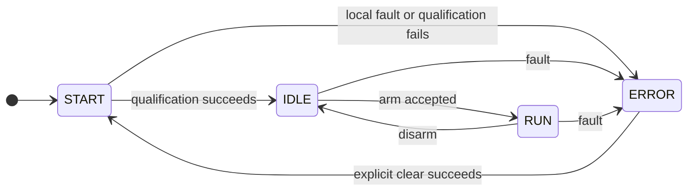

# ADR-003: Hierarchical State Machine Definition

**Status:** Resolved
**Last updated:** 2026-08-16

---

## Context

The main board coordinates arming, timing, and recovery through shared backplane signals, while every active board independently enforces its own safety and readiness conditions. The architecture needs common externally visible state behavior without prescribing the internal registers or HDL structure used by each board.

> **Core decision:** Use the common state families `START`, `IDLE`, `RUN`, and `ERROR`. Enter the safe state promptly on a fault, permit arming only after qualification, and require explicit recovery after every trip.

Exact register names, state encoding, debounce implementation, diagnostic-bit layout, and timer values belong to firmware and ICD specifications.

---

## Resolved Constraints

### R1: Main board scope

The main board is the hardware coordinator and host gateway for shared backplane behavior:

| Function | Main-board responsibility |
|---|---|
| Arm and disarm | Drive shared `EN` |
| Acquisition timing | Generate point-to-point `CLOCK` and `SYNC` |
| Fault and recovery coordination | Observe `OK` and `LOOP_IN`; drive shared `CLEAR` |
| Utility-converter timing | Provide the five synchronization outputs defined by ADR-005 |

The main board does not execute detector sequencers or carry science data. Detector-specific clocks, bias, video processing, and other instrument functions belong to function boards.

### R2: Safety layers and clock ownership

The system follows one principle:

> **Go to safe state fast. Go to armed state deliberately.**

Three layers cooperate:

1. **Hardware interlock:** `OK`, `EN`, normally-open relays, and board-local fail-safe hardware remove hazardous drive without depending on host software or continued FPGA state progression.
2. **Safety FSM:** FPGA logic implements the common state behavior, readiness gates, fault retention, and recovery coordination from an independent local management clock.
3. **Host management:** Ethernet supplies commands, configuration, diagnostics, and armed supervision but cannot override an asserted hardware interlock.

The management clock shall remain independent of distributed `CLOCK`. Timing-critical sequencer actions use the 100 MHz timing domain; management observes those actions through safe clock-domain crossings. Implementations shall make safety outputs and asynchronous inputs resistant to metastability and glitches, but exact synchronizer, register, and debounce structures are design-specification scope.

### R3: Backplane signal behavior

| Signal | Driver and topology | Architectural behavior |
|---|---|---|
| `OK` | Open-drain contributions from boards and qualified backplane rail-health sources; pull-up on main | HIGH means no participant is asserting a fault. Any participant may pull LOW. A LOW trip has priority over commanded operation. |
| `LOOP_OUT` / `LOOP_IN` | Passive series continuity path originating and terminating at main | A broken return path causes main to assert its `OK` fault contribution. |
| `EN` | Main; shared level | HIGH only while the system is armed in `RUN`. LOW means safe/disarmed. Function boards independently qualify a rising edge; falling removes hardware permission without waiting for an FSM transition. |
| `CLEAR` | Main; shared level/pulse | Requests locally faulted boards to clear retained evidence as appropriate and re-evaluate live conditions. It does not force a board to declare itself healthy. |
| `CLOCK` | Main clock source; point-to-point LVDS | Continuous 100 MHz sequencer clock. Function boards use it directly for timing-critical work and independently detect its loss. |
| `SYNC` | Main; point-to-point LVDS | Rising and falling acquisition events are captured in the 100 MHz domain. A separate CDC-safe observation is used for management. Optional pre-arm converter synchronization is defined by ADR-004/ADR-005. |

Undriven `EN` and `CLEAR` shall assume their safe LOW levels. Electrical bias, termination, pinout, pulse width, and timing margins belong to the applicable ICD.

### R4: State model


```mermaid
stateDiagram-v2
    direction LR
    [*] --> START
    START --> IDLE: qualification succeeds
    START --> ERROR: local fault or qualification fails
    IDLE --> RUN: arm accepted
    RUN --> IDLE: disarm
    IDLE --> ERROR: fault
    RUN --> ERROR: fault
    ERROR --> START: explicit clear succeeds
```

The state families have the following meanings:

| State | Meaning |
|---|---|
| `START.boot` | Initialize board identity, communications, safe defaults, and local monitoring. The system remains unarmed. |
| `START.wait` | Qualify required timing activity and stable shared health before permitting `IDLE`. Used after boot and after recovery. |
| `IDLE` | Safe and configurable. Relays are open and `EN=0`. |
| `RUN.init` | Arm-entry preparation after `EN` rises. |
| `RUN.wait` | Armed and ready for an acquisition `SYNC` event. |
| `RUN.run` | Acquisition active. |
| `RUN.stop` | Complete the board-specific graceful stop before returning to `RUN.wait`. |
| `ERROR.run` | Latched safe hold with diagnostic evidence available. |
| `ERROR.clear` | Explicit local clear and live-fault re-evaluation attempt. |

Board designs may implement equivalent internal substates differently, but their external behavior shall match these meanings.

### R5: Fault, trip, and recovery invariants

1. A detected local safety-relevant fault shall assert that board's contribution to `OK` and retain enough evidence for diagnosis.
2. `OK=0` or `EN=0` shall remove function-board relay drive through the hardware permissive path in R9 without waiting for an FSM transition.
3. A board shall not release a local trip merely because the initiating condition disappears. Release is permitted only during explicit recovery after live conditions have been re-evaluated successfully.
4. A board already in `ERROR` because another participant tripped shall still record and assert any later local fault.
5. A healthy board shall not pull `OK` LOW solely because it observed the shared bus LOW or entered `ERROR` due to another participant.
6. Successful recovery returns through `START.wait`; there is no direct `ERROR` to `IDLE` path.
7. Restoring a rail, clock, communication link, or other fault source never resumes acquisition automatically.
8. Diagnostic representation and internal latch structure are implementation-specific.

During initial fleet startup, participants may legitimately hold `OK` LOW while their local interlock paths initialize. Startup behavior shall prevent arming until all required participants release the bus and the qualification conditions remain stable.

### R6: Timing parameters

The architecture requires the following bounded behaviors, but their values are defined by the system or board ICD from verified hardware and operational requirements:

| Parameter | Required purpose |
|---|---|
| Clock-qualification timeout | Detect missing required timing activity during `START.wait` |
| Startup deadline | Prevent indefinite startup or recovery qualification |
| Stable-health interval | Require continuously valid `OK` before entering `IDLE` |
| `CLEAR` pulse width | Ensure recognition by every supported board |
| Clear-attempt timeout | Bound local recovery work |
| Arm-to-first-trigger guard | Give the slowest supported board time to finish `RUN.init` |
| Host-supervision timeout | Bound loss of qualifying host interaction while armed |
| Watchdog timeout and test-release time | Verify external watchdog response |
| Optional converter settling time | Prevent arming before an intentionally phase-controlled converter is ready |

Timeout boundaries, debounce counts, counter implementation, and diagnostic-bit allocation belong to the firmware and ICD specifications.

### R7: Arming, acquisition, and disarming

The host commands `arm` to the main board. Main checks its local requirements and asserts `EN` only from `IDLE`. Each function board then independently accepts the `EN` rising edge only if its applicable safety and readiness conditions are valid. A board that detects an unsafe arm attempt trips through `OK`; no separate backplane readiness bus is required.

Main shall not emit the first acquisition `SYNC` until the ICD-defined arm-to-first-trigger guard has elapsed. This guard covers `EN` recognition and the worst-case `RUN.init` completion time across the installed fleet.

In `RUN`, a rising acquisition `SYNC` starts the timing action and a falling `SYNC` stops it according to ADR-004. A disarm command makes main drop `EN`; function-board hardware removes relay drive without waiting for FSM cleanup, and boards return to `IDLE` for any residual cleanup.

Operational writes and sequencer loading are permitted only while safely disarmed as defined by ADR-002. Exact command names, acknowledgements, and rejection responses belong to the communication ICD.

### R8: Armed host supervision and maintenance tests

Every armed active board shall require an ICD-defined qualifying host interaction within a bounded interval. The interaction must demonstrate communication in both directions; unsolicited outbound traffic alone is insufficient. Timeout is a supervisory interlock event that uses the normal local trip path.

The system shall also support safe maintenance verification of board `OK` and watchdog paths. Tests are performed only while disarmed or already latched safe. Exact commands, sequencing, cadence, and acceptance timing belong to the system ICD and maintenance plan.

### R9: Function-board relay permissive

A function-board detector-facing relay may energize only when all required hardware permissives are true:

```text
relay_energized = local_arm_request AND EN AND OK
```

Loss of `EN`, loss of `OK`, or loss of local interlock power shall remove relay drive independently of processor software, FPGA state progression, and distributed `CLOCK`. Relays shall be normally open so complete board-power loss is safe. Energization shall be deliberate and glitch-resistant; de-energization shall not require completion of an FSM transition.

A reset-dominant latch or flip-flop is one compliant implementation, not an architectural requirement. Circuit topology, polarity, relay driver, and component selection belong to the board hardware design specification.

---

## Reference Material

[ADR-003_transition_reference.md](reference/ADR-003_transition_reference.md) is a non-normative implementation reference. It may illustrate one detailed transition implementation but cannot add requirements beyond this ADR.

---

## Decision

Resolved. The common state families, external backplane-signal behavior, fault and recovery invariants, armed host supervision, timing-parameter ownership, and hardware relay permissive are architectural. Internal registers, exact timers, debounce logic, command framing, and circuit topology are delegated to ICD and design specifications.

---

## Consequences

- All boards expose consistent arm, fault, recovery, and acquisition behavior without requiring identical HDL structure.
- The system and board ICDs must define timing values, communication details, readiness conditions, and diagnostic schemas.
- Verification must demonstrate safe transition priority, rejected unsafe arm attempts, bounded startup/recovery, host-supervision timeout, and hardware relay de-energization.
