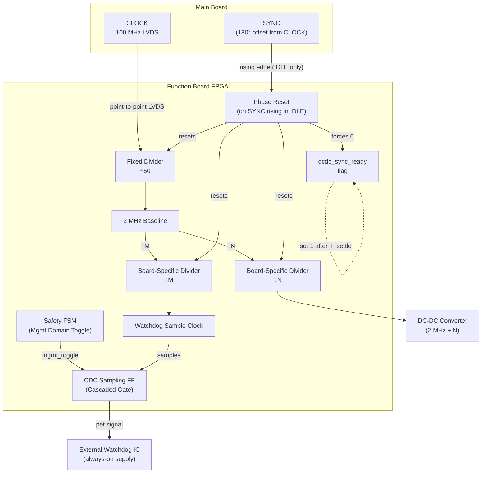
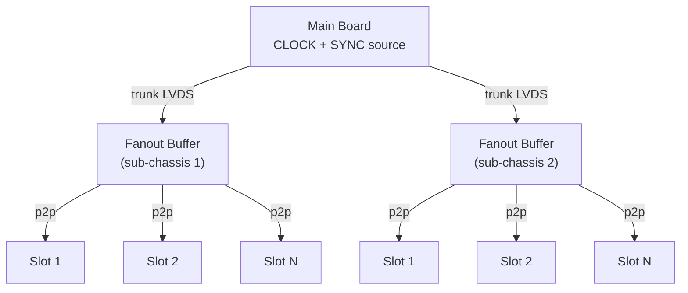
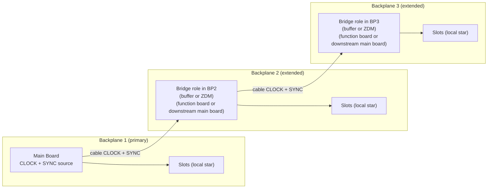
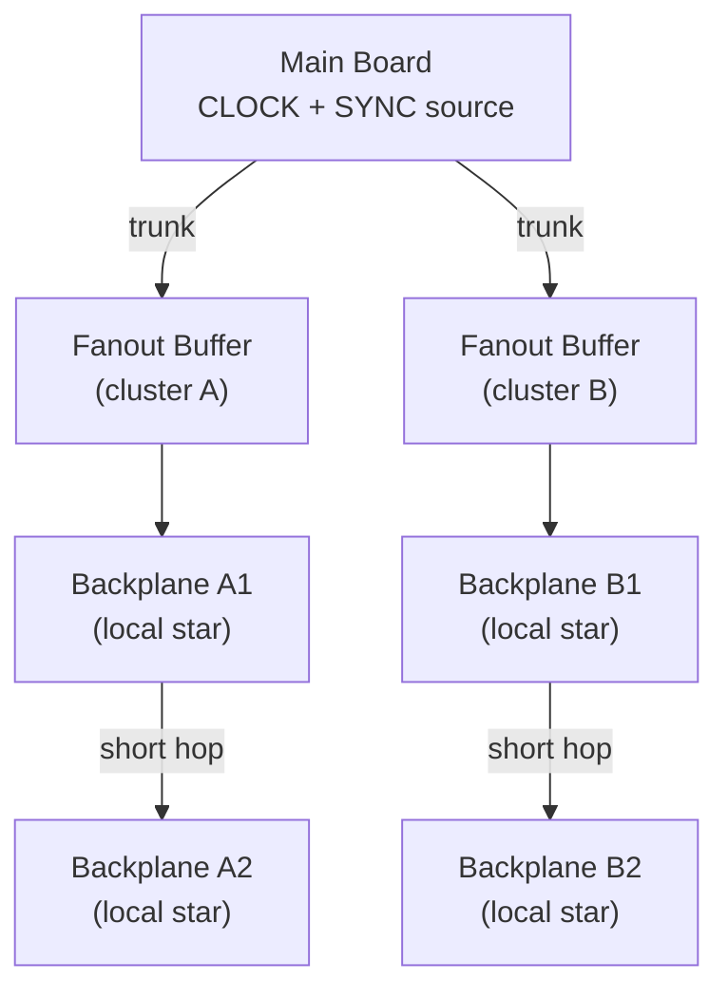

# ADR-004: Clock and Sync Distribution

**Status:** Resolved
**Last updated:** 2026-04-09

---

## Context

The main board must distribute sequencer `CLOCK` and `SYNC` to all function boards across one or more backplanes. In this architecture, both are LVDS. Two constraints drive the design:

1. **Jitter budget:** The video board supports multiple readout modes selected by sequencer. DCDS is the hardest case: a 16-bit ADC up to 100 MSPS samples in short settled windows (hundreds of ns inside each ~1 us pixel period). If CNV jitters, sampling edges move into signal-slew regions and SNR collapses. DCDS is not always used, but it sets the worst-case architecture limit: **< 5 ps RMS CNV jitter**. Less demanding modes are automatically covered by this limit.

2. **DC-DC switching noise:** Each board has internal DC-DC converters. If boards switch asynchronously, transients overlap randomly and create broadband noise. Synchronizing all converter clocks collapses this into a predictable, harmonically aligned noise profile that board-level analog filtering can effectively attenuate.

> **Core Decision:** To meet the 5 ps jitter target without requiring premium PLL performance on every board, distribute the full-rate 100 MHz sequencer clock directly from main to each slot over point-to-point LVDS.

---

## Considered and Rejected

### M-LVDS multidrop backplane clock

A single differential pair routed to all slots via a multidrop stub topology.

**Rejected because:** Stubs create impedance discontinuities at each slot connector. At frequencies above ~40 MHz the reflections cause signal integrity degradation that cannot be corrected without matched termination at every slot, complicating passive backplane design. Point-to-point per-slot traces eliminate this problem entirely.

---

## Resolved Constraints

Backplane signal semantics and FSM transition behavior are normative in ADR-003 (`R3`, `R6`, `R7`, `R8`). This ADR specifies clock/SYNC distribution architecture, jitter constraints, and derived readiness requirements.

### R1: Point-to-Point LVDS Star Topology

Each slot receives its own dedicated differential pair for CLOCK and SYNC, driven independently from the main board. Both links use LVDS electrical signaling. There are no stubs or shared transmission line segments. Each trace is a clean 100 Ω point-to-point link from main driver to slot termination resistor. Signal integrity is independent of slot population — empty slots have no electrical effect on other slots.

### R2: High-frequency clock distributed from main — no local PLLs

The main board provides a low-jitter high-frequency sequencer clock at **100 MHz**. This clock is distributed directly to all function boards via the LVDS star.

This ADR does not constrain the exact clock-source implementation. Any source is acceptable if system jitter requirements are met (for example jitter cleaner or low-jitter oscillator).

Function boards use the distributed clock directly and do not multiply it with local PLLs. This is the key optimization:

- A PLL inside an FPGA operating from a low-frequency reference (e.g. 10 MHz) must multiply up to reach the sequencer clock rate. FPGA internal switching noise couples into PLL rails and the VCO, typically yielding 15–30 ps of output jitter — far beyond the 5 ps budget.
- A clock distributed at full frequency requires only buffering and digital division on the function board, not multiplication. Digital division by N reduces phase noise by 20·log(N) dB, producing a cleaner output than the source.

### R3: IOB re-timing for the CNV signal

The CNV (convert-start) signal is generated by FPGA sequencer logic. On video boards, CNV is the ADC start-conversion control. The active readout mode (DCDS or other) is determined by the sequencer loaded for the session.
Bias boards and clock boards do not generate CNV and do not implement this CNV output requirement.

**The Rule (Normative):** CNV output must use IOB (pad-level) re-timing. Sequencer logic asserts `CNV_enable` in fabric, which drives the D input of a flip-flop placed in the output pad. The distributed main `CLOCK` must drive that flip-flop clock directly through the global clock tree. This makes the physical CNV edge occur on the low-jitter clock edge, independent of fabric routing delay. Apply the same rule to any timing-critical ADC control output.

**The Rationale:** CNV is not a fixed divider output; it is an aperiodic sequencer-driven signal. Its timing inside each pixel changes with readout mode and detector profile. If emitted directly from fabric, switching noise and path skew can push jitter beyond 5 ps. Re-timing at the output pad with the main clock keeps CNV within the DCDS jitter budget.

### R4: DC-DC switching clock is derived from the main clock

Each function board first derives a fixed 2 MHz baseline from the incoming 100 MHz main clock using a ÷50 digital divider in FPGA fabric. The DC-DC switching clock is then derived as an exact integer division of this 2 MHz baseline (÷N). The exact switching frequency is a hardware implementation choice for each specific board design to optimize local LDO PSRR, but must remain harmonically aligned to the global 2 MHz baseline to prevent cross-board noise pollution on the backplane (see R8).

**Cascaded Watchdog Reference:** A separate divider (÷M from the 2 MHz baseline) generates the timing-domain sample clock for the board's Cascaded Hardware Watchdog. Per ADR-001 R5, this timing-domain clock does not directly drive the external watchdog IC; instead, it synchronously samples a continuous toggle generated by the management FSM. This cross-domain gating ensures the watchdog trips if either the timing chain breaks or the management FSM freezes.

All three dividers (÷50 baseline, ÷N DC-DC, ÷M watchdog) must reset simultaneously in `IDLE` (`EN = 0`) on `SYNC` rising edge. This decouples converter synchronization/settling from acquisition arming by executing the reset while the system is unarmed (`EN=0`), before transitioning to `RUN`. This `SYNC` edge in `IDLE` is pre-arm synchronization only, not an acquisition trigger.

`SYNC` and `CLOCK` are generated by the main board with a fixed 180° phase relationship (`SYNC` rising aligned to `CLOCK` falling). This removes uncertain cycle-capture ambiguity when boards generate the divider-reset flag in their local clock domain.

After divider reset, each board must wait the converter settling window (`T_settle`) before `EN` may rise into `RUN`. `dcdc_sync_ready` is the normative readiness flag: force it to `0` on every IDLE `SYNC` rising edge, and set it to `1` only after local `T_settle` expires. `T_settle` remains ICD-defined.

**Note on architectural abstraction:** While this ADR relies on normative prose to define strict rules, the following block diagram is included pragmatically as a high-level map of clock domains and signal flow boundaries. It illustrates *what boundaries must exist* (e.g., cross-domain sampling) to satisfy the architecture, not *how they must be implemented* at the gate or firmware level. Exact synchronizer topologies and component selections belong in the Firmware and Hardware Design Specifications.

#### Signal derivation and pre-arm timing

### R5: Local management clock independence and CLOCK-derived watchdog reference

Each board must include an independent local management clock source (oscillator/crystal) for the management/control domain. This clock is the time base for the hierarchical Moore FSM, all registered safety-path outputs, and the internal clock monitor. It must **not** be derived from the distributed backplane `CLOCK` signal (100 MHz LVDS) — not directly, and not via a PLL or clock manager that uses the distributed CLOCK as a reference input. If the distributed CLOCK stops (F5), the management clock domain must continue operating normally so the FSM can detect the fault, assert `OK` LOW, and transition to `ERROR.init`.

**Maximum management clock period: `T_mgmt_max` ≤ 100 ns** (equivalent to ≥ 10 MHz). This provides adequate margin for the sub-microsecond registered fault-assertion requirement (ADR-003 R2) including I/O propagation delays. Each board may use any management clock frequency that satisfies `T_mgmt_max`; the specific oscillator frequency is a board-level design choice, not a system-wide constant. All timeouts and timing parameters are defined in real-time units, so boards with different management clock frequencies produce identical real-time behavior.

The distributed 100 MHz `CLOCK` is used exclusively for:
1. Sequencer timing path (acquisition)
2. 2 MHz baseline derivation (÷50) → DC-DC switching clock (÷N) and watchdog sample clock (÷M)
3. CNV/ADC timing-critical outputs (via IOB re-timing from the CLOCK global tree, R3)

Normative implications:

- `START.boot` self-configuration and Ethernet/UART/NVM service must run without depending on distributed backplane `CLOCK`.
- The full hierarchical FSM (`START`, `IDLE`, `RUN`, `ERROR`), registered `OK` driver, `relay_drive`, `EN`, and internal clock monitor (`F5_latch`) must all be clocked from the local management clock domain (ADR-003 R2).
- **Cascaded Watchdog Pet (Normative update per ADR-001):** The watchdog pet generation must use a cross-domain cascaded architecture. The base toggle must be generated by the safety FSM in the management clock domain, and it must be synchronously sampled by the distributed backplane `CLOCK` timing family (e.g., the dedicated watchdog divider ÷M from the 2 MHz baseline on function boards).
- For `START.wait` qualification (ADR-003), the internal monitor must verify the timing-domain sample clock activity from the perspective of the local management clock domain.
- Loss of distributed backplane `CLOCK` must not disable management Ethernet diagnostics/recovery capability or FSM operation.

### R6: Backplane slot count is application-dependent

This ADR does not impose a fixed slot-count limit per backplane. The number of slots and total board count are defined per instrument and must be justified by power-delivery, thermal, signal-integrity, and mechanical constraints in the corresponding ICD/project design package.

### R7: Multi-backplane clock/SYNC distribution topology is application-dependent

For multi-backplane systems, choose topology per instrument scale and physical layout. This ADR intentionally leaves topology open and does not mandate one pattern:

| Topology | Description | Suitable for |
|---|---|---|
| Hierarchical (tiered) star | Main distributes trunk lines to secondary fanout buffers in each sub-chassis | Large fixed instruments, best jitter |
| Daisy-chain repeater | The main board resides on the first (primary) backplane and extends CLOCK/SYNC over cable to downstream backplanes. The repeater/bridge role is implemented on each extended backplane (for example, a bridge function board or a downstream main board). See daisy-chain implementation rules below for buffer vs. ZDM constraints. | Moderate scale, limited hop count |
| Hybrid | Tiered distribution to primary chassis, short daisy-chain hops within localized clusters | Very large instruments (50+ boards) |

#### Daisy-chain repeater implementation rules

When implementing the bridge role on an extended backplane, engineers must choose between two options:

**(a) Buffer-only:** Both `CLOCK` and `SYNC` pass through matched low-skew LVDS buffers. Both accumulate similar propagation delays per hop, maintaining the relative 180° phase, but `CLOCK` jitter accumulates per hop.

**(b) ZDM regeneration:** `CLOCK` is a continuous periodic signal and is regenerated via a jitter cleaner in Zero Delay Mode (ZDM). `SYNC` consists of aperiodic pulses and cannot be ZDM regenerated; it must pass through a low-skew LVDS fanout buffer.

**Hop-count constraint:** Because ZDM eliminates `CLOCK` delay but `SYNC` accumulates buffer propagation delay per hop, the 180° phase margin degrades linearly with each backplane added. This imposes a strict physical limit on the maximum number of daisy-chained backplanes. The maximum hop count must be mathematically validated against the 100 MHz setup/hold margins.

#### Topology diagrams

**Hierarchical (tiered) star:**

**Daisy-chain repeater:**

*ZDM constraint:* CLOCK jitter is cleaned at each hop, but SYNC delay accumulates — the 180° phase margin between CLOCK and SYNC degrades per hop, limiting the maximum chain length.

**Hybrid:**

### R8: Specific sequencer clock frequency is fixed

The sequencer `CLOCK` frequency is fixed at **100 MHz**.

Implications:

- **Global Harmonic Alignment (Normative):** Every board derives a fixed 2 MHz baseline from the 100 MHz clock via ÷50. To prevent unpredictable cross-board noise pollution, all DC-DC switching frequencies and watchdog sample clocks must be exact integer divisors of this 2 MHz baseline (e.g., 2 MHz ÷1, 1 MHz ÷2, 500 kHz ÷4, 400 kHz ÷5). Frequencies that do not evenly divide into 2 MHz (such as 800 kHz or 1.5 MHz) are strictly prohibited. Because all boards reset phase on the exact same SYNC edge, enforcing this 2 MHz harmonic baseline ensures that every switching transient on every board overlaps perfectly. This prevents asynchronous transient interleaving and low-frequency beat harmonics on the shared backplane, creating a predictable noise profile that board-level analog filtering can effectively attenuate.
  - **Phase Offsetting (di/dt mitigation, design note):** To reduce peak simultaneous current draw on the shared backplane 12V rail, hardware designers may intentionally offset the phase of their local DC-DC clocks relative to the SYNC reset edge. The offset value is a free board-level design choice — no grid constraint applies — because the noise mitigation strategy is frequency-domain: board-level analog filtering attenuates the harmonically aligned switching frequencies, and phase offset does not change frequency content.
- Video-board sequencer timing uses the 100 MHz base time step (10 ns period)
- Because the 100 MHz frequency mandates a high timing resolution (10 ns period), it inherently tightens setup/hold margins. This strictly limits the maximum hop count for daisy-chain multi-backplane designs (as noted in R7).
- LVDS link design and jitter budgeting are verified against 100 MHz operation

---

## Decision
*Resolved. LVDS star distribution, high-frequency direct distribution without local PLL multiplication, IOB re-timing, independent local management clocks, DC-DC divider phase reset in IDLE on SYNC rising with settling before arm, and the specific sequencer frequency selection (`CLOCK = 100 MHz`) are all settled. Multi-backplane capacity/topology remains application-dependent and must be justified per instrument ICD/design package.*

---

## Consequences

- Clock distribution implementation must guarantee low-jitter delivery at each slot without relying on local PLL multiplication.
- Each board must include an independent local management clock source; management Ethernet/control functions must remain operational without distributed backplane `CLOCK`.
- FPGA/board designs must implement IOB re-timing for CNV-class timing-critical ADC control outputs.
- System arm flow must include IDLE SYNC phase-reset + `T_settle` readiness gating before EN assertion, per ADR-003.
- Each instrument must explicitly define slot count and (when needed) multi-backplane distribution topology in its ICD/design package.
- Each function board must implement watchdog-pet-source qualification behavior for START.wait per `ADR-003 R7`, an internal clock monitor on the local management clock domain (`F5_latch`), a dedicated watchdog status sense line (`WD_latch`), and enforce post-qualification CLOCK loss handling through the existing interlock fault path with diagnostic classification per ADR-001 R6 truth table.

