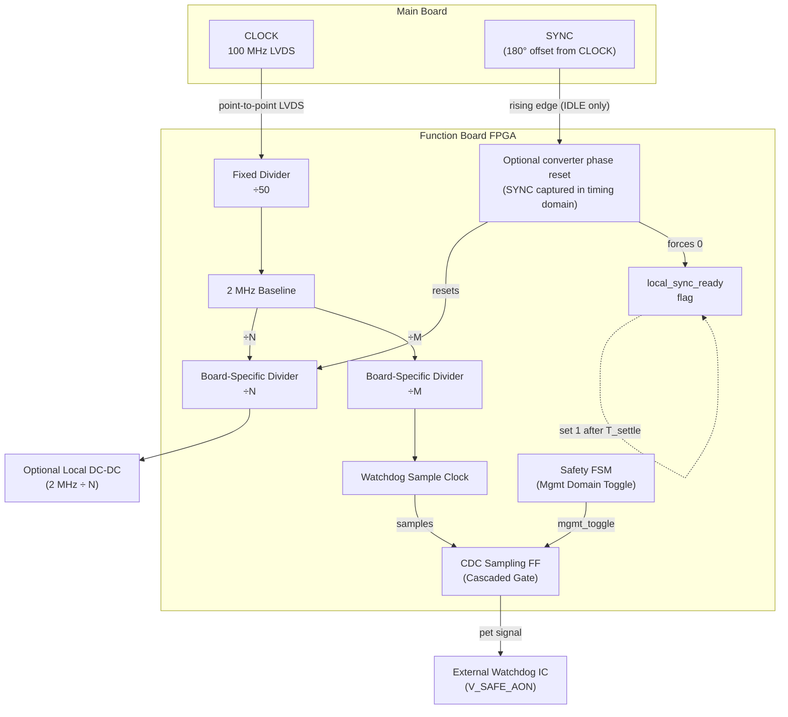

# ADR-004: Clock and Sync Distribution

**Status:** Resolved
**Last updated:** 2026-08-14

---

## Context

The main board must distribute sequencer `CLOCK` and `SYNC` to all function boards across one or more backplanes. Both are LVDS. Timing-sensitive acquisition modes benefit from one common full-rate clock, while management and safety logic must remain operational if that clock is lost.

Some boards and the backplane utility-power domain also include DC-DC converters. Converter synchronization may be used where predictable harmonic relationships or controlled phase offsets improve detector performance, but auxiliary clocks must have defined behavior when the external timing reference disappears.

> **Core Decision:** Distribute the full-rate 100 MHz sequencer clock directly from main to each slot over point-to-point LVDS. Use it directly for sequencer timing; keep management/processor clocks independent; and make synchronization or free-running fallback of non-sequencer auxiliary clocks a board-specific choice.

---

## Considered and Rejected

### M-LVDS multidrop backplane clock

A single differential pair routed to all slots via a multidrop stub topology.

**Rejected because:** Backplane stubs, connector discontinuities, and population-dependent loading make timing verification more difficult than dedicated point-to-point links. Point-to-point per-slot traces keep each link independent of slot population.

---

## Resolved Constraints

Backplane signal semantics and FSM transition behavior are normative in ADR-003 (`R3`, `R6`, `R7`, `R8`). This ADR specifies clock/SYNC distribution, clock-domain ownership, and derived readiness requirements. Backplane utility-voltage generation, fixed-frequency operation, mandatory main-board sync capability, and optional converter use of that capability are defined in ADR-005.

### R1: Point-to-Point LVDS Star Topology

Each slot receives its own dedicated differential pair for CLOCK and SYNC, driven independently from the main board. Both links use LVDS electrical signaling. There are no stubs or shared transmission line segments. Each trace is a clean 100 Ω point-to-point link from main driver to slot termination resistor. Signal integrity is independent of slot population — empty slots have no electrical effect on other slots.

### R2: Full-rate clock distributed from main — no local multiplication in the sequencer path

The main board provides the sequencer clock at **100 MHz**. This clock is distributed directly to all function boards via the LVDS star.

This ADR does not constrain the exact clock-source implementation. The clock source and complete timing chain must be verified against the selected ADC, analog front end, sequencer, and detector-performance requirements in the relevant design package.

Function boards use the distributed clock directly for their primary sequencer timing and do not multiply a lower-frequency local reference to recreate it. Lower-frequency synchronous timing signals may be produced by integer division where required.

### R3: Timing-critical outputs and SYNC clock-domain ownership

The CNV (convert-start) signal is generated by FPGA sequencer logic. On video boards, CNV is the ADC start-conversion control. The active readout mode (DCDS or other) is determined by the sequencer loaded for the session.
Bias boards and clock boards do not generate CNV and do not implement this CNV output requirement.

**The Rule (Normative):** CNV and other timing-critical ADC control outputs must be launched from the distributed `CLOCK` timing domain using a deterministic registered output path. The selected technique and end-to-end timing quality are verified in the video-board design. Dedicated I/O-register re-timing is a normal implementation technique, but equivalent implementations are acceptable.

Acquisition `SYNC` edges are captured directly in the distributed 100 MHz timing domain so participating sequencers start and stop on defined clock edges. A separate CDC-safe observation of `SYNC` may enter the independent management domain for state reporting, readiness, and telemetry; management-domain recognition is not the source of the timing-critical sequencer edge.

Restoration of a lost distributed `CLOCK` never resumes acquisition automatically. The system remains in `ERROR`, requalifies the restored clock through `START.wait`, returns to `IDLE`, performs any required pre-arm preparation, and is explicitly armed again.

### R4: Timing-derived watchdog and optional local DC-DC clocks

Each function board derives a fixed 2 MHz baseline from the incoming 100 MHz main clock using a ÷50 digital divider. This baseline is required for the watchdog timing-domain sample clock. It may also be used by board-local special-purpose DC-DC converters when a board design chooses to synchronize those converters to the system timing family.

For synchronized board-local converters, the switching clock must be an exact integer division of the 2 MHz baseline (÷N). Exact frequency, optional phase control, filtering, and free-running behavior after loss of synchronization are board-design choices. A converter or auxiliary clock that continues after reference loss must do so from a defined local free-running source; this fallback is optional and is never used for sequencer timing.

Common utility-voltage converters (`+3.3V_DIG_AUX`, `+6V_ANA`, `-6V_ANA`, `+16V_ANA`, `-16V_ANA`) are located on the backplane board, not generated independently on each function board. ADR-005 defines their nominal 2 MHz fixed-frequency operation and the main board's mandatory provision of independently phase-capable utility-sync outputs. Whether an instrument uses those outputs and applies phase offsets remains an ADR-005 backplane-power design choice.

**Cascaded Watchdog Reference:** A separate divider (÷M from the 2 MHz baseline) generates the timing-domain sample clock for the board's Cascaded Hardware Watchdog. Per ADR-001 R5, the binding requirement is two-domain liveness: pet transitions must stop if either the timing chain breaks or the management FSM freezes. The reference pattern uses this timing-domain clock to synchronously sample a continuous toggle generated by the management FSM.

The watchdog divider need not be phase-aligned across boards; it must run from the distributed timing family and stop when that family stops. A board that intentionally controls the phase of a local converter may use an IDLE `SYNC` edge captured in the 100 MHz domain to reset that converter divider before arming. Other dividers are not required to reset from pre-arm `SYNC`.

`SYNC` and `CLOCK` are generated by the main board with a nominal 180° relationship: `SYNC` changes on a `CLOCK` falling edge and is captured on a following rising edge. The exact setup/hold margin is verified by the backplane and board designs.

Boards that implement a phase-controlled local converter must wait their local settling window (`T_settle`) before `EN` may rise into `RUN`. `local_sync_ready` represents this optional condition. Boards without such a requirement tie it to ready. `T_settle` remains ICD-defined.

**Note on architectural abstraction:** While this ADR relies on normative prose to define strict rules, the following block diagram is included pragmatically as a high-level map of clock domains and signal flow boundaries. It illustrates *what boundaries must exist* (e.g., cross-domain sampling) to satisfy the architecture, not *how they must be implemented* at the gate or firmware level. Exact synchronizer topologies and component selections belong in the Firmware and Hardware Design Specifications.

#### Signal derivation and pre-arm timing

```mermaid
graph TD
    subgraph main ["Main Board"]
        CLK["CLOCK\n100 MHz LVDS"]
        SYN["SYNC\n(180° offset from CLOCK)"]
    end

    subgraph fn ["Function Board FPGA"]
        DIV50["Fixed Divider\n÷50"]
        BASE["2 MHz Baseline"]
        DIV_N["Board-Specific Divider\n÷N"]
        DIV_M["Board-Specific Divider\n÷M"]
        PET_CLK["Watchdog Sample Clock"]
        RST["Optional converter phase reset\n(SYNC captured in timing domain)"]
        RDY["local_sync_ready\nflag"]
        FSM["Safety FSM\n(Mgmt Domain Toggle)"]
        SAMP["CDC Sampling FF\n(Cascaded Gate)"]
    end

    DCDC["Optional Local DC-DC\n(2 MHz ÷ N)"]
    WD["External Watchdog IC\n(V_SAFE_AON)"]

    CLK -- "point-to-point LVDS" --> DIV50
    DIV50 --> BASE
    BASE -- "÷N" --> DIV_N --> DCDC
    BASE -- "÷M" --> DIV_M --> PET_CLK

    %% Cascaded Watchdog Logic
    FSM -- "mgmt_toggle" --> SAMP
    PET_CLK -- "samples" --> SAMP
    SAMP -- "pet signal" --> WD

    %% Sync Logic
    SYN -- "rising edge (IDLE only)" --> RST
    RST -- "resets" --> DIV_N
    RST -- "forces 0" --> RDY
    RDY -. "set 1 after T_settle" .-> RDY
```

### R5: Local management clock independence and CLOCK-derived watchdog reference

Each board must include an independent, continuously running local management clock source for the management/control domain. This clock is the time base for the hierarchical safety FSM, registered safety-path outputs, host-supervision timer, and internal clock monitor. It must not be derived from, switched to, or require phase lock with the distributed backplane `CLOCK`. If the distributed `CLOCK` stops, management, processor communication, diagnostics, and safety logic continue operating.

The management-clock frequency and implementation are board-design choices sized for the allocated control and fault-response requirements. Operational timeouts are defined in real-time units so boards with different management-clock frequencies behave consistently.

The distributed 100 MHz `CLOCK` is used exclusively for:
1. Sequencer timing path (acquisition)
2. 2 MHz baseline derivation (÷50) -> watchdog sample clock (÷M) and optional synchronized local DC-DC switching clock (÷N)
3. CNV/ADC timing-critical outputs through deterministic registered timing paths (R3)

Normative implications:

- `START.boot` self-configuration and Ethernet/UART/NVM service must run without depending on distributed backplane `CLOCK`.
- The hierarchical safety FSM (`START`, `IDLE`, `RUN`, `ERROR`), registered `OK` driver, `relay_drive`, `EN`, and internal clock monitor must all operate from the local management clock domain (ADR-003 R2). Timing-critical sequencer start/stop actions remain in the distributed 100 MHz domain per R3.
- **Watchdog Pet Liveness (per ADR-001 R5):** Pet generation must stop if either the management clock domain or the distributed backplane `CLOCK` timing family (e.g., the dedicated watchdog divider ÷M from the 2 MHz baseline on function boards) stops. The cascaded toggle-and-sample architecture defined in ADR-001 R5 is the reference pattern.
- For `START.wait` qualification (ADR-003), the internal monitor must verify the timing-domain sample clock activity from the perspective of the local management clock domain.
- Loss of distributed backplane `CLOCK` must not disable management Ethernet diagnostics/recovery capability or FSM operation.

### R6: Backplane slot count is application-dependent

This ADR does not impose a fixed slot-count limit per backplane. The number of slots and total board count are defined per instrument and must be justified by power-delivery, thermal, signal-integrity, and mechanical constraints in the corresponding ICD/project design package.

### R7: Multi-backplane clock/SYNC distribution topology is application-dependent

For multi-backplane systems, choose topology per instrument scale and physical layout. This ADR intentionally leaves topology open and does not mandate one pattern.

Normative constraints:

- The selected topology must preserve the slot-level point-to-point LVDS rule from R1.
- Hop count, jitter accumulation, propagation delay, and `CLOCK`/`SYNC` phase margin must be justified in the instrument ICD/design package.
- Daisy-chain or regenerated topologies must explicitly validate the 100 MHz setup/hold margins.

Topology examples and diagrams are kept in [ADR-004_clock_topology_reference.md](reference/ADR-004_clock_topology_reference.md).

### R8: Specific sequencer clock frequency is fixed

The sequencer `CLOCK` frequency is fixed at **100 MHz**.

Implications:

- Every function board derives the 2 MHz watchdog baseline from the 100 MHz clock via ÷50. Board-local DC-DC converters that opt into synchronized switching use exact integer divisors of this baseline. Optional phase alignment or offset is board-specific and is required only when the board design claims controlled converter phase.
- Video-board sequencer timing uses the 100 MHz base time step (10 ns period)
- Because the 100 MHz frequency mandates a high timing resolution (10 ns period), it inherently tightens setup/hold margins. This strictly limits the maximum hop count for daisy-chain multi-backplane designs (as noted in R7).
- LVDS link timing and signal integrity are verified against 100 MHz operation and the selected board components

---

## Decision
*Resolved. LVDS star distribution, direct 100 MHz sequencer-clock distribution without local frequency multiplication, timing-domain capture of acquisition SYNC, deterministic registered timing-critical outputs, independent management/processor clocks, optional auxiliary-clock fallback, and optional board-local converter phase control are settled. Backplane utility-voltage generation is covered by ADR-005. Multi-backplane capacity/topology remains application-dependent and must be justified per instrument ICD/design package.*

---

## Consequences

- Clock distribution and board designs must verify the timing quality required by their selected ADC, analog front end, sequencer, and detector application without recreating the primary sequencer clock through local frequency multiplication.
- Each board must include an independent local management clock source; management Ethernet/control functions must remain operational without distributed backplane `CLOCK`.
- FPGA/board designs must launch CNV-class timing-critical ADC control outputs through deterministic registered timing paths.
- System arm flow includes IDLE pre-arm synchronization only where a board implements controlled local-converter phase; those boards apply `T_settle` readiness gating before EN assertion per ADR-003.
- Each instrument must explicitly define slot count and (when needed) multi-backplane distribution topology in its ICD/design package.
- Each function board must implement watchdog-pet-source qualification behavior for START.wait per `ADR-003 R7`, an internal clock monitor on the local management clock domain, a dedicated watchdog status indication, and post-qualification CLOCK-loss handling through the existing interlock path with sufficient retained evidence to distinguish clock-loss from watchdog-only events.
