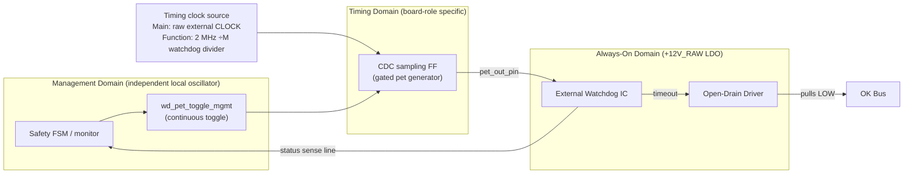
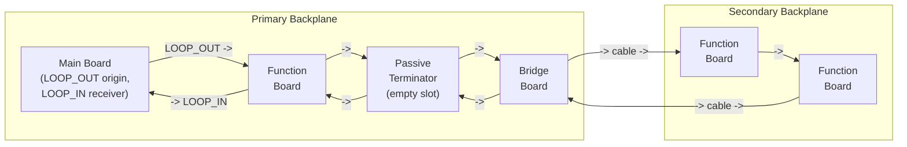

# ADR-001 Reference: Fault Detection Diagrams

This reference supports `../ADR-001_presence_health_detection.md`.

ADR-001 is the peer-review entry point for the health-detection decision. This file holds supporting diagrams so the ADR can stay focused on the fault taxonomy, required mechanisms, and diagnostic truth tables.

## Watchdog and clock monitor architecture

This diagram applies to all boards. The timing-domain source differs by board role:

- Main board: raw external `CLOCK` source domain.
- Function boards: dedicated watchdog divider (`÷M`) from the 2 MHz baseline derived from distributed backplane `CLOCK`.

Key properties:

- Cascaded pet generation requires both management-domain execution and timing-domain clock activity.
- If either domain freezes, pet transitions stop and the external watchdog independently times out to pull `OK` LOW.
- Main-board freeze while armed is covered by hardware: the main-board watchdog pulls `OK` LOW, and function-board relay RESET paths (`RESET = NOT(EN) OR NOT(OK)`, ADR-003 R9) de-energize relays immediately.

## Continuity loop routing

The loop is a single series circuit: `LOOP_OUT` leaves the main board, passes through every occupied slot and passive terminator on the primary backplane, crosses to the secondary backplane via the bridge board and cable, routes through all secondary slots, and returns the same path back to `LOOP_IN` on the main board. Any physical break anywhere in this chain drops `LOOP_IN` instantly (F1).
