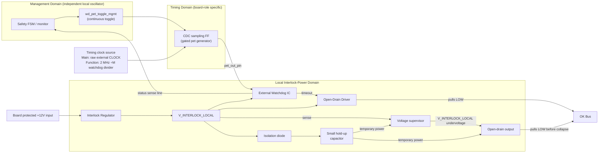
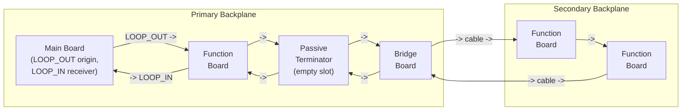

# ADR-001 Reference: Fault Detection Diagrams

**Status: Non-normative reference**

This reference illustrates implementations consistent with `../ADR-001_presence_health_detection.md`. It does not add requirements; the parent ADR controls if the documents conflict.

ADR-001 is the peer-review entry point for the health-detection decision. This file holds supporting diagrams so the ADR can stay focused on the fault taxonomy, required mechanisms, and diagnostic truth tables.

## Example watchdog and clock monitor architecture

This example shows a cascaded implementation of the required two-domain liveness behavior. Other implementations are acceptable. In this example, the timing-domain source differs by board role:

- Main board: raw external `CLOCK` source domain.
- Function boards: dedicated watchdog divider (`÷M`) from the 2 MHz baseline derived from distributed backplane `CLOCK`.

```mermaid
graph LR
    subgraph mgmt_domain ["Management Domain (independent local oscillator)"]
        FSM["Safety FSM / monitor"]
        TOG["wd_pet_toggle_mgmt\n(continuous toggle)"]
        FSM --> TOG
    end

    subgraph timing_domain ["Timing Domain (board-role specific)"]
        SAMP["CDC sampling FF\n(gated pet generator)"]
    end

    subgraph wd_domain ["Local Interlock-Power Domain"]
        LDO["Interlock Regulator"]
        VSAFE["V_INTERLOCK_LOCAL"]
        WD["External Watchdog IC"]
        OD["Open-Drain Driver"]
        DIODE["Isolation diode"]
        HOLD["Small hold-up\ncapacitor"]
        SUP["Voltage supervisor"]
        SUPOD["Open-drain output"]
    end

    TIMING_CLK["Timing clock source\nMain: raw external CLOCK\nFunction: 2 MHz ÷M watchdog divider"] --> SAMP
    TOG --> SAMP
    SAMP -- "pet_out_pin" --> WD
    WD -- "timeout" --> OD
    WD -- "status sense line" --> FSM
    OD -- "pulls LOW" --> OK["OK Bus"]
    RAW["Board protected +12V input"] --> LDO --> VSAFE
    VSAFE --> WD
    VSAFE --> OD
    VSAFE -- "sense" --> SUP
    VSAFE --> DIODE --> HOLD
    HOLD -- "temporary power" --> SUP
    HOLD -- "temporary power" --> SUPOD
    SUP -- "V_INTERLOCK_LOCAL undervoltage" --> SUPOD
    SUPOD -- "pulls LOW before collapse" --> OK
```

Key properties:

- Cascaded pet generation requires both management-domain execution and timing-domain clock activity.
- If either domain freezes, pet transitions stop and the external watchdog independently times out to pull `OK` LOW.
- The shown diode/capacitor path is one way to keep the supervisor/output valid briefly during an isolated `V_INTERLOCK_LOCAL` collapse; the ADR requires the behavior, not this topology.
- Main-board freeze while armed is covered by hardware: the main-board watchdog pulls `OK` LOW, and function-board relay-permissive paths de-energize relays as required by ADR-003 R9. A reset-dominant expression such as `RESET = NOT(EN) OR NOT(OK)` is one possible implementation.

## Continuity loop routing

```mermaid
graph LR
    subgraph "Primary Backplane"
        M["Main Board\n(LOOP_OUT origin,\nLOOP_IN receiver)"]
        F1["Function\nBoard"]
        T["Passive\nTerminator\n(empty slot)"]
        B["Bridge\nBoard"]
    end

    subgraph "Secondary Backplane"
        F2["Function\nBoard"]
        F3["Function\nBoard"]
    end

    M -- "LOOP_OUT ->" --> F1
    F1 -- "->" --> T
    T -- "->" --> B
    B -- "-> cable ->" --> F2
    F2 -- "->" --> F3
    F3 -- "-> cable ->" --> B
    B -- "->" --> T
    T -- "->" --> F1
    F1 -- "-> LOOP_IN" --> M
```

The loop is a single series circuit: `LOOP_OUT` leaves the main board, passes through every occupied slot and passive terminator on the primary backplane, crosses to the secondary backplane via the bridge board and cable, routes through all secondary slots, and returns the same path back to `LOOP_IN` on the main board. Any physical break anywhere in this chain drops `LOOP_IN` and invokes the F1 interlock path.
