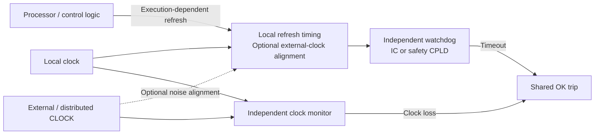
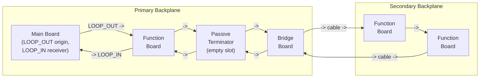

# ADR-001 Reference: Fault Detection Diagrams

**Status: Non-normative reference**

This reference illustrates implementations consistent with `../ADR-001_presence_health_detection.md`. It does not add requirements; the parent ADR controls if the documents conflict.

ADR-001 is the peer-review entry point for the health-detection decision. This file holds supporting diagrams so the ADR can stay focused on the fault taxonomy, required mechanisms, and diagnostic truth tables.

## Example watchdog and clock monitor architecture

The watchdog monitors processor/control-logic execution. A separate clock monitor detects acquisition-clock loss. Optional refresh alignment for noise control must fall back to local clocking when the reference disappears; refreshes must still depend on execution. The independent watchdog timeout does not use the acquisition clock.

```mermaid
flowchart LR
    CPU["Processor / control logic"] -->|"Execution-dependent refresh"| REF["Local refresh timing
Optional external-clock alignment"]
    LOCAL["Local clock"] --> REF
    EXT["External / distributed CLOCK"] -. "Optional noise alignment" .-> REF
    REF --> WD["Independent watchdog
IC or safety CPLD"]
    EXT --> MON["Independent clock monitor"]
    LOCAL --> MON
    WD -->|"Timeout"| OK["Shared OK trip"]
    MON -->|"Clock loss"| OK
```

The watchdog timeout and trip path use local interlock power and remain independent of the supervised logic. A watchdog inside a safety CPLD does not independently cover failure of that same CPLD. Local interlock-power loss uses the F6 reporting options in ADR-001 R9; a dedicated supervisor or hold-up supply is not mandatory.

## Loop implementation options

| Board implementation | Normal continuity | Interlock-power loss (F6) |
|---|---|---|
| Passive copper | Direct connection between loop contacts | Separate hardware contribution to `OK` required |
| Qualified active forwarding | Combinational copy of incoming level | Safe LOW propagates to main, which asserts `OK` |

Both may coexist under the common electrical interface. Empty-slot terminators remain passive. Active forwarding does not depend on `OK`, `EN`, state, or clocks. Its LOW default and recovery on restored power must be verified. Main's own power-loss response cannot depend on failed main-board logic.

An active function board may also remove detector-facing permission directly on incoming LOOP LOW. Downstream boards can act before main asserts `OK`; upstream boards receive the shared trip through `OK`. Local safe-state entry does not force the forwarded output LOW. A detected local safety-hardware problem may independently make the output LOW; forwarding resumes when that condition clears without depending on shared-trip recovery. This provides fault propagation, not automatic fault localization or exhaustive internal failure detection.

## Continuity loop routing

```mermaid
graph LR
    subgraph "Primary Backplane"
        M["Main Board\n(LOOP_OUT origin,\nLOOP_IN receiver)"]
        F1["Function\nBoard"]
        T["Passive\nTerminator\n(empty slot)"]
        B["Bridge\nBoard"]
    end

    subgraph "Secondary Backplane"
        F2["Function\nBoard"]
        F3["Function\nBoard"]
    end

    M -- "LOOP_OUT ->" --> F1
    F1 -- "->" --> T
    T -- "->" --> B
    B -- "-> cable ->" --> F2
    F2 -- "->" --> F3
    F3 -- "-> cable ->" --> B
    B -- "->" --> T
    T -- "->" --> F1
    F1 -- "-> LOOP_IN" --> M
```

The loop is a single series circuit: `LOOP_OUT` leaves the main board, passes through every occupied slot and passive terminator on the primary backplane, crosses to the secondary backplane via the bridge board and cable, routes through all secondary slots, and returns the same path back to `LOOP_IN` on the main board. Any physical break anywhere in this chain drops `LOOP_IN` and invokes the F1 interlock path.
