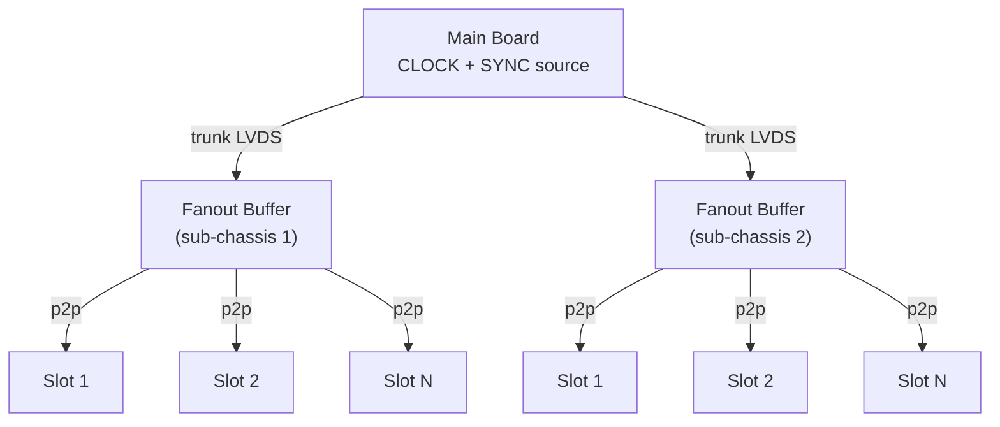
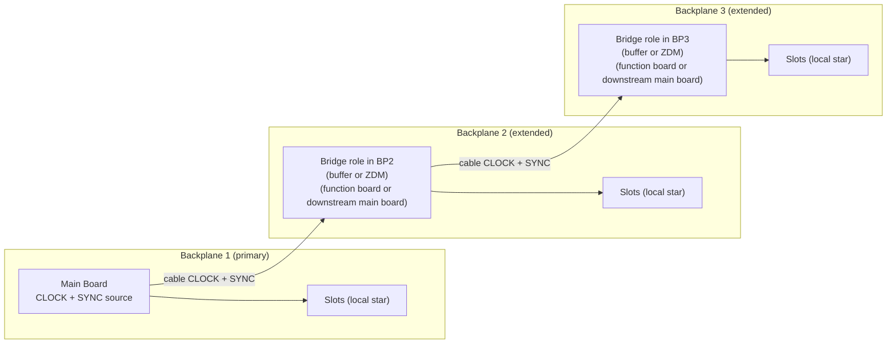
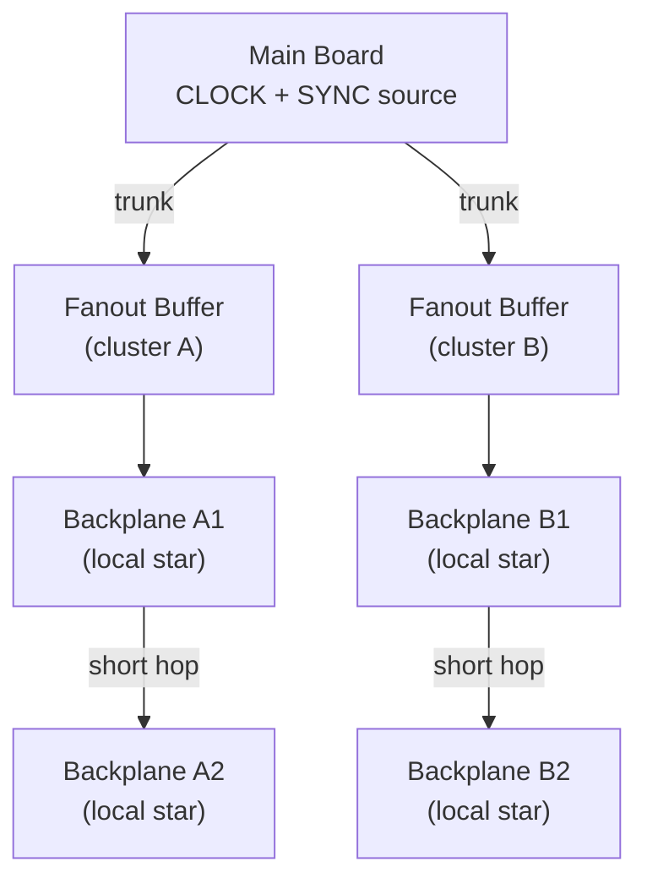

# ADR-004 Reference: Multi-Backplane Clock/SYNC Topologies

This reference supports `../ADR-004_clock_sync_distribution.md`.

ADR-004 is the peer-review entry point for the 100 MHz point-to-point LVDS timing decision. This file holds multi-backplane topology examples and implementation notes that are useful during ICD/design work.

## Topology options

For multi-backplane systems, choose topology per instrument scale and physical layout. ADR-004 intentionally leaves topology open and does not mandate one pattern.

| Topology | Description | Suitable for |
|---|---|---|
| Hierarchical (tiered) star | Main distributes trunk lines to secondary fanout buffers in each sub-chassis | Large fixed instruments, best jitter |
| Daisy-chain repeater | The main board resides on the first (primary) backplane and extends CLOCK/SYNC over cable to downstream backplanes. The repeater/bridge role is implemented on each extended backplane (for example, a bridge function board or a downstream main board). See daisy-chain implementation rules below for buffer vs. ZDM constraints. | Moderate scale, limited hop count |
| Hybrid | Tiered distribution to primary chassis, short daisy-chain hops within localized clusters | Very large instruments (50+ boards) |

## Daisy-chain repeater implementation rules

When implementing the bridge role on an extended backplane, engineers must choose between two options:

**(a) Buffer-only:** Both `CLOCK` and `SYNC` pass through matched low-skew LVDS buffers. Both accumulate similar propagation delays per hop, maintaining the relative 180° phase, but `CLOCK` jitter accumulates per hop.

**(b) ZDM regeneration:** `CLOCK` is a continuous periodic signal and is regenerated via a jitter cleaner in Zero Delay Mode (ZDM). `SYNC` consists of aperiodic pulses and cannot be ZDM regenerated; it must pass through a low-skew LVDS fanout buffer.

**Hop-count constraint:** Because ZDM eliminates `CLOCK` delay but `SYNC` accumulates buffer propagation delay per hop, the 180° phase margin degrades linearly with each backplane added. This imposes a strict physical limit on the maximum number of daisy-chained backplanes. The maximum hop count must be mathematically validated against the 100 MHz setup/hold margins.

## Topology diagrams

**Hierarchical (tiered) star:**

**Daisy-chain repeater:**

*ZDM constraint:* CLOCK jitter is cleaned at each hop, but SYNC delay accumulates. The 180° phase margin between CLOCK and SYNC degrades per hop, limiting the maximum chain length.

**Hybrid:**

