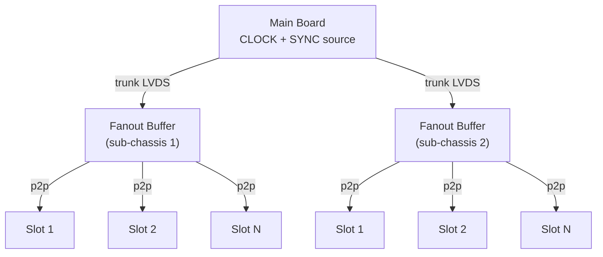
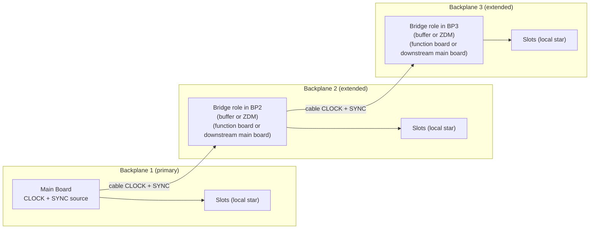
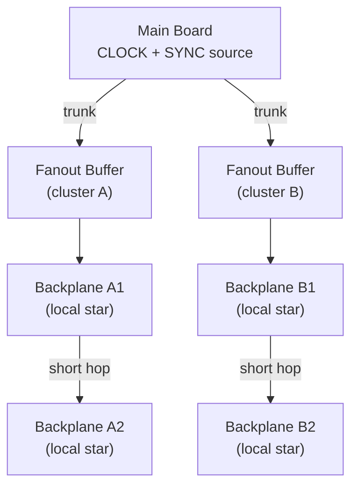

# ADR-004 Reference: Multi-Backplane Clock/SYNC Topologies

This reference supports `../ADR-004_clock_sync_distribution.md`.

ADR-004 is the peer-review entry point for the 100 MHz point-to-point LVDS timing decision. This file holds multi-backplane topology examples and implementation notes that are useful during ICD/design work.

## Topology options

For multi-backplane systems, choose topology per instrument scale and physical layout. ADR-004 intentionally leaves topology open and does not mandate one pattern.

| Topology | Description | Suitable for |
|---|---|---|
| Hierarchical (tiered) star | Main distributes trunk lines to secondary fanout buffers in each sub-chassis | Large fixed instruments where a verified timing tree is practical |
| Daisy-chain repeater | The main board resides on the first (primary) backplane and extends CLOCK/SYNC over cable to downstream backplanes. The repeater/bridge role is implemented on each extended backplane (for example, a bridge function board or a downstream main board). See daisy-chain implementation rules below for buffer vs. ZDM constraints. | Moderate scale, limited hop count |
| Hybrid | Tiered distribution to primary chassis, short daisy-chain hops within localized clusters | Very large instruments (50+ boards) |

## Daisy-chain repeater implementation rules

When implementing the bridge role on an extended backplane, engineers must choose between two options:

**(a) Buffer-only:** Both `CLOCK` and `SYNC` pass through matched low-skew LVDS buffers. Their accumulated delay, skew, duty-cycle distortion, and jitter must be included in the end-to-end timing budget.

**(b) Clock regeneration:** `CLOCK` is regenerated by a device operated in a suitable zero-delay or phase-controlled mode, while aperiodic `SYNC` passes through a compatible low-skew path. The selected components and configuration must preserve the required `CLOCK`/`SYNC` relationship and meet the application timing budget; no generic jitter improvement is assumed.

**Hop-count constraint:** Regenerated `CLOCK` and buffered `SYNC` can accumulate different delays and uncertainties at each hop. The maximum hop count must be validated against the complete 100 MHz setup/hold budget using the selected devices, routing, environmental limits, and topology.

## Topology diagrams

**Hierarchical (tiered) star:**

```mermaid
graph TD
    M["Main Board\nCLOCK + SYNC source"]

    M -- "trunk LVDS" --> FO1["Fanout Buffer\n(sub-chassis 1)"]
    M -- "trunk LVDS" --> FO2["Fanout Buffer\n(sub-chassis 2)"]

    FO1 -- "p2p" --> S1F1["Slot 1"]
    FO1 -- "p2p" --> S1F2["Slot 2"]
    FO1 -- "p2p" --> S1FN["Slot N"]

    FO2 -- "p2p" --> S2F1["Slot 1"]
    FO2 -- "p2p" --> S2F2["Slot 2"]
    FO2 -- "p2p" --> S2FN["Slot N"]
```

**Daisy-chain repeater:**

```mermaid
graph LR
    subgraph BP1["Backplane 1 (primary)"]
        M["Main Board\nCLOCK + SYNC source"]
        S1["Slots (local star)"]
        M --> S1
    end

    subgraph BP2["Backplane 2 (extended)"]
        BR2["Bridge role in BP2\n(buffer or ZDM)\n(function board or downstream main board)"]
        S2["Slots (local star)"]
        BR2 --> S2
    end

    subgraph BP3["Backplane 3 (extended)"]
        BR3["Bridge role in BP3\n(buffer or ZDM)\n(function board or downstream main board)"]
        S3["Slots (local star)"]
        BR3 --> S3
    end

    M -- "cable CLOCK + SYNC" --> BR2
    BR2 -- "cable CLOCK + SYNC" --> BR3
```

*Regeneration constraint:* `CLOCK` and `SYNC` follow different paths, so their relative delay and uncertainty must be budgeted at every hop. The verified phase margin limits the maximum chain length.

**Hybrid:**

```mermaid
graph TD
    M["Main Board\nCLOCK + SYNC source"]

    M -- "trunk" --> FO1["Fanout Buffer\n(cluster A)"]
    M -- "trunk" --> FO2["Fanout Buffer\n(cluster B)"]

    FO1 --> BPA1["Backplane A1\n(local star)"]
    BPA1 -- "short hop" --> BPA2["Backplane A2\n(local star)"]

    FO2 --> BPB1["Backplane B1\n(local star)"]
    BPB1 -- "short hop" --> BPB2["Backplane B2\n(local star)"]
```
