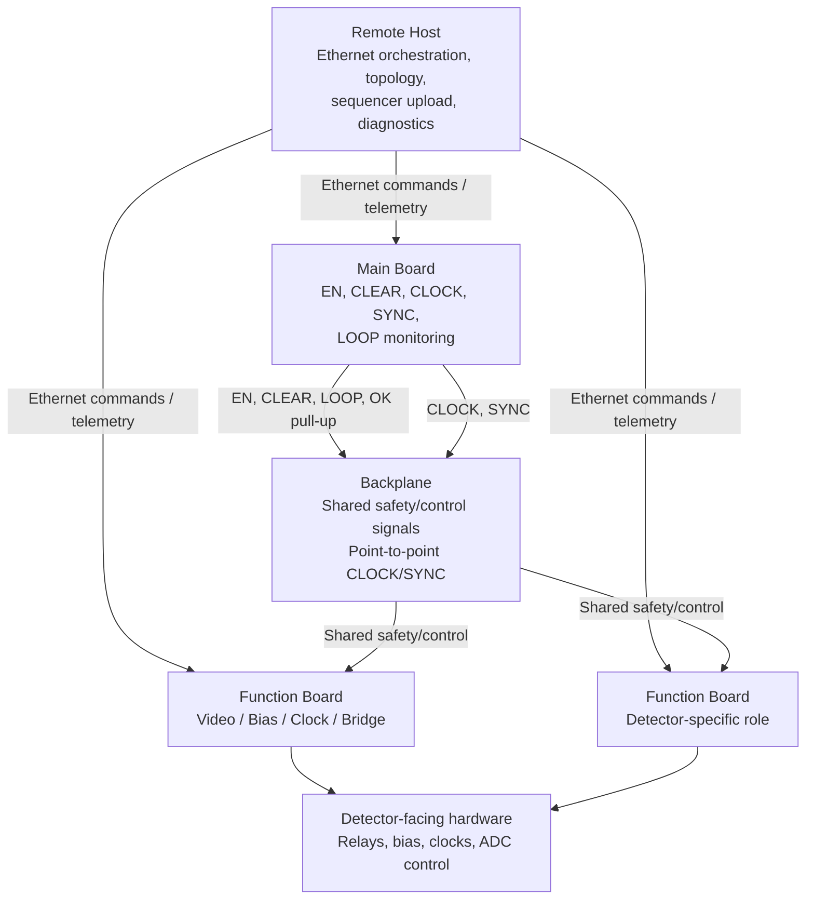
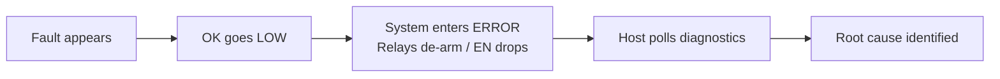
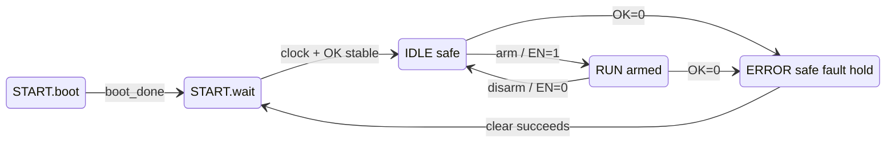

# Modular Detector Controller Concept Guide

- **Status:** Draft / Non-normative
- **Last updated:** 2026-05-04

This guide explains the modular detector controller from first principles. It is intended for readers who need to understand the system before reading the detailed ADRs, ICDs, firmware design specs, or hardware design specs.

This document is **not** the source of truth for requirements. If this guide and an ADR/ICD disagree, the ADR/ICD wins.

---

## 1. Introduction

The modular detector controller is the electronics system that prepares, arms, drives, monitors, and protects a detector during operation. It is built from several boards connected through a backplane. Some boards provide system infrastructure; others perform detector-specific work such as bias generation, clock generation, video acquisition, or sequencer execution.

The main challenge is that the detector must be protected even if software hangs, Ethernet disappears, a board freezes, a cable is disconnected, or a local board fault appears. For that reason, the architecture separates:

- **Fast safety behavior:** handled by hardware signals and latches
- **Slow diagnostic behavior:** handled by Ethernet telemetry and host orchestration

This guide introduces the concepts in the same order a new reader usually needs them:

1. What it means to arm the system
2. Which boards exist and what they do
3. Which signals connect the boards
4. How normal operation proceeds
5. What happens during a fault
6. How recovery works
7. Where the detailed ADRs and future ICDs fit

---

## 2. Basic Operating Words

Some words in the ADRs are precise but easy to misread at first. This guide uses them as follows.

| Word | Meaning in this system |
|---|---|
| **Safe** | The detector-facing outputs are in a non-hazardous condition. In practice, `EN = 0`, function-board relays are open, and acquisition-driving outputs are not armed. |
| **Arm** | Deliberately move the system from safe `IDLE` into armed `RUN` behavior by asserting `EN = 1`. Arming allows function boards to close their relay paths and prepare detector-driving outputs, but only after readiness checks pass. |
| **Disarm** | Return from armed operation to safe operation by dropping `EN = 0`. Function boards must de-arm immediately. |
| **Run** | The armed state family where acquisition can occur. `RUN` includes preparation, waiting for trigger/sync, active acquisition, stopping, and disarm cleanup. |
| **Fault** | A hardware or safety-relevant condition that requires immediate transition to the safe error path. Faults propagate through `OK = 0`. |
| **Not Ready** | A condition that blocks arming but is not itself a fault while `EN = 0`. Example: DC-DC phase has not settled after pre-arm `SYNC`. |
| **Trip** | The act of pulling `OK` LOW or otherwise forcing the system into the safe error path. |
| **Recover / clear** | The explicit operator or host action that asks boards to recheck fault conditions and, if clean, return through `START.wait`. |

The most important distinction is **Not Ready vs Fault**:

- Not Ready while disarmed means "do not arm yet."
- The same missing readiness discovered after `EN` rises becomes an interlock violation and trips the system.

---

## 3. The System in One Paragraph

The controller is a backplane-based system with one **main board** and multiple **function boards**. The main board coordinates system-level signals such as arm/disarm, recovery, clock, sync, and loop monitoring. Function boards do the detector-specific work: generating clocks, applying bias, running sequencers, driving detector pins, and acquiring data. A remote host controls the system over Ethernet and uses UART only for bootstrap configuration or fallback diagnostics.

The architecture is designed around one safety rule:

> **Go to safe state fast. Go to not-safe state slow.**

This means faults should remove power or drive from sensitive hardware immediately, while arming the detector should require deliberate checks.

---

## 4. First Mental Model

The system is easier to understand if you separate three layers:



The host makes decisions and sends commands, but the fast protection path does not depend on host software. If a board needs to make the system safe, it pulls `OK` LOW through hardware-controlled paths.

---

## 5. The Main Ideas Before the Details

There are four ideas that make the rest of the documents easier to read:

1. **Safety is hardware-first.**  
   Software and Ethernet are useful for diagnostics, but the immediate trip path is hardware: the `OK` bus, continuity loop, watchdogs, fail-safe drivers, and relay reset logic.

2. **The main board coordinates but does not acquire science data.**  
   The main board distributes `CLOCK` and `SYNC`, drives `EN` and `CLEAR`, and monitors global health. It has no sequencer.

3. **Function boards enforce their own readiness.**  
   The host should verify readiness before arming, but each function board still checks locally when `EN` rises. If a required condition is missing, that board trips the system.

4. **Recovery always goes through a stability gate.**  
   After a fault, the system does not jump directly back to `IDLE`. It must pass through `ERROR.clear` and then `START.wait`, where `OK` and clock evidence must be stable.

---

## 6. Physical View

Conceptually, the system has these pieces:

| Piece | Role |
|---|---|
| Main board | System coordinator. Drives `EN`, `CLEAR`, `SYNC`, `CLOCK`, and `LOOP_OUT`; monitors `OK` and `LOOP_IN`. |
| Function boards | Detector-specific boards such as video, bias, clock, or bridge boards. They run sequencers, drive outputs, monitor local faults, and enforce arm readiness. |
| Backplane | Carries shared safety/control signals and point-to-point clock/sync distribution. |
| Remote host | Owns topology, sends Ethernet commands, uploads sequencers, performs hash attestation, polls diagnostics, and initiates recovery. |
| UART port | Per-board bootstrap and fallback path. Used when Ethernet is not configured or unavailable. |

The main board is not a central computer that commands every function board internally. The host talks to each board over that board's own Ethernet port.

---

## 7. Host vs Main Board Responsibility

A common first misunderstanding is to treat the main board as the controller for all function boards. In this architecture, the **remote host** is the orchestration controller. The **main board** is a hardware coordinator and gateway for shared backplane signals.

| Responsibility | Remote host | Main board |
|---|---|---|
| Own topology map | Yes | No |
| Poll each board over Ethernet | Yes | No |
| Upload sequencers | Yes | No |
| Check function-board readiness before arm | Yes | No direct backplane feedback |
| Command arm/disarm | Sends command to main | Drives `EN` |
| Command recovery | Sends `clear_error` to main | Drives `CLEAR` |
| Generate/distribute `CLOCK` and `SYNC` | Requests timing actions | Drives hardware signals |
| Start an acquisition window | Sends start/trigger command to main | Emits `SYNC` edge/window |
| Monitor continuity loop | No | Yes |
| Execute detector sequencer pattern | No | No |

The host and main board initiate acquisition together: the host requests the action, and the main board expresses it on the backplane using `SYNC`. The function boards execute their already-loaded local sequencer patterns in response to the qualified `SYNC` behavior while armed.

The host should make a good decision before sending `arm`. Function boards still enforce their own local readiness when `EN` rises, because the host may be wrong, stale, or interrupted.

---

## 8. Signal Vocabulary

These are the system-level signals that appear throughout the ADRs.

| Signal | Plain meaning | Conceptual behavior |
|---|---|---|
| `OK` | Shared fault bus | Normally HIGH. Any board can pull it LOW to signal a fault or armed supervision timeout. |
| `EN` | Global arm signal | Driven by the main board. HIGH means the system is armed. LOW means safe/disarmed. |
| `CLEAR` | Recovery command signal | Driven by the main board during fault recovery. Function boards use it to enter local clear/recheck logic. |
| `CLOCK` | 100 MHz sequencer clock | Distributed by the main board over point-to-point LVDS. Used by function boards for timing-sensitive work. |
| `SYNC` | Synchronized timing edge | Used in `IDLE` for pre-arm divider phase reset and in `RUN` to start/stop acquisition windows. |
| `LOOP_OUT` / `LOOP_IN` | Physical continuity loop | A passive loop through slots and cables. If the loop breaks, the main board converts that into an `OK` fault. |

The detailed behavioral source of truth for these signals is ADR-003.

---

## 9. OK Bus and Diagnostics

The `OK` bus is a shared hardware fault line, not a communication protocol.

Conceptually:

- `OK = 1` means no board is currently pulling the shared fault bus LOW.
- `OK = 0` means at least one board, watchdog path, fail-safe path, or main-board loop conversion has asserted a fault.
- `OK` does **not** identify which board failed.
- `OK` does **not** describe the root cause.

That separation is intentional. The system first uses `OK = 0` to become safe quickly. After the system is safe in `ERROR.run`, the host uses Ethernet diagnostics to ask each board what it saw.



Diagnostic signals such as `fault_vector`, `F5_latch`, `WD_latch`, and `latched_supervision_fault` exist for the slower explanation step. They should not be confused with the immediate safety trip itself.

---

## 10. Normal Operation Story

The normal path is:

```text
START.boot -> START.wait -> IDLE -> RUN -> IDLE
```

The same flow with the main safety gates shown:



### START.boot

Each board powers up using its own local management clock. It reads NVM, applies network configuration, applies operational defaults, and brings up Ethernet. During this phase, the shared `OK` bus may legitimately be LOW because boards are still booting.

### START.wait

This is the stability gate shared by boot and recovery. A board may enter `IDLE` only after:

- required clock evidence is present
- `OK` has risen at least once
- `OK` remains continuously stable for the required window

If those checks do not pass within the defined deadlines, the board enters `ERROR.init`.

### IDLE

`IDLE` is safe: `EN = 0`, relays are open, and the host may configure operational parameters over Ethernet.

Before every arm, the host should:

1. Send pre-arm `SYNC` through the main board.
2. Wait for DC-DC phase-settle readiness.
3. Attest sequencer hashes on required function boards.
4. Confirm function-board readiness.
5. Send `arm` to the main board.

The main board checks its own readiness before asserting `EN`.

### RUN

When `EN` rises, function boards independently evaluate their local arm gates. If readiness is valid, they enter `RUN.init`, then `RUN.wait`, then respond to `SYNC` edges for acquisition.

If `OK` drops during any armed state, the system transitions to `ERROR.init`.

### Disarm

The host sends `disarm` to the main board. The main board drops `EN`. Function boards see `EN` fall and immediately de-arm.

---

## 11. Sequencer Hash Routine

Some function boards execute a **sequencer**: a programmed timing pattern that drives detector-facing signals during acquisition. Before arming, the host must know that each required sequencer board has the correct program loaded locally.

The hash routine is the freshness check for that program.

Conceptually:

1. The host knows the expected sequencer payload for the next acquisition.
2. The host computes, or already has, the expected hash for that payload.
3. While the system is in `IDLE`, the host asks each required sequencer board to attest its active sequencer hash.
4. Each board computes the hash from the bytes actually stored in its local volatile sequencer buffer.
5. The board replies with one of three conceptual results:

| Result | Meaning |
|---|---|
| `hash_match` | The board has a valid local sequencer and its computed hash matches the expected hash. |
| `hash_mismatch` | The board has a sequencer, but it is not the expected one. The host must reload or correct it before arming. |
| `missing/invalid` | The board has no valid sequencer payload. The host must upload or restore one before arming. |

The important safety idea is that the board does **not** trust the host's hash as proof. The board computes its own hash from its own local memory at the time of the request. This catches stale, missing, partial, corrupted, or wrong-board sequencer payloads.

After a board returns `hash_match` in `IDLE`, it sets a local one-arm-use readiness token: `sequencer_hash_valid_current_arm`. When `EN` rises, the function board checks that token together with other readiness conditions. If the token is missing on a required sequencer board, the board treats the arm attempt as an interlock violation and trips the system.

The token is consumed on arm entry, so the next arm requires a fresh attestation cycle. The exact hash algorithm, command format, payload framing, and error codes belong in the ICD.

---

## 12. Keep Alive Supervision

While armed, each board must continue receiving valid host `keep_alive` messages. This is a supervision lease: the host periodically proves that it is still alive and still intentionally supervising the armed system.

This matters because Ethernet loss while armed is not harmless. If the host disappears during acquisition, the system should not continue indefinitely in an armed state without supervision.

Conceptually:

1. The system enters `RUN` and `EN = 1`.
2. Each board starts or continues an armed keep_alive lease timer.
3. The host periodically sends a dedicated `keep_alive` command to each board.
4. Each valid keep_alive refreshes that board's lease.
5. If a board's lease expires while `EN = 1`, that board trips the system by pulling `OK` LOW.

This event is called a **supervisory interlock event**, not a normal hardware fault. The physical response is the same (`OK = 0` and global transition to `ERROR`), but the root cause is loss of valid host supervision while armed.

The keep_alive message format, cadence, timeout, and jitter policy belong in the ICD.

---

## 13. Fault Story

Faults are intentionally handled faster than normal arming.

Examples:

| Situation | Conceptual result |
|---|---|
| A board detects over-current, over-temperature, PLL loss, or another local internal fault | That board pulls `OK` LOW. |
| A board FPGA loses power or reset collapses | Fail-safe hardware pulls `OK` LOW if local 12V is still present. |
| A board logic path freezes | External watchdog eventually pulls `OK` LOW. |
| A cable or slot continuity path breaks | Main board detects `LOOP_IN` drop and pulls `OK` LOW. |
| Host keep_alive stops while armed | The timed-out board pulls `OK` LOW as a supervisory interlock event. |

Once `OK` goes LOW, all boards see the same fault condition. Function-board relays are also protected by external reset-dominant hardware, so relay cutoff does not depend only on FPGA state progression.

The system does not need to classify the root cause before becoming safe. Classification happens later in `ERROR.run` using telemetry and diagnostic latches.

---

## 14. Relay Safety Path

Function-board relays are the hardware boundary between "safe/disarmed" and "armed detector-facing drive." The important concept is that relay cutoff does not rely only on the FPGA state machine continuing to run correctly.

The function-board relay path has two layers:

| Layer | Purpose |
|---|---|
| FPGA `relay_drive` / ARM control | Deliberately requests relay closure only in the correct `RUN` substates. |
| External reset-dominant latch/flip-flop stage | Forces relay output LOW when `EN = 0` or `OK = 0`, even if local FPGA logic is stalled. |

This is another example of the design rule:

- Closing relays is slow and gated.
- Opening relays is fast and hardware-enforced.

Complete board power loss is also safe because relays are normally open and energize-to-arm.

---

## 15. Recovery Story

The fault recovery path is:

```text
ERROR.init -> ERROR.run -> ERROR.clear -> START.wait -> IDLE
```

### ERROR.init

The system enters the safe fault state. The main board drops `EN`. Function-board relay reset logic opens relays. Fault latches remain held.

### ERROR.run

The system waits here while the operator or host polls diagnostics. This is where the host identifies whether the root cause was a local hardware fault, clock fault, watchdog event, loop break, supervision timeout, or another board dragging the system into `ERROR`.

### ERROR.clear

The operator commands recovery. The main board asserts `CLEAR`, and each board runs its local clear/recheck routine. A board may release its local trip summary only at the successful recovery boundary, not just because a command was received.

### START.wait

Even after a clear succeeds, the system must pass through `START.wait`. This ensures the fleet has a stable `OK` bus and valid clock evidence before returning to `IDLE`.

There is intentionally no direct `ERROR -> IDLE` shortcut.

---

## 16. Configuration Story

Configuration is split by purpose:

| Channel | Purpose |
|---|---|
| UART | Bootstrap identity and fallback diagnostics. Used for IP, port, board type, MAC, and recovery when Ethernet is unavailable. |
| NVM | Persistent per-board configuration storage. Read during `START.boot`. |
| Ethernet | Normal operation: commands, telemetry, sequencer upload, hash attestation, keep_alive, diagnostics, and operational parameter overrides. |

The host owns the topology map. Boards identify themselves by network identity and hardware identity, but they do not report their physical slot as the authoritative source.

---

## 17. Clock and Sync Story

The main board distributes a full-rate 100 MHz `CLOCK` to every function board using point-to-point LVDS. Function boards use this clock directly for sequencer timing and derive lower-frequency clocks by digital division.

This avoids requiring every function board to multiply a low-frequency reference with a local PLL. It also supports the jitter target needed by demanding ADC timing modes.

`SYNC` has two conceptual uses:

1. In `IDLE`, `SYNC` resets divider phase before arming. This aligns DC-DC switching behavior across boards before sensitive operation begins.
2. In `RUN`, `SYNC` starts and stops acquisition windows.

Function boards also have an independent local management clock. The FSM, safety outputs, fault monitors, and diagnostics must not depend on the distributed 100 MHz `CLOCK`, because a lost distributed clock is itself a fault that must be detected.

---

## 18. Two Clock Domains

Each board has two important timing families.

| Clock family | What it is for |
|---|---|
| Distributed 100 MHz `CLOCK` | Sequencer timing, timing-critical outputs, DC-DC divider baseline, watchdog timing-domain sample path. |
| Local management clock | Safety FSM, registered safety outputs, fault monitoring, diagnostics, Ethernet/UART management logic. |

The management clock must be independent of the distributed `CLOCK`. Otherwise, if the distributed `CLOCK` disappeared, the logic responsible for detecting that disappearance could stop too.

This distinction explains why the system can safely treat missing distributed `CLOCK` as a fault: the local management domain remains alive long enough to detect the problem, assert the fault path, and report diagnostics.

---

## 19. Injected Fault and F4 Verification

The system includes maintenance commands that intentionally force a board to pull `OK` LOW. This may seem strange at first, but it is how the system proves that a board's fault-output path can actually trip the shared `OK` bus.

The dangerous F4 case is an `OK` driver path that is damaged or stuck open. If that happened, a board might detect a local fault but fail to propagate it to the rest of the system.

Conceptually, F4 verification does this:

1. Start from a safe maintenance state such as `IDLE` or `ERROR.run`.
2. Select one board.
3. Command that board to assert an injected fault.
4. Verify that the shared `OK` bus drops.
5. Clear the injected source.
6. Continue with the next required test path or next board.

There is also a watchdog-path test where the board deliberately stops watchdog petting so the external watchdog can prove it can pull `OK` LOW. The exact command ordering and pass/fail timing windows belong in the ICD.

---

## 20. Reading the Detailed Documents

Use this guide to understand the system shape, then use the detailed documents for authority:

| Need | Read |
|---|---|
| Fault taxonomy, `OK` bus behavior, watchdogs, fail-safe paths | `decisions/ADR-001_presence_health_detection.md` |
| UART/NVM/Ethernet configuration model, topology ownership, sequencer hash attestation | `decisions/ADR-002_backplane_configuration_identification.md` |
| FSM states, signal semantics, transition guards, timing constants, relay logic | `decisions/ADR-003_state_machine_definition.md` |
| 100 MHz clock distribution, SYNC behavior, DC-DC divider alignment, management clock independence | `decisions/ADR-004_clock_sync_distribution.md` |
| Message schemas, electrical pinouts, command sequences | Future `interfaces/` ICDs |
| RTL, schematics, pseudocode, component choices | Future `design/` specs |
| Worked examples and bring-up procedures | Future `integration/` guides |

---

## 21. Terms That Appear Later

These terms are useful when moving from this guide into the ADRs.

| Term | Short meaning |
|---|---|
| `fault_vector` | Sticky per-source diagnostic bits for local fault/event sources. |
| `local_trip_summary` | Local hardware-fault summary latch that contributes to the FPGA `OK` driver. |
| `ok_fault` | Registered FPGA output that drives the local open-drain `OK` fault path. |
| `boot_pulldown_active` | Startup latch that intentionally holds `OK` LOW until clock qualification succeeds. |
| `injected_fault` | Host-authorized maintenance bit used to test the `OK` driver path. |
| `latched_supervision_fault` | Sticky indication that armed keep_alive supervision timed out. |
| `keep_alive` | Dedicated host heartbeat command that refreshes a board's armed supervision lease. |
| `F5_latch` | Diagnostic indication of local clock/pet-path fault detection. |
| F4 | Failure mode where a board's `OK` driver path is damaged or stuck open. |
| `WD_latch` | Diagnostic observer latch showing that the external watchdog tripped. |
| Local management clock | Independent board-local clock used for safety FSM, fault detection, and management logic. |
| Distributed `CLOCK` | Main-board 100 MHz timing clock sent to function boards for sequencer and timing-derived functions. |
| `dcdc_sync_ready` | Local readiness flag set after IDLE pre-arm `SYNC` and settle time. |
| `sequencer_hash_valid_current_arm` | One-arm-use readiness token set by successful sequencer hash attestation in `IDLE`. |
