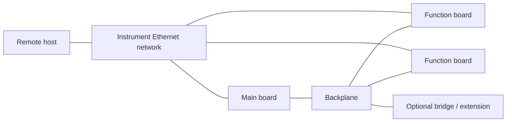

# System Concept Guide

**Status: Non-normative introduction**

This guide explains the controller architecture in plain language for readers who are new to the project. The ADRs define the architectural requirements; future ICDs and hardware/firmware specifications define exact interfaces and implementations.

---

## 1. System Purpose

The system is a modular detector controller. Different plug-in boards generate detector clocks and bias, digitize video, and perform other instrument-specific work. One remote host configures and operates the complete instrument.

The architecture separates three concerns:

- **detector safety**, enforced by hardware interlocks;
- **precise acquisition timing**, distributed from the main board; and
- **configuration and diagnosis**, performed over UART and Ethernet.

The guiding rule is:

> A fault makes the system safe through hardware. Software explains the cause afterward.

---

## 2. Board Roles

| Role | Purpose |
|---|---|
| Main board | Coordinates `EN`, `CLEAR`, `CLOCK`, and `SYNC`; observes shared faults; connects to the host |
| Function board | Performs detector-specific work such as video, bias, or clock generation |
| Bridge board | Extends supported signals to another backplane |
| Backplane board | Carries slots, shared signals, protected power, utility converters, and connector routing |
| Passive terminator | Maintains the continuity-loop path in an unused slot |

The main board is not a central processor for the function boards. The remote host communicates directly with every active board and owns the instrument inventory.


```mermaid
flowchart LR
    HOST["Remote host"] --- NET["Instrument Ethernet network"]
    NET --- MAIN["Main board"]
    NET --- F1["Function board"]
    NET --- FN["Function board"]
    MAIN --- BP["Backplane"]
    BP --- F1
    BP --- FN
    BP --- BR["Optional bridge / extension"]
```

---

## 3. Power Architecture

### Protected system input

The external power input and the distributed rail have different names:

```text
+12V_IN -> central backplane eFuse -> protected +12V
                                           |
                                           +-> utility converters
                                           +-> all active boards
```

The central eFuse is the system input circuit breaker. It protects against unsafe input voltage, reverse polarity, aggregate overcurrent, and inrush. It is not controlled by `OK`, `EN`, or the state machine. If it disconnects the complete system, normally-open relays and powered outputs de-energize directly.

Local board eFuses are not mandatory. Each board must respect its allocated current and inrush budget and select appropriate local protection in its hardware design.

### Common utility rails

Every standard backplane provides the same power interface:

| Rail | Intended use |
|---|---|
| `+12V` | Bulk input for board-local processor/FPGA conversion and specialized local rails |
| `+3.3V_DIG_AUX` | Low-power auxiliary digital support; not processors, FPGAs, or memory |
| `+6V_ANA` / `-6V_ANA` | Common low-voltage analog utilities |
| `+16V_ANA` / `-16V_ANA` | Common analog utilities |

An individual board need not consume every rail. Detector-specific voltages remain local to the board that needs them.

The backplane supervises protected `+12V` and every common utility rail. Compatible converter PGOOD outputs or dedicated supervisors contribute directly to the shared `OK` bus. Main-board voltage and optional current measurements help diagnose a trip but are not the protection path.

### Predictable converter switching

Five main-board LVDS outputs are reserved for backplane utility-converter synchronization:

```text
UTILITY_DCDC_SYNC[0..4]
```

During acquisition, every enabled utility-converter switching channel uses an assigned synchronized frequency of `2 MHz / N`, with channel mapping, divisor, and phase defined by the backplane ICD. Utility converters use forced continuous switching rather than burst, pulse-skipping, or spread-spectrum modes so their noise pattern remains predictable.

Function boards condition consumed analog rails at their power-entry boundary. This conditioning protects local analog circuitry from shared-rail noise and prevents board load transients or conducted emissions from polluting the common rail. The required performance is an interface contract; LDO and filter topology are board-design choices.

### Local interlock power

Every active board derives a small local supply called `V_INTERLOCK_LOCAL` from protected `+12V`. It powers only independent protection hardware:

- external watchdog;
- FPGA/reset fail-safe output;
- relay-permissive hardware; and
- its own voltage supervisor.

If one board loses this supply while the rest of the system remains powered, its hardware reporting path pulls `OK` LOW long enough to trip the fleet. The circuit may use hold-up energy or another verified method. Continued `OK` operation is not required after the central eFuse removes power from the complete system.

---

## 4. Shared Signals

| Signal | Plain meaning |
|---|---|
| `OK` | Shared open-drain fault bus. Any participant can pull it LOW. |
| `EN` | Global arm level from main. HIGH only while the system is armed. |
| `CLEAR` | Explicit recovery request from main. Boards still decide locally whether recovery succeeds. |
| `CLOCK` | Point-to-point 100 MHz sequencer clock. |
| `SYNC` | Point-to-point acquisition start/stop timing event. |
| `LOOP_OUT` / `LOOP_IN` | Passive continuity path through slots and extension cables. |

`OK` is deliberately simple:

- `OK=1`: nobody is currently asserting a fault;
- `OK=0`: at least one hardware, rail-health, watchdog, local-fault, or supervisory source is asserting a trip.

The bus does not identify the source. After the system is safe, the host polls board diagnostics to find the cause.

---

## 5. Normal Operating Story

```text
START -> IDLE -> RUN -> IDLE
           \       /
            -> ERROR -> START
```

1. **START:** Boards initialize safely, establish communications, and qualify required power, timing, and shared health.
2. **IDLE:** The system is safe and configurable. Relays are open and operational settings or sequencers may be loaded.
3. **RUN:** Main asserts `EN`; every function board independently checks readiness before allowing its detector-facing relay path to energize.
4. **Acquisition:** Main sends synchronized `SYNC` events. Function boards execute their own timing and data functions.
5. **Disarm:** Main drops `EN`; relay hardware removes drive and boards return to `IDLE`.
6. **ERROR:** Any trip drops the system into a latched safe condition. Explicit recovery rechecks live conditions and returns through startup qualification before another arm is possible.

Restoring a clock, rail, or communication link never resumes acquisition automatically.

---

## 6. Hardware Safety Story

The shared fault system combines complementary mechanisms:

| Failure or event | Primary response |
|---|---|
| Slot, board, or extension continuity opens | Main detects the passive-loop break and asserts `OK` |
| FPGA/processor power or reset collapses | `V_INTERLOCK_LOCAL`-powered fail-safe hardware asserts `OK` |
| Logic or critical pet path freezes | External watchdog asserts `OK` |
| Distributed timing disappears | Independent clock monitor asserts a local trip |
| Common utility rail becomes invalid | Backplane rail-health output asserts `OK` |
| One board loses local interlock power | Local power-loss reporting asserts `OK` while the fleet remains powered |
| Host supervision expires while armed | The affected board asserts its normal local trip path |

Detector-facing relays are normally open and follow the hardware permissive:

```text
relay_energized = local_arm_request AND EN AND OK
```

Loss of `EN`, `OK`, or local interlock power removes relay drive without waiting for processor software or an FPGA state transition. A latch, flip-flop, relay-driver IC, or other verified circuit may implement this behavior.

Maintenance can command one board at a time to assert its `OK` and watchdog paths while the system is safely disarmed. This detects a latent fault-output path that could otherwise remain hidden.

---

## 7. Timing and Clock Domains

Main distributes the 100 MHz `CLOCK` directly to function boards. Acquisition `SYNC` changes on a falling clock edge and is captured by participating boards on the following rising edge. This half-cycle relationship prevents boards from associating a transition with different clock cycles. The timing ICD verifies the remaining setup/hold and skew margin.

Each active board also has an independent local management clock. Management, Ethernet/UART service, diagnostics, fault monitoring, and recovery remain operational if distributed `CLOCK` is lost.

Watchdog petting demonstrates progress of both management logic and the required timing/pet path. Separate retained clock-loss and watchdog evidence helps the host distinguish a main source failure, a board distribution problem, and a local logic/pet failure. The exact dividers and CDC implementation belong to board design specifications.

---

## 8. Configuration, Inventory, and Data

UART and Ethernet have different responsibilities:

| Information | Normal channel | Lifetime |
|---|---|---|
| Identity, bootstrap network, factory data | UART service interface | Persistent |
| Operational settings | Ethernet | Current boot session |
| Sequencer payload | Reliable host transfer | Current boot session |
| Diagnostics | Ethernet normally; UART for recovery | Observation |

The host inventory maps each logical instrument role to the expected board identity and network endpoint. Physical slot position is not operational identity.

Every active board has its own Ethernet endpoint. Link rate and transport are selected in the applicable ICD from control, telemetry, supervision, and data throughput requirements. Video data flows directly from video boards to the host rather than through main or the backplane.

While armed, every board requires a bounded bidirectional host interaction. The qualifying operation may be telemetry, heartbeat, acknowledgement, credit, or another ICD-defined exchange. Outbound traffic alone does not prove that the host remains reachable.

---

## 9. Where Requirements Live

| Need | Authoritative document |
|---|---|
| Fault taxonomy, continuity loop, watchdog, fail-safe paths, local interlock power | [ADR-001](../decisions/ADR-001_presence_health_detection.md) |
| Persistent configuration, inventory, UART/Ethernet ownership, sequencer readiness | [ADR-002](../decisions/ADR-002_backplane_configuration_identification.md) |
| States, signal behavior, arming, fault recovery, host supervision, relay permissive | [ADR-003](../decisions/ADR-003_state_machine_definition.md) |
| 100 MHz timing, acquisition `SYNC`, clock domains, multi-backplane timing | [ADR-004](../decisions/ADR-004_clock_sync_distribution.md) |
| System input protection, common rails, utility synchronization, shared-rail conditioning | [ADR-005](../decisions/ADR-005_backplane_utility_voltages.md) |
| Acquisition data path and overrun interaction | [ADR-006](../decisions/ADR-006_acquisition_data_path.md) |

Files under `decisions/reference/` are non-normative diagrams and examples. ICDs define electrical pinouts, timing values, protocols, current/noise limits, and other cross-board contracts. Hardware and firmware specifications define exact implementations.

---

## 10. Short Glossary

| Term | Meaning |
|---|---|
| Active board | Powered main, function, or bridge board participating in communication or safety logic |
| Arm | Deliberately enter `RUN` and permit detector-facing functions |
| Fault | Hardware or electrical condition requiring safe-state action |
| Not Ready | Condition that blocks safe arming but is not itself a fault while disarmed |
| PGOOD | Native power-converter power-good output |
| Qualified rail-health output | Backplane contribution that reports a shared rail to `OK` |
| Supervisory interlock event | Non-hardware event, such as armed host timeout, using the same safe response |
| Trip | Assertion that places the system in the safe state |
| Utility rail | Mandatory common low-current rail generated by the backplane |
| `V_INTERLOCK_LOCAL` | Board-local supply for independent interlock hardware |
