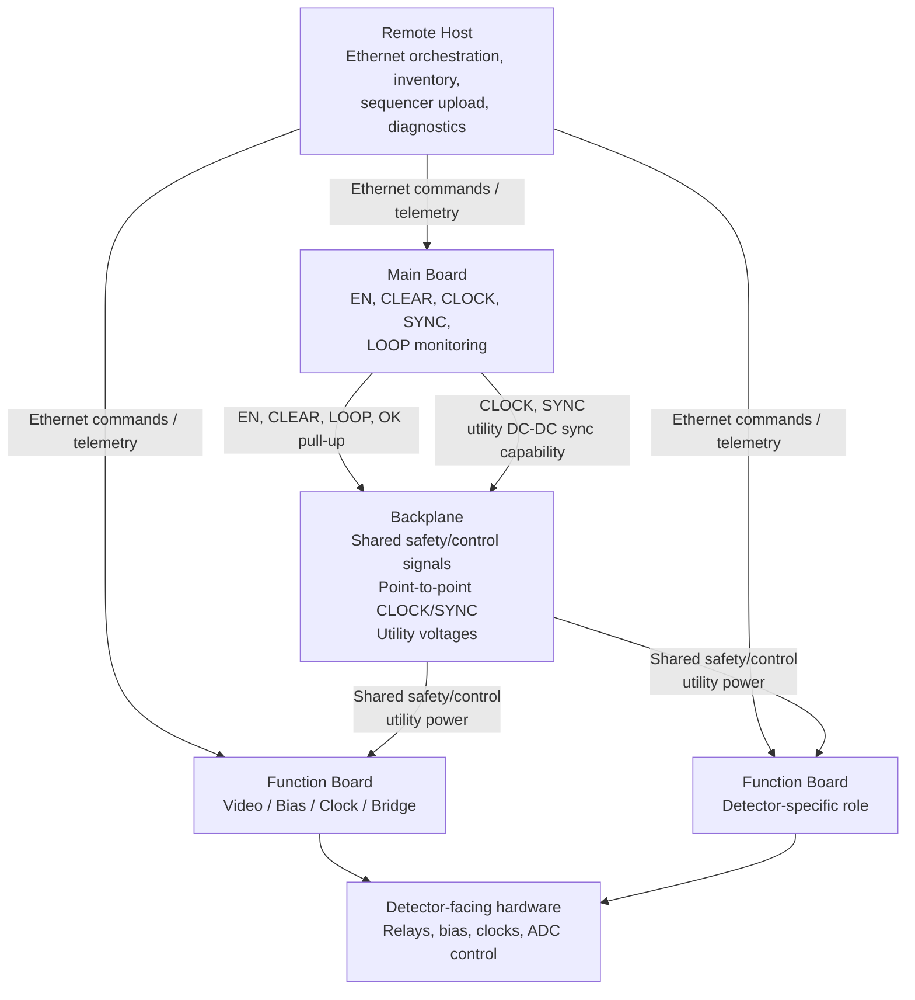
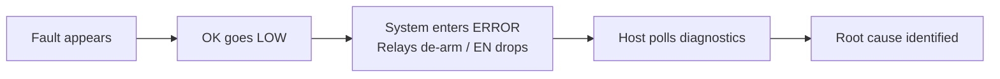
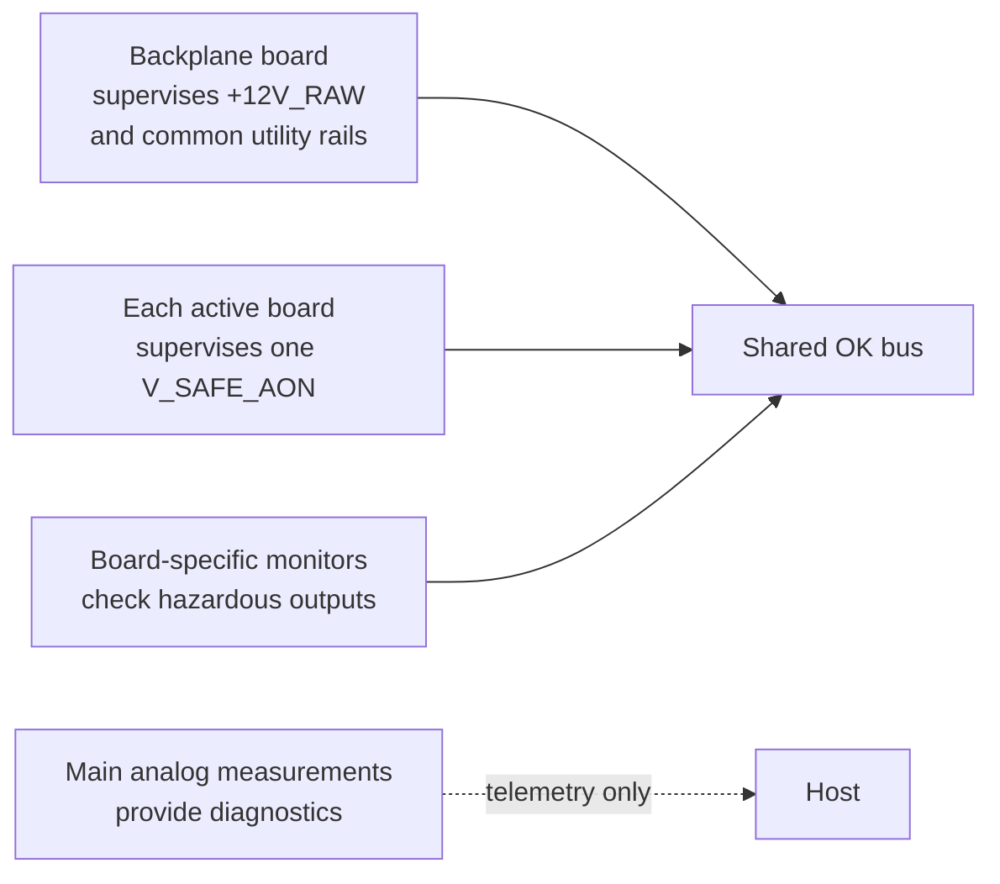
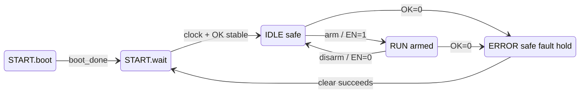

# Modular Detector Controller Concept Guide

- **Status:** Draft / Non-normative
- **Last updated:** 2026-08-14

This guide explains the modular detector controller from first principles. It is intended for readers who need to understand the system before reading the detailed ADRs, ICDs, firmware design specs, or hardware design specs.

This document is **not** the source of truth for requirements. If this guide and an ADR/ICD disagree, the ADR/ICD wins.

---

## 1. Introduction

The modular detector controller is the electronics system that prepares, arms, drives, monitors, and protects a detector during operation. It is built from several boards connected through a backplane. Some boards provide system infrastructure; others perform detector-specific work such as bias generation, clock generation, video acquisition, or sequencer execution.

The main challenge is protecting the detector even if software hangs, Ethernet disappears, a board freezes, a cable is disconnected, or a local board fault appears. For that reason, the architecture separates:

- **Fast safety behavior:** handled by hardware signals and latches
- **Slow diagnostic behavior:** handled by Ethernet telemetry and host orchestration

This guide introduces the concepts in the same order a new reader usually needs them:

1. What it means to arm the system
2. Which boards exist and what they do
3. Which signals connect the boards
4. How normal operation proceeds
5. What happens during a fault
6. How recovery works
7. Where the detailed ADRs and future ICDs fit

---

## 2. Basic Operating Words

Some words in the ADRs are precise but easy to misread at first. This guide uses them as follows.

| Word | Meaning in this system |
|---|---|
| **Safe** | The detector-facing outputs are in a non-hazardous condition. In practice, `EN = 0`, function-board relays are open, and acquisition-driving outputs are not armed. |
| **Arm** | Deliberately move the system from safe `IDLE` into armed `RUN` behavior by asserting `EN = 1`. Arming allows function boards to close their relay paths and prepare detector-driving outputs, but only after readiness checks pass. |
| **Disarm** | Return from armed operation to safe operation by dropping `EN = 0`. Function boards de-arm through the hardware path. |
| **Run** | The armed state family where acquisition can occur. `RUN` includes preparation, waiting for trigger/sync, active acquisition, and stopping. Disarm exits directly to `IDLE`. |
| **Fault** | A hardware or safety-relevant condition that requires immediate transition to the safe error path. Faults propagate through `OK = 0`. |
| **Not Ready** | A condition that blocks arming but is not itself a fault while `EN = 0`. Example: local synchronization readiness has not completed after pre-arm `SYNC` on a board that needs it. |
| **Trip** | The act of pulling `OK` LOW or otherwise forcing the system into the safe error path. |
| **Recover / clear** | The explicit operator or host action that asks boards to recheck fault conditions and, if clean, return through `START.wait`. |

The most important distinction is **Not Ready vs Fault**:

- Not Ready while disarmed means "do not arm yet."
- The same missing readiness discovered after `EN` rises becomes an interlock violation and trips the system.

---

## 3. The System in One Paragraph

The controller is a backplane-based system with one **main board** and multiple **function boards**. The main board coordinates system-level signals such as arm/disarm, recovery, clock, sync, loop monitoring, and utility-converter synchronization capability. Function boards do the detector-specific work: generating clocks, applying bias, running sequencers, driving detector pins, and acquiring data. A remote host controls the system over Ethernet; UART is the persistent identity/network configuration and fallback diagnostic path.

Every standard backplane generates and distributes the same mandatory **utility rails** (`+3.3V_DIG_AUX`, `+/-6V_ANA`, `+/-16V_ANA`) even when a particular board or specialized detector does not consume all of them. `+3.3V_DIG_AUX` serves low-power auxiliary digital functions only. Processors, FPGAs, memory, and other high-current digital loads use board-local conversion from `+12V_RAW`; the raw rail also supplies specialized local rails such as detector high voltages. Qualified rail-health signals contribute directly to `OK`, while the main board measures `+12V_RAW`, utility voltages, and optional currents for diagnosis.

The architecture is designed around one safety rule:

> **Go to safe state fast. Go to not-safe state slow.**

This means faults should remove power or drive from sensitive hardware immediately, while arming the detector should require deliberate checks.

---

## 4. First Mental Model

The system is easier to understand if you separate three layers:


```mermaid
flowchart TB
    HOST["Remote Host\nEthernet orchestration, inventory,\nsequencer upload, diagnostics"]
    MAIN["Main Board\nEN, CLEAR, CLOCK, SYNC,\nLOOP monitoring"]
    BACKPLANE["Backplane\nShared safety/control signals\nPoint-to-point CLOCK/SYNC\nUtility voltages"]
    FB1["Function Board\nVideo / Bias / Clock / Bridge"]
    FBN["Function Board\nDetector-specific role"]
    DET["Detector-facing hardware\nRelays, bias, clocks, ADC control"]

    HOST -- "Ethernet commands / telemetry" --> MAIN
    HOST -- "Ethernet commands / telemetry" --> FB1
    HOST -- "Ethernet commands / telemetry" --> FBN
    MAIN -- "EN, CLEAR, LOOP, OK pull-up" --> BACKPLANE
    MAIN -- "CLOCK, SYNC\nutility DC-DC sync capability" --> BACKPLANE
    BACKPLANE -- "Shared safety/control\nutility power" --> FB1
    BACKPLANE -- "Shared safety/control\nutility power" --> FBN
    FB1 --> DET
    FBN --> DET
```

The host makes decisions and sends commands, but the fast protection path does not depend on host software. If a board needs to make the system safe, it pulls `OK` LOW through hardware-controlled paths.

---

## 5. The Main Ideas Before the Details

There are four ideas that make the rest of the documents easier to read:

1. **Safety is hardware-first.**
   Software and Ethernet are useful for diagnostics, but the immediate trip path is hardware: the `OK` bus, continuity loop, watchdogs, fail-safe drivers, and relay reset logic.

2. **The main board coordinates but does not acquire science data.**
   The main board distributes `CLOCK` and `SYNC`, drives `EN` and `CLEAR`, monitors global health, and provides the backplane utility DC-DC sync capability defined in ADR-005 (converter use is optional). The main board has no sequencer.

3. **Function boards enforce their own readiness.**
   The host should verify readiness before arming, but each function board still checks locally when `EN` rises. If a required condition is missing, that board trips the system.

4. **Recovery always goes through a stability gate.**
   After a fault, the system does not jump directly back to `IDLE`. It passes through `ERROR.clear` and then `START.wait`, where `OK` and clock evidence become stable.

---

## 6. Host vs Main Board Responsibility

A common first misunderstanding is to treat the main board as the controller for all function boards. In this architecture, the **remote host** is the orchestration controller. The **main board** is a hardware coordinator and gateway for shared backplane signals.

| Responsibility | Remote host | Main board |
|---|---|---|
| Own board inventory/identity map | Yes | No |
| Poll each board over Ethernet | Yes | No |
| Upload sequencers | Yes | No |
| Check function-board readiness before arm | Yes | No direct backplane feedback |
| Command arm/disarm | Sends command to main | Drives `EN` |
| Command recovery | Sends `clear_error` to main | Drives `CLEAR` |
| Generate/distribute `CLOCK` and `SYNC` | Requests timing actions | Drives hardware signals |
| Start an acquisition window | Sends start/trigger command to main | Emits `SYNC` edge/window |
| Monitor continuity loop | No | Yes |
| Execute detector sequencer pattern | No | No |

The host and main board initiate acquisition together: the host requests the action, and the main board expresses it on the backplane using `SYNC`. The function boards execute their already-loaded local sequencer patterns in response to the qualified `SYNC` behavior while armed.

The host should make a good decision before sending `arm`. Function boards still enforce their own local readiness when `EN` rises, because the host may be wrong, stale, or interrupted.

---

## 7. Signal Vocabulary

These are the system-level signals that appear throughout the ADRs.

| Signal | Plain meaning | Conceptual behavior |
|---|---|---|
| `OK` | Shared fault bus | Normally HIGH. Any board can pull it LOW to signal a fault or armed supervision timeout. |
| `EN` | Global arm signal | Driven by the main board. HIGH means the system is armed. LOW means safe/disarmed. |
| `CLEAR` | Recovery command signal | Driven by the main board during fault recovery. Function boards use it to enter local clear/recheck logic. |
| `CLOCK` | 100 MHz sequencer clock | Distributed by the main board over point-to-point LVDS. Used by function boards for timing-sensitive work. |
| `SYNC` | Synchronized timing edge | In `IDLE`, optionally phase-resets a controlled local-converter divider. In `RUN`, its timing-domain capture starts/stops acquisition; a CDC-safe observation updates management state. |
| `LOOP_OUT` / `LOOP_IN` | Physical continuity loop | A passive loop through slots and cables. If the loop breaks, the main board converts that into an `OK` fault. |

The detailed behavioral source of truth for these signals is ADR-003.

The common backplane utility voltages are not state-machine signals. They are power resources defined in ADR-005:

| Power resource | Plain meaning |
|---|---|
| `+3.3V_DIG_AUX` | Current-limited auxiliary rail for low-power identification, monitoring, management, and digital support loads; not for processors, FPGAs, memory, or high-current point-of-load conversion. |
| `+6V_ANA` / `-6V_ANA` | Common low-voltage analog utility rails. |
| `+16V_ANA` / `-16V_ANA` | Common analog utility rails. |
| `+12V_RAW` | Primary bulk-power input for local processor/FPGA conversion, specialized board-local converters, and independent safety support paths. |
| `V_SAFE_AON` | One low-power safety supply derived locally on each active board from `+12V_RAW`; it is not distributed by the backplane. |

---

## 8. OK Bus and Diagnostics

The `OK` bus is a shared hardware fault line, not a communication protocol.

Conceptually:

- `OK = 1` means no board is currently pulling the shared fault bus LOW.
- `OK = 0` means at least one board, watchdog path, fail-safe path, safety-supply supervisor, qualified backplane PGOOD source, or main-board loop conversion has asserted a fault.
- `OK` does **not** identify which board failed.
- `OK` does **not** describe the root cause.

That separation is intentional. The system first uses `OK = 0` to become safe quickly. After the system is safe in `ERROR.run`, the host uses Ethernet diagnostics to ask each board what it saw.


```mermaid
flowchart LR
    FAULT["Fault appears"] --> OKLOW["OK goes LOW"]
    OKLOW --> SAFE["System enters ERROR\nRelays de-arm / EN drops"]
    SAFE --> DIAG["Host polls diagnostics"]
    DIAG --> ROOT["Root cause identified"]
```

Diagnostic information such as local fault sources, retained clock-loss evidence, and retained watchdog-activation evidence exists for the slower explanation step. Its exact register organization is implementation-specific and should not be confused with the hardware safety trip itself.

### Power supervision without duplication

Power is supervised at three useful boundaries rather than monitoring every rail everywhere:


```mermaid
flowchart LR
    BP["Backplane board\nsupervises +12V_RAW\nand common utility rails"] --> OK["Shared OK bus"]
    VS["Each active board\nsupervises one V_SAFE_AON"] --> OK
    FN["Board-specific monitors\ncheck hazardous outputs"] --> OK
    MAIN["Main analog measurements\nprovide diagnostics"] -. "telemetry only" .-> HOST["Host"]
```

- The backplane detects failures of power shared by the fleet.
- Each active board detects loss of its own connector branch or local safety regulator through one `V_SAFE_AON` supervisor connected directly to `OK`.
- A board adds further monitoring only where an actual detector-facing function could become hazardous. For example, a bias board monitors its bias behavior rather than duplicating monitors on every upstream utility input.
- Main-board voltage and optional current measurements explain a backplane-power trip but do not make the protection decision.

`V_SAFE_AON` powers only the watchdog, fail-safe `OK` driver, relay-reset circuitry, and its voltage supervisor. A small isolated hold-up keeps the supervisor/output alive briefly during collapse; it does not keep the complete board running.

The mandatory utility converters stay enabled whenever the backplane is powered. Their rail-health signals may hold `OK` LOW during startup; after a fault, electrical recovery of a rail does not restart the system automatically because `ERROR` remains latched until explicit recovery.

---

## 9. Normal Operation Story

The normal path is:

```text
START.boot -> START.wait -> IDLE -> RUN -> IDLE
```

The same flow with the main safety gates shown:


```mermaid
stateDiagram-v2
    direction LR
    START_BOOT: START.boot
    START_WAIT: START.wait
    IDLE: IDLE safe
    RUN: RUN armed
    ERROR: ERROR safe fault hold

    START_BOOT --> START_WAIT: boot_done
    START_WAIT --> IDLE: clock + OK stable
    IDLE --> RUN: arm / EN=1
    RUN --> IDLE: disarm / EN=0
    IDLE --> ERROR: OK=0
    RUN --> ERROR: OK=0
    ERROR --> START_WAIT: clear succeeds
```

### START.boot

Each board powers up using its own local management clock. It reads persistent identity, network, and required factory data from NVM, brings up Ethernet, initializes operational parameters to safe firmware defaults, and clears `sequencer_ready`. During this phase, the shared `OK` bus may legitimately be LOW because boards are still booting.

### START.wait

This is the stability gate shared by boot and recovery. A board may enter `IDLE` only after:

- required clock evidence is present
- `OK` remains continuously stable for the required window

If those checks do not pass within the defined deadlines, the board enters `ERROR.run`.

### IDLE

`IDLE` is safe: `EN = 0`, relays are open, and the host may configure operational parameters over Ethernet.

Before every arm, the host should:

1. Confirm board readiness and `sequencer_ready` on sequencer boards.
2. Send pre-arm `SYNC` through the main board.
3. Wait for `local_sync_ready` on boards that require local synchronization readiness.
4. Send `arm` to the main board.

The main board checks its own readiness before asserting `EN`.

### RUN

When `EN` rises, function boards independently evaluate their local arm gates. If the checks pass, they enter `RUN.init`, then `RUN.wait`, then respond to `SYNC` edges for acquisition.

If `OK` drops during any armed state, the system transitions to `ERROR.run`.

### Disarm

The host sends `disarm` to the main board. The main board drops `EN`. Function boards see `EN` fall and immediately de-arm.

---

## 10. Sequencer Loading and Readiness

Some function boards execute a **sequencer**: a programmed timing pattern that drives detector-facing signals during acquisition. After each reset, the host loads the required sequencer over TCP while the board is in `IDLE`.

Reset and every sequencer-memory write clear `sequencer_ready`. After finishing all intended writes, the host sends a separate ready command in `IDLE` to set it. The flag records only that the trusted host declared loading complete; it does not validate BRAM contents. A sequencer board enforces the flag when `EN` rises and trips the interlock if it is clear.

Sequencer storage is volatile, and Ethernet has no path to configuration NVM. Transfer framing, logical memory addressing, single-versus-segmented upload, ready-command details, and execution termination belong in the ICD; the architecture does not use a hash-attestation exchange.

---

## 11. Host Supervision

While armed, the architecture expects each board to continue completing valid host interactions. The exact interaction is deliberately left to the board protocol: it may be a telemetry request, an explicit heartbeat, or an application-level data acknowledgement or credit.

This matters because Ethernet loss while armed is not harmless. If the host disappears during acquisition, the system should not continue indefinitely in an armed state without supervision.

Conceptually:

1. The system enters `RUN` and `EN = 1`.
2. Each board starts or continues its armed host-supervision timer.
3. The host completes an ICD-defined qualifying interaction with each board.
4. The board returns an ICD-defined response, and the interaction refreshes its timer.
5. If the timer expires while `EN = 1`, that board trips the system by pulling `OK` LOW.

This event is called a **supervisory interlock event**, not a normal hardware fault. The physical response is the same (`OK = 0` and global transition to `ERROR`), but the root cause is loss of valid host supervision while armed.

Unsolicited board-to-host traffic alone does not prove host presence. The qualifying interaction, response, cadence, retry policy, and timeout belong in the ICD.

---

## 12. Fault Story

Faults are intentionally handled faster than normal arming.

Examples:

| Situation | Conceptual result |
|---|---|
| A board detects over-current, over-temperature, PLL loss, or another local internal fault | That board pulls `OK` LOW. |
| A board FPGA loses power or reset collapses | Safety hardware powered by `V_SAFE_AON` pulls `OK` LOW. |
| A board logic path freezes | External watchdog eventually pulls `OK` LOW. |
| A common backplane utility rail loses power-good | Its compatible open-drain PGOOD/supervisor pulls `OK` LOW; main-board analog measurements help identify the rail. |
| A cable or slot continuity path breaks | Main board detects `LOOP_IN` drop and pulls `OK` LOW. |
| Qualifying host interaction stops while armed | The timed-out board pulls `OK` LOW as a supervisory interlock event. |
| A board's `V_SAFE_AON` collapses | Its held-up voltage supervisor pulls `OK` LOW before the fault-reporting path loses power. |

Once `OK` goes LOW, all boards see the same fault condition. Function-board relays are also protected by external reset-dominant hardware, so relay cutoff does not depend only on FPGA state progression.

The system does not need to classify the root cause before becoming safe. Classification happens later in `ERROR.run` using telemetry and diagnostic latches.

---

## 13. Relay Safety Path

Function-board relays are the hardware boundary between "safe/disarmed" and "armed detector-facing drive." The important concept is that relay cutoff does not rely only on the FPGA state machine continuing to run correctly.

The function-board relay path has two layers:

| Layer | Purpose |
|---|---|
| FPGA `relay_drive` / ARM control | Deliberately requests relay closure only in the correct `RUN` substates. |
| External reset-dominant latch/flip-flop stage | Forces relay output LOW when `EN = 0` or `OK = 0`, even if local FPGA logic is stalled. |

This is another example of the design rule:

- Closing relays is slow and gated.
- Opening relays is fast and hardware-enforced.

Each active board derives `V_SAFE_AON` locally from `+12V_RAW`. A held-up hardware supervisor connects directly to `OK` and reports loss of this safety supply without depending on the FPGA. Complete loss of power still de-energizes the normally-open relay, and physical removal also breaks the continuity loop.

---

## 14. Recovery Story

The fault recovery path is:

```text
ERROR.run -> ERROR.clear -> START.wait -> IDLE
```

### ERROR.run

The system enters this safe fault state directly on any fault: the main board drops `EN`, function-board relay reset logic opens relays, and fault latches remain held. The system then waits here while the operator or host polls diagnostics. This is where the host identifies whether the root cause was a local hardware fault, clock fault, watchdog event, loop break, supervision timeout, or another board dragging the system into `ERROR`.

### ERROR.clear

The operator commands recovery. The main board asserts `CLEAR`, and each board runs its local clear/recheck routine. A board may release its local trip summary only at the successful recovery boundary, not just because a command was received.

### START.wait

Even after a clear succeeds, the system passes through `START.wait`. This ensures the fleet has a stable `OK` bus and valid clock evidence before returning to `IDLE`.

There is intentionally no direct `ERROR -> IDLE` shortcut.

---

## 15. Configuration Story

Configuration is split by purpose:

| Channel | Purpose |
|---|---|
| UART | Persistent identity/network configuration, permitted factory-data service, and fallback diagnostics. NVM writes follow the ADR-002 state allowlist. |
| NVM | Bootstrap identity, network, and required factory data. Read during `START.boot`; never written by Ethernet. |
| Ethernet | Volatile operational configuration and sequencer loading in `IDLE`, plus normal commands, telemetry, qualifying host-supervision interactions, and diagnostics. |

The host owns the board inventory, mapping logical role to expected board type/revision, IP, MAC, and serial ID. At startup it verifies identity as well as reachability. Physical slot is not authoritative; an optional identify command may flash a board LED to locate it.

---

## 16. Clock and Sync Story

The main board distributes a full-rate 100 MHz `CLOCK` to every function board using point-to-point LVDS. Function boards use this clock directly for sequencer timing and derive lower-frequency clocks by digital division.

This avoids requiring every function board to multiply a low-frequency reference with a local PLL. End-to-end timing quality is verified against the selected ADC, analog front end, sequencer, and detector requirements.

`SYNC` has two conceptual uses:

1. In `IDLE`, `SYNC` may reset an optional phase-controlled local converter divider before arming. It does not reset the watchdog divider.
2. In `RUN`, `SYNC` is captured directly in the 100 MHz timing domain to start and stop sequencers on defined edges; a separate CDC-safe copy is used for management state and telemetry.

Common utility-voltage converters live on the backplane board and operate at a nominal fixed 2 MHz during acquisition. The main board provides optional synchronization and phase-control signals. Noise-sensitive boards add local filtering, while exact filter and connector implementation belongs in the ICD and hardware design specifications.

Specialized board-local converters may also choose to synchronize to the timing family, but that is board-specific. When they do, their switching frequency remains an exact integer divisor of the function board's 2 MHz baseline as defined by ADR-004.

Function boards also have an independent local management clock. Keeping control separate from acquisition timing lets the board detect and report loss of the distributed clock.

The two timing families have different jobs:

| Clock family | What it is for |
|---|---|
| Distributed 100 MHz `CLOCK` | Sequencer timing, timing-critical outputs, watchdog timing-domain sample path, and optional synchronized local-converter divider baseline. |
| Local management clock | Safety FSM, registered safety outputs, fault monitoring, diagnostics, Ethernet/UART management logic. |

The management clock remains independent of the distributed `CLOCK`; otherwise the logic responsible for detecting a missing distributed clock could stop with it.

---

## 17. Injected Fault and F4 Verification

The system includes maintenance commands that intentionally force a board to pull `OK` LOW. This may seem strange at first, but it is how the system proves that a board's fault-output path can actually trip the shared `OK` bus.

The dangerous F4 case is an `OK` driver path that is damaged or stuck open: a board could detect a local fault but fail to propagate it. In a safe maintenance state, the host commands one board at a time to assert a test fault and verifies that the shared bus responds. A related test stops watchdog petting to exercise the independent watchdog path. Exact sequencing and acceptance timing belong in the ICD.

---

## 18. Reading the Detailed Documents

Use this guide to understand the system shape, then use the detailed documents for authority:

| Need | Read |
|---|---|
| Fault taxonomy, `OK` bus behavior, watchdogs, fail-safe paths | `decisions/ADR-001_presence_health_detection.md` |
| UART/NVM/Ethernet configuration model, inventory ownership, sequencer loading | `decisions/ADR-002_backplane_configuration_identification.md` |
| FSM states, signal semantics, transition guards, timing constants, relay logic | `decisions/ADR-003_state_machine_definition.md` |
| 100 MHz clock distribution, SYNC behavior, optional local-converter divider alignment, management clock independence | `decisions/ADR-004_clock_sync_distribution.md` |
| Backplane utility voltages, `+12V_RAW`, 2 MHz utility switching, sync capability, function-board filtering, and connector zoning | `decisions/ADR-005_backplane_utility_voltages.md` |
| Acquisition data path, overrun policy, and host supervision during readout | `decisions/ADR-006_acquisition_data_path.md` |
| Message schemas, electrical pinouts, command sequences | Future `interfaces/` ICDs |
| RTL, schematics, pseudocode, component choices | Future `design/` specs |
| Worked examples and bring-up procedures | Future `integration/` guides |

---

## 19. Short Glossary

These cross-document terms are useful when moving from this guide into the ADRs. Internal register and strobe names are intentionally omitted.

| Term | Short meaning |
|---|---|
| Host-supervision interaction | ICD-defined request/response activity that proves the host and board can still communicate while armed. |
| Clock-loss evidence | Retained diagnostic indication that the role-appropriate timing clock stopped. |
| F4 | Failure mode where a board's `OK` driver path is damaged or stuck open. |
| Watchdog-activation evidence | Retained diagnostic indication that the external watchdog tripped. |
| Local management clock | Independent board-local clock used for safety FSM, fault detection, and management logic. |
| Distributed `CLOCK` | Main-board 100 MHz timing clock sent to function boards for sequencer and timing-derived functions. |
| `V_SAFE_AON` | One board-local always-on safety supply derived from `+12V_RAW`; it is not a shared utility rail. |
| Host inventory | Mapping from a board's logical role to its type/revision, IP, MAC, and serial ID. |
