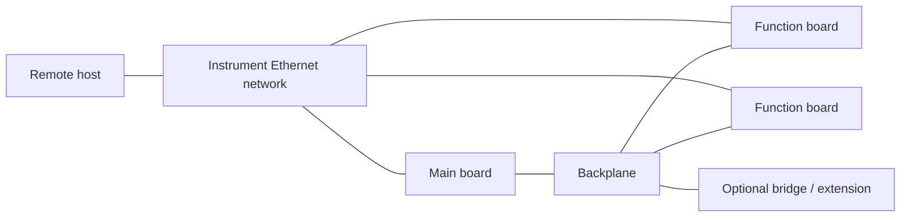

# System Concept Guide

**Status: Non-normative introduction**
**Last updated: 2026-09-08**

This guide is the maintained explanatory content source for the LaTeX handbook. It explains the controller architecture in plain language for readers who are new to the project. Handbook chapters expand this guide; prose is maintained in both places, not automatically converted from Markdown. The ADRs define the architectural requirements; future ICDs and hardware/firmware specifications define exact interfaces and implementations.

---

## 1. System Purpose

The system is a modular detector controller. Different plug-in boards generate detector clocks and bias, digitize video, and perform other instrument-specific work. One remote host configures and operates the complete instrument.

The architecture separates three concerns:

- **detector safety**, enforced by hardware interlocks;
- **precise acquisition timing**, distributed from the main board; and
- **configuration and diagnosis**, performed over UART and Ethernet.

The guiding rule is:

> A fault makes the system safe through hardware. Software explains the cause afterward.

---

## 2. Board Roles

| Role | Purpose |
|---|---|
| Main board | Coordinates `EN`, `CLEAR`, `CLOCK`, and `SYNC`; observes shared faults; connects to the host |
| Function board | Performs detector-specific work such as video, bias, or clock generation |
| Bridge board | Extends supported signals to another backplane |
| Backplane board | Carries slots, shared signals, protected power, utility converters, and connector routing |
| Passive terminator | Maintains the continuity-loop path in an unused slot |

The main board is not a central processor for the function boards. The remote host communicates directly with every active board and owns the instrument inventory.


```mermaid
flowchart LR
    HOST["Remote host"] --- NET["Instrument Ethernet network"]
    NET --- MAIN["Main board"]
    NET --- F1["Function board"]
    NET --- FN["Function board"]
    MAIN --- BP["Backplane"]
    BP --- F1
    BP --- FN
    BP --- BR["Optional bridge / extension"]
```

### Example: what is inside a function board?

A function board is a removable PCB assembly that connects the common controller infrastructure to a particular detector function. The example below uses a video board. A clock or bias board replaces the video chain with drivers or DAC/output stages; its common interfaces retain the same meaning.

[View the conceptual function-board diagram](../publication/figures/generated/example_function_board.tikz.pdf) (also included in handbook Chapter 3).

The outline and zones explain responsibilities, not exact dimensions, placement, or connector geometry. They do not prescribe a SoM, processor family, ADC, relay circuit, or physical connector count.

| Part | Job |
|---|---|
| Backplane connector | Fixed power contacts, `CLOCK`/`SYNC`, `EN`/`CLEAR`/`OK`, returns, and continuity-loop contacts |
| Local conversion and rail conditioning | Supply ordinary digital loads from `+12V`; use shared analog rails or local conversion for analog loads |
| Processing and memory | Configure the function, execute local logic, capture/process data, and handle network traffic |
| Timing and monitoring | Observe distributed timing using independent management/safety clocking where required |
| Independent interlock hardware | Watchdog, fail-safe paths, supply supervision, and optional safety CPLD; remove hazardous permission independently of ordinary processing |
| Functional electronics | In this video example: input protection, analog conditioning, ADC, and sample processing |
| Detector interface connector | Connect the board's specialized electronics to detector/preamp wiring |
| Ethernet and UART connectors | Direct host communication and local commissioning/recovery respectively |

The continuity path uses passive copper or unconditional hardware forwarding, for example in a safety CPLD. Forwarding does not depend on `OK`, `EN`, operating state, or clocks. Hardware safety controls the applicable detector-facing permissives. A voltage/current monitor measures or evaluates local health; it is not a replacement for analog input protection.

---

## 3. Power Architecture

Every standard backplane offers the same fixed-pin power interface. Each function board chooses which rails to consume and which supplies to generate locally. Rail availability is mandatory; board consumption is optional.

### Protected system input

The external power input and the distributed rail have different names:

```text
+12V_IN -> central backplane eFuse -> protected +12V
                                           |
                                           +-> utility converters
                                           +-> all active boards
```

The central eFuse is the system input circuit breaker. It protects against unsafe input voltage, reverse polarity, aggregate overcurrent, and inrush. It also disconnects the system if protected `+12V` cannot remain within the verified input range of downstream converters. It is not controlled by `OK`, `EN`, or the state machine. If it disconnects the complete system, normally-open relays and powered outputs de-energize directly. A common utility-rail fault trips `OK` but does not command this complete cutoff.

Local board eFuses are not mandatory. Each board must respect its allocated current and inrush budget and select appropriate local protection in its hardware design.

### Common utility rails

Every standard backplane provides the same power interface:

| Rail | Intended use |
|---|---|
| `+12V` | Bulk input for board-local processor/FPGA conversion and specialized local rails |
| `+6V_ANA` / `-6V_ANA` | Common low-voltage analog utilities |
| `+16V_ANA` / `-16V_ANA` | Common analog utilities |

An individual board may consume any subset of the analog utility rails or generate supplies locally from protected `+12V`, even when the same nominal voltage is available from the backplane. Local conversion is a normal application-dependent choice, not an architecture variant. All ordinary digital supplies, including low-power identification and monitoring supplies, are generated locally from protected `+12V`. Detector-specific voltages also remain local to the board that needs them.

The backplane supervises protected `+12V` and every common utility rail. Compatible converter PGOOD outputs or dedicated supervisors contribute directly to the shared `OK` bus. Main-board voltage and optional current measurements help diagnose a trip but are not the protection path.

### Predictable converter switching

Five main-board LVDS outputs are reserved for backplane utility-converter synchronization:

```text
UTILITY_DCDC_SYNC[0..4]
```

During acquisition, every enabled utility-converter switching channel uses an assigned synchronized frequency of `2 MHz / N`, with channel mapping, divisor, and phase defined by the backplane ICD. Utility converters use forced continuous switching rather than burst, pulse-skipping, or spread-spectrum modes so their noise pattern remains predictable.

Compatible function-board converters may optionally derive their local switching references from the distributed `CLOCK`. Whenever the system enters `START`, main sends one converter-alignment `SYNC` pulse while `EN=0`. A compatible board recognizes any such pulse in `START`, `IDLE`, or `ERROR`, aligns its local divider, and completes any required settling before it declares itself ready. With `EN=1`, `SYNC` has acquisition meaning only and does not reset converter timing. These local choices belong to the function-board ICD and do not use the five dedicated backplane utility-synchronization outputs.

Function boards condition every consumed shared rail, including protected `+12V` and the analog utility rails, at their power-entry boundary. Conditioning protects local circuitry from incoming noise and limits load disturbances and conducted emissions returned to other boards. Digital loads and local converters must also meet these limits: another board may use the same protected `+12V` to generate sensitive analog supplies. The required performance is an interface contract; LDO and filter topology are board-design choices.

Both main and function boards may use optional input eFuses on protected `+12V` or any consumed analog utility rail, with protection circuitry suitable for the rail's voltage and polarity. Other suitable local protection methods are also permitted.

### Local interlock power

Every active board derives a small local supply called `V_INTERLOCK_LOCAL` from protected `+12V`. It powers only independent protection hardware:

- independent hardware watchdog (dedicated IC or safety CPLD);
- FPGA/reset fail-safe output;
- relay-permissive hardware;
- power-loss protection hardware; and
- an optional dedicated safety CPLD for the functions permitted by ADR-001.

If one board loses this supply while the rest of the system remains powered, its hardware reporting path causes `OK` LOW long enough to trip the fleet, either directly or through qualified active forwarding and main-board conversion. Loss of this supply also disables the detector protection relay permission without waiting for software or logic state progression, including when relay-driver power remains available. A dedicated supervisor is optional; the board design must verify both relay disable and F6 reporting. An optional input eFuse disconnecting the interlock-supply branch is one possible cause of local power loss and follows the same F6 response. Hold-up energy is one possible implementation choice. Continued `OK` operation is not required after the central eFuse removes power from the complete system.

---

### Continuity implementation choices

Both copper continuity and active forwarding are permitted, including a mixed chain. Active forwarding copies the incoming level and must establish LOW on interlock-power loss; an output that reliably becomes high impedance plus an external pull-down is one implementation. It may also resolve LOW to report a detected condition that prevents local safety hardware from performing its role. Forwarding resumes after power/configuration becomes valid and that condition clears, independently of the retained shared trip. Coverage of every possible internal device failure is not required. This avoids a recovery dependency on `OK` or operating state.

Passive boards need a separate hardware F6 contribution to `OK`. Qualified active forwarding can report F6 through main without a separate local supervisor or hold-up supply. Main's own power-loss reporting still needs a path that does not depend on its failed logic. A LOW return alone cannot distinguish physical disconnection (F1) from power loss in a forwarder (F6), and static forwarding does not replace a watchdog.

An active function board may use incoming `LOOP_IN` LOW to remove local detector-facing permission directly in hardware, without waiting for main or a state-machine transition. LOW propagates through downstream boards to main, which asserts `OK` so every powered board, including those upstream, enters the shared safe response. Entering the safe state must not itself force the forwarded output LOW: forwarding remains independent of `OK`, `EN`, and operating state. The chain reports an upstream problem but does not automatically identify its location.

The backplane ICD defines loop voltage and logic thresholds, drive/loading and leakage limits, pull-down placement and values, unpowered and partial-power behavior, and the supported chain's propagation time. Mixed-chain verification includes consecutive passive boards and terminators. Empty-slot terminators remain passive; the architecture does not choose the loop voltage.

## 4. Shared Signals

| Signal | Plain meaning |
|---|---|
| `OK` | Shared open-drain fault bus. Any participant can pull it LOW. |
| `EN` | Global arm level from main. HIGH only while the system is armed. |
| `CLEAR` | Explicit recovery request from main. Boards still decide locally whether recovery succeeds. |
| `CLOCK` | Point-to-point 100 MHz sequencer clock. |
| `SYNC` | Point-to-point acquisition start/stop timing event. |
| `LOOP_OUT` / `LOOP_IN` | Series continuity path through slots and extension cables; passive copper or unconditional active forwarding. |

`OK` is deliberately simple:

- `OK=1`: nobody is currently asserting a fault;
- `OK=0`: at least one hardware, rail-health, watchdog, local-fault, or supervisory source is asserting a trip.

The bus does not identify the source. After the system is safe, the host polls board diagnostics to find the cause.

---

## 5. Normal Operating Story

```text
START -> IDLE -> RUN -> IDLE
           \       /
            -> ERROR -> START
```

1. **START:** Boards initialize safely, establish communications, and qualify required power, timing, and shared health.
2. **IDLE:** The system is safe and configurable. Relays are open and operational settings or sequencers may be loaded.
3. **Arm:** The host verifies that board configuration and readiness match the intended operation, then requests arming. Main checks its own conditions and raises `EN`. Each function board independently accepts or rejects the request before enabling its detector-facing function.
4. **Acquisition:** Main sends synchronized `SYNC` events. Function boards execute their own timing and data functions.
5. **Stop or disarm:** A falling acquisition `SYNC` ends the acquisition and may leave the controller armed in `RUN.wait`. Disarming drops `EN`, removes relay permission, and returns boards to `IDLE`.
6. **ERROR:** Any trip drops the system into a latched safe condition. Explicit recovery rechecks live conditions and returns through startup qualification before another arm is possible.

Restoring a clock, rail, or communication link never resumes acquisition automatically.

---

## 6. Hardware Safety Story

The shared fault system combines complementary mechanisms:

| Failure or event | Primary response |
|---|---|
| Slot, board, or extension continuity opens | Main detects the loop interruption and asserts `OK` |
| FPGA/processor power or reset collapses | `V_INTERLOCK_LOCAL`-powered fail-safe hardware asserts `OK` |
| Logic or critical pet path freezes | Independent hardware watchdog asserts `OK` |
| Distributed timing disappears | Independent clock monitor asserts a local trip |
| Common utility rail becomes invalid | Backplane rail-health output asserts `OK` |
| One board loses local interlock power | Direct local reporting or qualified active forwarding through main asserts `OK` while the fleet remains powered |
| Host supervision expires while armed | The affected board asserts its normal local trip path |

Detector protection relays are normally open and follow the hardware permissive:

```text
relay_energized = local_arm_request AND EN AND OK
```

These are the common permissives. Active boards may additionally require incoming-loop validity to remove local permission immediately on LOOP LOW.

Loss of `EN`, `OK`, or local interlock power removes relay drive without waiting for processor software or an FPGA/CPLD state transition. A latch, flip-flop, relay-driver IC, or other verified circuit may implement this behavior.

### Independent protection and the safety CPLD option

A dedicated watchdog IC or dedicated safety CPLD may implement the independent watchdog. Its timeout time base must survive loss of the supervised clocks. Petting is the progress signal that services the watchdog; it must demonstrate progress of the required management and timing paths rather than continue autonomously after they fail.

A safety CPLD may also combine fault aggregation and retention, clock monitoring, main-board continuity-loop conversion, relay permissive logic, and evaluation of voltage/current-monitor indications. Appropriate analog sensing circuitry is still needed. The hardware F6 reporting path must remain effective when interlock power fails; a dedicated supply supervisor is optional.

“Safety CPLD” describes its role, not a certification. A watchdog counter inside the CPLD does not independently cover failure of that same device. Board design addresses its power, reset, configuration, clock, and stale-permission failures, preserving bounded safe response and relay de-energization without continued logic progression.

### Maintenance verification

While safely disarmed, a test establishes `OK` HIGH, asserts one selected contribution, and verifies the transition LOW. Release follows the defined safe test/recovery behavior, with a HIGH baseline before the next test. An already-LOW bus can mask the selected contribution and makes the test inconclusive, not passed. Active protection is never bypassed. Testing one contribution does not validate every independent watchdog or supervisor path. Commands, timing, and procedures belong to the ICD and maintenance plan.

---

## 7. Timing and Clock Domains

Main distributes the 100 MHz `CLOCK` directly to function boards. Acquisition `SYNC` changes on a falling clock edge and is captured by participating boards on the following rising edge. This half-cycle relationship prevents boards from associating a transition with different clock cycles. The timing ICD verifies the remaining setup/hold and skew margin.

ADC sampling rate is application-specific. The video-board ICD defines the actual rate, its relationship to sequencer timing, and how samples belong to acquisition events and processing windows. The ADC maximum supported rate is distinct from its selected operating rate.

Each active board also has independent local management clocking. Safety may share the management clock or use a separate local safety clock. Management, Ethernet/UART service, diagnostics, fault monitoring, and recovery remain operational if distributed `CLOCK` is lost.

The clock monitor detects acquisition-clock loss. The watchdog separately detects missing refreshes from the processor or control logic. Refreshes use local clocking and depend on normal execution, so they stop when the supervised logic freezes. Either detector can assert `OK`; each retains its own fault indication.

For noise control, refresh transitions may optionally align with the external/distributed clock while it is valid. When that reference is absent, refresh timing uses the local clock. Changing between aligned and local timing must not cause a false timeout or hide frozen execution. The watchdog's independent timeout time base is not synchronized to the acquisition clock.

Watchdog protection also applies while disarmed, with startup qualification before arming. Host-supervision timeout, in contrast, trips only while armed.

Local management and safety clocking remains available when the distributed acquisition clock disappears, allowing fault reporting, communication, and recovery. Management receives acquisition-event information through a reliable clock-domain crossing without needing phase alignment: the sequencer acts on the specified `SYNC` edge, and management subsequently records the event. That reporting delay does not change the sequencer action. Safety may share management clocking or use a separate local clock; the watchdog timeout time base remains independent of the clocks it supervises.

Clock-loss and watchdog activation are reported separately; both being present does not establish their order. The exact dividers and CDC implementation belong to board design specifications.

---

## 8. Configuration, Inventory, and Data

UART and Ethernet have different responsibilities:

| Information | Normal channel | Lifetime |
|---|---|---|
| Identity, bootstrap network, factory data | UART service interface | Persistent |
| Operational settings | Ethernet | Current boot session |
| Sequencer payload | Reliable host transfer | Current boot session |
| Diagnostics | Ethernet normally; UART for recovery | Observation |

The host inventory maps each logical instrument role to the expected board identity and network endpoint. Physical slot position is not operational identity.

Every active board has its own Ethernet endpoint. Ethernet speed is application-dependent: 100 Mb/s, 1 Gb/s, or another supported capacity may be selected. The ICD defines data products and rates, any local processing or reduction, buffering, and transport, and verifies capacity for control, telemetry, supervision, and acquisition at maximum supported load. Video data flows directly from video boards to the host rather than through main or the backplane.

While armed, every active board, including main and function boards, requires a bounded bidirectional host interaction because continued operation with an unavailable or unresponsive host is not assumed safe. The qualifying operation may be telemetry, heartbeat, acknowledgement, credit, or another ICD-defined exchange. Outbound traffic alone does not prove that the host remains reachable. Science traffic must not prevent qualifying interactions from completing within the supervision interval.

While disarmed, host disconnection alone does not assert `OK`; hardware protection remains active. A new host may use retained settings and sequences after verifying that configuration and readiness match the intended operation. Changing hosts does not itself require a reload or shared trip. The ICD defines how configuration is verified.

Data overrun alone is a data-quality event, not an interlock fault. The board identifies affected data and follows its defined transport behavior. If host supervision also expires while armed, that independent timeout still trips the controller.

---

## 9. Where Requirements Live

| Need | Authoritative document |
|---|---|
| Fault taxonomy, continuity loop, watchdog, fail-safe paths, local interlock power | [ADR-001](../decisions/ADR-001_presence_health_detection.md) |
| Persistent configuration, inventory, UART/Ethernet ownership, sequencer readiness | [ADR-002](../decisions/ADR-002_backplane_configuration_identification.md) |
| States, signal behavior, arming, fault recovery, host supervision, relay permissive | [ADR-003](../decisions/ADR-003_state_machine_definition.md) |
| 100 MHz timing, acquisition `SYNC`, clock domains, multi-backplane timing | [ADR-004](../decisions/ADR-004_clock_sync_distribution.md) |
| System input protection, common rails, utility synchronization, shared-rail conditioning | [ADR-005](../decisions/ADR-005_backplane_utility_voltages.md) |
| Acquisition data path and overrun interaction | [ADR-006](../decisions/ADR-006_acquisition_data_path.md) |

Files under `decisions/reference/` are non-normative diagrams and examples. ICDs define electrical pinouts, timing values, protocols, current/noise limits, and other cross-board contracts. Hardware and firmware specifications define exact implementations.

---

## 10. Short Glossary

| Term | Meaning |
|---|---|
| Active board | Powered main, function, or bridge board participating in communication or safety logic |
| Arm | Deliberately enter `RUN` and permit detector-facing functions |
| Fault | Hardware or electrical condition requiring safe-state action |
| Not Ready | Condition that blocks safe arming but is not itself a fault while disarmed |
| PGOOD | Native power-converter power-good output |
| Qualified rail-health output | Backplane contribution that reports a shared rail to `OK` |
| Supervisory interlock event | Non-hardware event, such as armed host timeout, using the same safe response |
| Trip | Assertion that places the system in the safe state |
| Utility rail | Mandatory common low-current rail generated by the backplane |
| `V_INTERLOCK_LOCAL` | Board-local supply for independent interlock hardware |

---

## 11. Maintaining and Building the Handbook

Keep explanations in this guide and the corresponding LaTeX chapters aligned. ADRs remain authoritative for architectural requirements; the guide supplies the explanatory organization and examples. Changes to common tables also require regenerating the ADR-derived fragments.

See [the publication build instructions](../publication/README.md) for prerequisites, the complete build command, generated-table maintenance, and troubleshooting. Windows users can follow the dedicated [MiKTeX and PowerShell instructions](../publication/README.md#windows-with-miktex); the normal build does not require Bash or WSL. From the repository root, the normal build is:

```sh
cd publication
latexmk -jobname=modular-detector-controller-architecture handbook/main.tex
```

The resulting handbook is `publication/build/modular-detector-controller-architecture.pdf`. Figure sources are rebuilt automatically. Visual review belongs to the reader; automated checks cover compilation, metadata, and references.
