<!--
_class: lead
_paginate: false
-->

# Modular Detector Controller

## Architecture decisions, simplified

 

High-level summary of ADR-001 through ADR-004  
April 29, 2026

 

Braulio Cancino - braulio.cancino@noirlab.edu
Marco Bonati - marco.bonati@noirlab.edu

---
# Audience and Goal

This version is for non-insiders.

Goal of this deck:

- Explain the architecture at system level
- Explain the principles behind safety behavior
- Explain the important operational logic
- Keep detailed implementation rules in ADR and ICD documents

---
# System Shape

One main board coordinates many function boards over one or more backplanes.

Main coordinates. Function boards execute acquisition behavior.

Simple roles:

- Main board: coordinates system behavior and safety supervision.
- Function board: runs detector functions and reports faults.

---
<!--
_class: compact
-->

# Inside the Main Board

The main board is the coordinator and backplane signal source.

  

Coordination parts:

- FPGA / control logic: safety FSM and fault supervision
- `EN` / `CLEAR` drivers: global arm and recovery intent
- `CLOCK` / `SYNC` source: deterministic timing to each slot
- Continuity loop interface: physical backplane/cable check

  

  

Safety-bus parts:

- `OK` pull-up: healthy level when no board pulls LOW
- Registered `OK` driver: main faults, including loop breaks
- Watchdog `OK` driver: independent trip if logic/timing stops

  

Key distinction: main coordinates arming with `EN`; detector-facing outputs live on function boards.

---
<!--
_class: compact
-->

# Inside a Function Board

Function boards turn global intent into local detector behavior.

  

Control and timing parts:

- FPGA / sequencer logic: board FSM, timing checks, telemetry
- Local timing dividers: synchronized timing from 100 MHz `CLOCK`
- Sensitive electronics: bias, clock, video, ADC, or similar circuits

  

  

Safety and output parts:

- Registered `OK` driver: local electronic/supervision faults
- Watchdog `OK` driver: independent trip if petting/timing stops
- Fail-safe driver path: trip if FPGA power/reset collapses
- ARM relay stage: connects outputs only when `EN` and `OK` are healthy

  

Design intent: FPGA requests action; hardware interlocks decide whether outputs may connect.

---
# Quick Terms (Plain Language)

- Output relay: final hardware switch that enables/disables detector-facing outputs.
- `EN`: "arm request" from the main board.
- `OK`: global health line; any board fault can force it LOW.
- `ERROR.run`: safe hold state used for diagnosis before recovery.

Relay rule in one line:

The output relay is allowed ON only when `EN = 1` and `OK = 1`.  
If either drops, relay opens immediately.

---
# Core Principles

> Go to safe state fast. Go to not-safe state slow.

What that means:

- Fault response is immediate and deterministic
- Arming is deliberate and gated
- Recovery requires explicit operator action
- Diagnostics can be slower because the system is already safe

---
# Safety Layers

| Layer | Primary role |
|---|---|
| Hardware interlocks | Immediate cutoff path (fast safety) |
| FPGA FSM | Deterministic transitions and state control |
| Host orchestration | Session coordination, pre-arm checks, diagnostics |
| UART fallback | Bootstrap and recovery path when Ethernet is unavailable |

---
<!--
_class: compact
-->

# Backplane Signal Model

| Signal | Topology | Purpose |
|---|---|---|
| `OK` | Shared wired-AND open-drain bus | Any board can assert fault (`LOW`) |
| `EN` | Shared signal (main drives) | Global arm/disarm intent |
| `CLEAR` | Shared signal (main drives) | Coordinated recovery attempt |
| `CLOCK` | Point-to-point LVDS per slot | 100 MHz timing reference |
| `SYNC` | Point-to-point LVDS per slot | Pre-arm phase reset and run edge control |
| `LOOP_OUT / LOOP_IN` | Passive continuity loop | Physical path integrity check |

---
# Connection Topology

<code>EN</code>/<code>CLEAR</code> are shared main-driven buses. <code>OK</code> is wired-AND. <code>CLOCK</code>/<code>SYNC</code> are point-to-point per slot.

---
<!--
_class: compact
-->

# Timing Distribution (ADR-004)

Main distributes low-jitter 100 MHz `CLOCK` and `SYNC` point-to-point (LVDS).
`LVDS` means a differential signaling method used for robust, low-noise high-speed timing links.

Why this matters:

- Supports strict timing/jitter needs and predictable cross-board behavior
- Avoids multidrop stub integrity issues

---
<!--
_class: compact
-->

# Fault Visibility Strategy (ADR-001)

Why both are required:

| Path | Catches well | Blind spot if used alone |
|---|---|---|
| Continuity loop | Physical opens: board removed, connector/cable break | Cannot report electronic or timing faults on powered boards |
| `OK` bus | Electronic/timing/supervision faults from active boards | Cannot detect pure passive path breaks by itself |

Together they cover both physical and electronic fault classes.

Any path ultimately drives `OK` LOW, so all boards enter the same safe fault handling path (`ERROR.init`).

---
# Fault Response Lifecycle

1. Detect fault: local monitor, watchdog, continuity, or supervision timeout
2. Trip quickly: fault source pulls `OK` LOW
3. Go safe: relays open, system enters `ERROR.run`
4. Diagnose and recover: host inspects telemetry, then commands controlled clear

---
<!--
_class: compact
-->

# State Machine View (ADR-003)

All boards follow the same hierarchical FSM in FPGA logic.

High-level behavior:

- `START`: boot plus stability qualification
- `IDLE`: safe configuration and pre-arm checks
- `RUN`: armed operation and acquisition flow
- `ERROR`: latched safe state, diagnostics, controlled clear

---

# Fault and Recovery Logic

4-step safety loop:

1. Trip fast: `EN` drops and `OK` goes LOW, so relay reset logic opens outputs immediately.
2. Latch safe: boards enter `ERROR.run` and preserve fault evidence.
3. Diagnose: host reads telemetry in `ERROR.run` to identify root cause.
4. Controlled clear: `ERROR.clear` re-evaluates conditions.

Outcome:

- Healthy path: `ERROR.clear -> START.wait -> IDLE`
- Fault still present: return to `ERROR.init` and remain safe

No auto re-arm: recovery must pass startup qualification again.

---
# Identity and Configuration (ADR-002)

Bootstrap identity via UART, then operate via Ethernet.

Key idea: Ethernet cannot configure itself before identity exists.

---

# Host Responsibilities

  

Before arm:

- reachability checks
- readiness checks
- pre-arm `SYNC`
- sequencer hash attestation

  

  

While armed / recovery:

- host heartbeat (`keep_alive`) supervision
- fault diagnosis in `ERROR.run`
- maintenance verification flow

  

---

# Why Pre-Arm Sequencer Attestation Matters

Interlocks prove electrical health, but not payload correctness.

Without pre-arm attestation, a board can be "healthy" and still run the wrong sequencer bytes:

- volatile sequencer state lost after reboot
- partial/corrupted upload
- stale payload from previous session
- payload mismatch across boards

Pre-arm hash attestation confirms required sequencer boards hold the intended payload before `EN` rises.

---

# ADR vs ICD Boundary

ADR documents define:

- architecture decisions
- safety principles
- normative behavior at system level.

ICD and design specs define:

- protocol framing and message details
- electrical limits and pin-level details
- board-specific thresholds, timing constants, and implementation parameters

`ICD` = Interface Control Document (the detailed contract between subsystems).

---
# Key Takeaways

- Safety behavior is intentionally hardware-first and conservative
- Shared architecture lets all boards react consistently to faults
- Main role is coordination and distribution, not board-level execution
- Detailed implementation stays in ADR and ICD documents

---
# Source ADRs

- `decisions/ADR-001_presence_health_detection.md`
- `decisions/ADR-002_backplane_configuration_identification.md`
- `decisions/ADR-003_state_machine_definition.md`
- `decisions/ADR-004_clock_sync_distribution.md`

All four source ADRs are currently `Resolved`.

